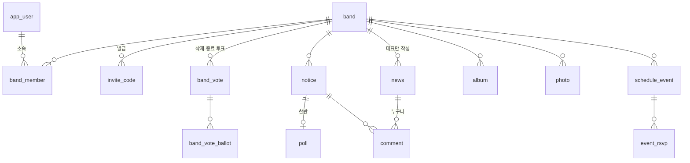
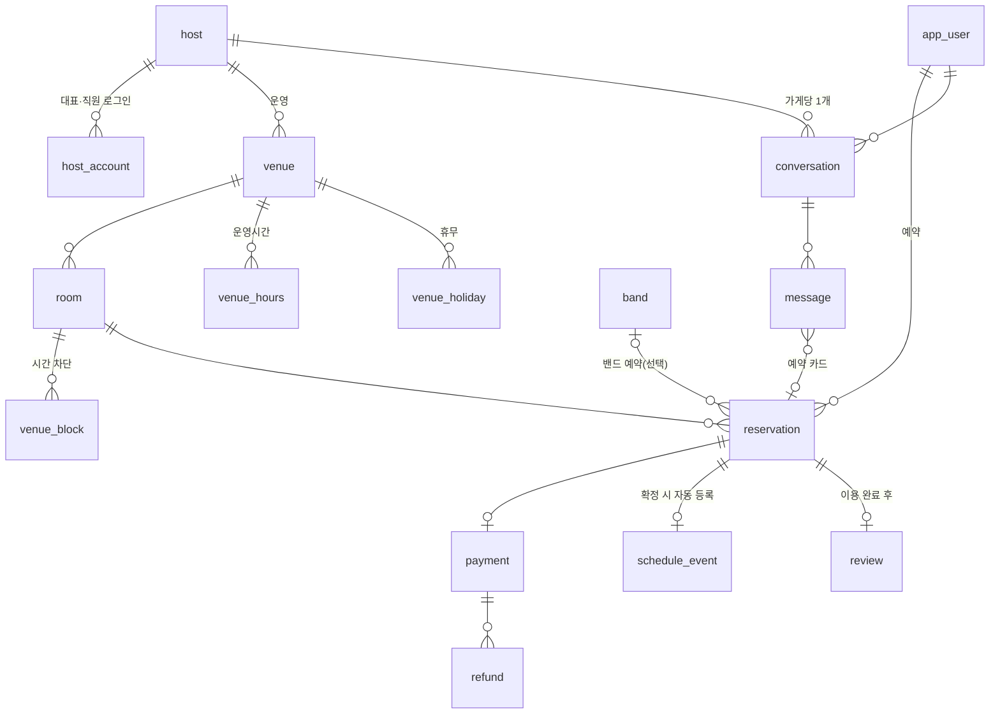
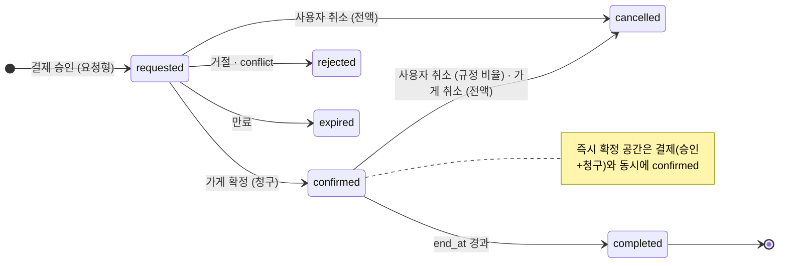

# WEARELIVE 개발 가이드 (2026-09-28)

`명세서_사용자용 모바일 앱.md`(이하 '명세서')·`명세서_가게용 웹.md`(이하 '가게용 웹 명세서')(기능 정의)와 짝을 이루는 구현 문서. 1장 스키마, 2장 예약·결제·환불 상태머신, 3장 외부 연동·서류, 4장 범위·일정. 표기는 명세서와 같다 — `[F]` 시안 사실, `[결정 D-xx]`/`[결정 Qn]` 정해진 것, `[추정]` 명세서에 없어 이 문서에서 가정한 것(4.5절에 모아 둠), `[미정]` 아직 안 정한 것.

## 1. 데이터 모델

명세서 12장 데이터 모델과 14장 결정 사항을 하나의 스키마로 합쳤다. DB는 AWS RDS(PostgreSQL)로 확정(4.2절)이라 DDL을 그대로 마이그레이션에 쓴다. 명세서에 없는데 구현에 필요해서 넣은 것은 `-- [추정]`으로 표시했으니 첫 주에 확정할 것.

공통 규칙

- 기본키 `id`는 uuid. 모든 테이블에 `created_at timestamptz not null default now()`. 수정이 있는 테이블은 `updated_at`.
- 금액은 원 단위 정수(`integer`). 소수점 없음. 원 단위 절사·반올림은 미정(WL-PAY-07) — 정해질 때까지 **원 단위 절사(floor)** 로 구현하고 상수 하나로 바꿀 수 있게 둔다 [추정].
- 시각은 timestamptz로 저장하고 표시는 Asia/Seoul. 예약의 `date`·`start_time`은 가게 운영시간 표시용이고, 겹침 검사는 `start_at`·`end_at`(timestamptz)로 한다.
- 삭제는 원칙적으로 소프트 삭제(`deleted_at`) — 신고 처리·환불 분쟁 때 기록이 필요하다 [추정].
- `[F]`·`[결정]` 표기는 명세서와 같다. 결정 번호는 명세서 13장 D-xx, 확인 문답 Qn.

### 1.1 열거형 (enum)

```sql
create type auth_provider   as enum ('kakao', 'google');            -- 애플은 iOS 출시 때 추가 (D-02)
create type region_code     as enum ('seoul', 'daejeon');           -- D-20 파일럿
create type position_code   as enum ('vocal','guitar','bass','drum','keyboard','other'); -- 6종 칩, other면 position_custom 사용 (D-04)
create type affiliation_kind as enum ('school','company','other');  -- 학교(목록) / 직장인 밴드 / 기타(직접 입력) (D-06)
create type band_status     as enum ('active','archived');          -- 활동 종료 = archived (Q12a)
create type band_role       as enum ('leader','admin','member');    -- 관리자 여러 명 (D-07·D-09)
create type band_vote_type  as enum ('delete','archive');           -- 삭제 2/3, 활동 종료 과반 (D-10)
create type vote_status     as enum ('open','passed','rejected');
create type news_category   as enum ('performance','recruit');      -- 공연 / 모집 [F]
create type comment_target  as enum ('news','notice');
create type report_target   as enum ('news','notice','comment','user'); -- 신고·차단 (D-18)
create type venue_type      as enum ('rehearsal','stage');          -- 합주실 / 공연장 [F]
create type reservation_status as enum ('requested','confirmed','rejected','expired','completed','cancelled');
create type reject_reason   as enum ('host','conflict');            -- 가게 거절 / 겹치는 요청 확정으로 자동 거절 (WL-BOOK-09)
create type payment_method  as enum ('kakaopay','tosspay','samsungpay','applepay'); -- 1차는 앞 3종 (D-36)
create type payment_status  as enum ('authorized','captured','cancelled','refunded','partially_refunded','failed');
create type refund_reason   as enum ('rejected','expired','conflict','user_cancel','host_cancel'); -- host_cancel: 확정 후 가게 취소, 전액 (부록 D 2026-09-30)
create type cancel_actor    as enum ('user','host');                -- 취소 주체
create type message_sender  as enum ('user','host','system');
create type message_type    as enum ('text','system','reservation_card');
```

### 1.2 사용자 · 인증

```sql
create table app_user (
  id              uuid primary key,
  provider        auth_provider not null,
  provider_uid    text not null,
  email           text,                         -- 카카오는 안 줄 수 있음 → 중복 가입 판별 불가 케이스 (Q5)
  name            text not null,                -- 실명 정책 [F]
  avatar_url      text,
  position        position_code,
  position_custom text,                         -- position = other 일 때 직접 입력 (D-04)
  region          region_code,                  -- 가입 때 안 받음, 계정정보수정에서 설정 [F]; null이면 리스트 전체 (Q32)
  current_band_id uuid,                         -- 프로필 탭에 보이는 밴드 (WL-BAND-02)
  onboarding_step smallint not null default 1,  -- 1 프로필 / 2 밴드 선택 / 3 밴드 만들기·코드 / 0 완료 — 이탈 후 재개 (Q7)
  created_at      timestamptz not null default now(),
  deleted_at      timestamptz,                  -- 회원 탈퇴 (D-38); 보존 기간은 미정
  unique (provider, provider_uid)
);
create unique index app_user_email_uidx on app_user (lower(email)) where email is not null and deleted_at is null; -- 같은 이메일 두 번째 가입 차단 (Q5)

create table device_token (               -- [추정] FCM 푸시용 (D-42: 1차는 푸시만)
  id uuid primary key, user_id uuid not null references app_user, token text not null unique,
  platform text not null default 'android', created_at timestamptz not null default now(), last_seen_at timestamptz
);

create table notification_setting (       -- 알림설정 4종 ('커뮤니티 소식' 삭제, D-41)
  user_id      uuid primary key references app_user,
  chat         boolean not null default true,
  reservation  boolean not null default true,
  band         boolean not null default true,
  marketing    boolean not null default false,
  marketing_agreed_at timestamptz,        -- 동의 일시 기록 (Q4)
  marketing_agreed_via text               -- 'app_setting' 등 동의 방법 (Q4)
);

create table user_block (                 -- 사용자 차단 (D-18)
  blocker_id uuid references app_user, blocked_id uuid references app_user,
  created_at timestamptz not null default now(), primary key (blocker_id, blocked_id)
);
```

### 1.3 밴드 · 멤버 · 초대 · 투표

```sql
create table school (                     -- 학교 목록 (D-06) — 공공데이터 대학 목록으로 채움 (3.9절 참조)
  id uuid primary key, name text not null, region text
);

create table band (
  id               uuid primary key,
  name             text not null,           -- 중복 허용 여부 미정 (WL-AUTH-04) → 허용 [추정]
  affiliation_kind affiliation_kind,        -- 선택 입력 (Q15)
  school_id        uuid references school,  -- affiliation_kind = school
  affiliation_text text,                    -- affiliation_kind = other 직접 입력; company는 회사명 없이 '직장인 밴드'로 표시 [추정]
  genres           text[] not null default '{}' check (cardinality(genres) <= 3), -- 록/인디/재즈/블루스/펑크/메탈/팝/힙합 [F]
  image_url        text,                    -- 프로필 편집에서만 업로드 (Q16)
  status           band_status not null default 'active',
  archived_at      timestamptz,
  created_by       uuid not null references app_user,
  created_at       timestamptz not null default now(),
  deleted_at       timestamptz              -- 삭제 투표 통과 (D-10)
);

create table band_member (
  band_id    uuid references band, user_id uuid references app_user,
  role       band_role not null default 'member',   -- 밴드당 leader는 정확히 1명 (트리거로 보장) [추정]
  position   position_code, position_custom text,   -- 밴드별 포지션 [F BAND_MEMBER.position]
  joined_at  timestamptz not null default now(),
  sort_order integer not null default 0,            -- 사용자별 밴드 전환 목록 순서 (WL-BAND-02)
  primary key (band_id, user_id)
);
create unique index band_one_leader_uidx on band_member (band_id) where role = 'leader';

create table invite_code (                -- D-08: 7일 만료, 기간 내 여러 명 사용, 재발급
  code       char(6) primary key,          -- 영숫자 6자리, 혼동 문자(0/O, 1/I) 제외 [추정]
  band_id    uuid not null references band,
  created_by uuid not null references app_user,
  expires_at timestamptz not null,         -- 발급 + 7일
  revoked_at timestamptz,                  -- 재발급하면 이전 코드는 폐기 [추정]
  created_at timestamptz not null default now()
);

create table band_vote (                  -- 밴드 삭제(2/3)·활동 종료(과반) 투표, 3일 (D-10, Q12a)
  id            uuid primary key,
  band_id       uuid not null references band,
  type          band_vote_type not null,
  proposed_by   uuid not null references app_user,   -- 대표만
  member_count  integer not null,          -- 시작 시점 전체 멤버 수 (분모 고정) [추정]
  starts_at     timestamptz not null default now(),
  ends_at       timestamptz not null,      -- starts_at + 3일
  status        vote_status not null default 'open',
  closed_at     timestamptz
);
create unique index band_vote_one_open_uidx on band_vote (band_id) where status = 'open'; -- 밴드당 진행 중 1건 [추정]

create table band_vote_ballot (
  vote_id uuid references band_vote, user_id uuid references app_user,
  choice boolean not null,                 -- true 찬성 / false 반대. 변경 가능 여부는 공지 투표 규칙(변경 가능) 준용 [추정]
  voted_at timestamptz not null default now(), primary key (vote_id, user_id)
);
```

통과 판정(서버 함수): `delete` → 찬성 수 ≥ ceil(member_count × 2/3), `archive` → 찬성 수 > member_count / 2. 미투표는 찬성으로 세지 않는다. `ends_at`까지 기준 미달이면 `rejected`. 1인 밴드는 대표 찬성 1표로 통과.

### 1.4 밴드 콘텐츠 (공지 · 투표 · 일정 · 사진)

```sql
create table notice (
  id uuid primary key, band_id uuid not null references band, author_id uuid not null references app_user,
  title text not null, body text,
  event_id uuid,                            -- 일정 '게시글로 공유'로 생긴 공지 (WL-SCHED-04) → schedule_event
  like_count integer not null default 0, comment_count integer not null default 0,
  created_at timestamptz not null default now(), updated_at timestamptz, deleted_at timestamptz
);
create table notice_photo (               -- 최대 10장 [F]
  id uuid primary key, notice_id uuid not null references notice, url text not null, sort_order smallint not null default 0
);
create table poll (                       -- 찬성/반대 2지선다, 마감 없음·변경 가능·공개, 결과 = 인원 수 (D-13)
  id uuid primary key, notice_id uuid not null unique references notice
);
create table poll_vote (
  poll_id uuid references poll, user_id uuid references app_user,
  agree boolean not null, voted_at timestamptz not null default now(), primary key (poll_id, user_id)
);

create table schedule_event (
  id uuid primary key, band_id uuid not null references band, created_by uuid references app_user, -- 자동 등록이면 null [추정]
  title text not null, all_day boolean not null default false,
  start_at timestamptz not null, end_at timestamptz,
  rsvp_enabled boolean not null default false, share_to_feed boolean not null default false,
  reservation_id uuid,                      -- 예약 확정으로 자동 등록된 일정 (Q22) → reservation. 장소 필드는 없음 (D-14)
  created_at timestamptz not null default now(), updated_at timestamptz, deleted_at timestamptz
);
create table event_rsvp (
  event_id uuid references schedule_event, user_id uuid references app_user,
  attend boolean not null, responded_at timestamptz not null default now(), primary key (event_id, user_id)
);

create table album (
  id uuid primary key, band_id uuid not null references band, name text not null, created_by uuid not null references app_user,
  created_at timestamptz not null default now(), deleted_at timestamptz   -- 앨범을 지워도 사진은 남김 (Q24)
);
create table photo (
  id uuid primary key, band_id uuid not null references band,
  album_id uuid references album on delete set null,   -- null = '전체 사진'에만 (D-15)
  url text not null, width integer, height integer,
  uploaded_by uuid not null references app_user, created_at timestamptz not null default now(), deleted_at timestamptz
);
create table user_album_seen (            -- NEW 배지 = 내가 마지막으로 본 뒤 올라온 사진 (Q24b)
  user_id uuid references app_user, album_id uuid references album, seen_at timestamptz not null, primary key (user_id, album_id)
);
```

### 1.5 소식 · 댓글 · 좋아요 · 신고

```sql
create table news (
  id uuid primary key, band_id uuid not null references band, author_id uuid not null references app_user, -- 대표만 (Q25)
  category news_category not null, title text not null, body text,
  event_date date, place text,              -- 공연만 입력 [F]
  like_count integer not null default 0, comment_count integer not null default 0,
  hidden_at timestamptz,                    -- 신고 처리로 운영자가 내림 (Q30)
  created_at timestamptz not null default now(), updated_at timestamptz, deleted_at timestamptz
);
create table news_photo (id uuid primary key, news_id uuid not null references news, url text not null, sort_order smallint not null default 0);

create table comment (                    -- 소식(누구나)·공지(멤버) 공용 (Q27)
  id uuid primary key, target_type comment_target not null, target_id uuid not null,
  author_id uuid not null references app_user, body text not null,
  created_at timestamptz not null default now(), deleted_at timestamptz
);
create table "like" (
  user_id uuid references app_user, target_type comment_target not null, target_id uuid not null,
  created_at timestamptz not null default now(), primary key (user_id, target_type, target_id)
);
create table report (                     -- 글·댓글 신고, 운영자 처리 (D-18)
  id uuid primary key, reporter_id uuid not null references app_user,
  target_type report_target not null, target_id uuid not null, reason text,
  status text not null default 'open',      -- open / actioned / dismissed [추정]
  created_at timestamptz not null default now(), handled_at timestamptz, handled_by text
);
```

인기순 = `like_count + comment_count` 내림차순 (D-16). 카운트 컬럼은 트리거 또는 서비스 계층에서 유지.

### 1.6 가게(호스트) · 공간 · 룸

```sql
create type host_role as enum ('owner','staff');                        -- 대표 계정 1개 · 직원 계정 여러 개 (미결정 1-4)
create type host_review_status as enum ('pending','rejected','approved'); -- 입점 심사 (가게용 웹 명세서 WL-HOST-04)

create table host (                       -- 가게 = 사업자 단위 (D-27). 로그인 주체는 host_account로 분리 (가게용 웹 명세서 11.1 [추정])
  id uuid primary key,
  phone text not null,                      -- 새 요청 알림톡 수신 번호 = 입점 신청 '연락처' [결정 — 부록 D 2026-09-30]
  display_name text not null,               -- 호스트프로필 이름 [F]. 입점 신청의 상호로 채움 [추정 — H-44]
  intro text,                               -- 호스트프로필 소개. 입력 화면 없음 → null [추정 — H-44]
  is_superhost boolean not null default false,       -- 운영자가 지정 (D-26)
  review_status host_review_status not null default 'pending',
  review_reject_reason text,                -- 운영자가 입력한 반려 사유
  business_doc_key text,                    -- 사업자등록증 S3 키 (비공개 버킷, 서명 URL로 운영자만 조회)
  business_verified_at timestamptz,         -- 사업자등록 확인 (Q42) — 1차에 표시하는 유일한 인증. 입점 승인 시 기록
  business_name text, business_owner text, business_reg_no text, business_address text,
  business_phone text, business_email text, -- 사업자 정보는 가게 단위 (미결정 2-9, D-25). business_phone은 손님에게 표시 — host.phone과 같은지 [미정 H-45]
  hosting_since date,                       -- 입점 승인일 자동 [추정 — H-11]
  response_rate numeric(5,2), avg_response_min integer,  -- 응답 기록으로 계산, 데이터 쌓이기 전엔 null → 표시 안 함 (D-26)
  created_at timestamptz not null default now()
);

create table host_account (                -- 가게용 웹 로그인 계정. 이메일 + 비밀번호 [결정 — 부록 D 2026-09-30]
  id uuid primary key, host_id uuid not null references host,
  email text not null unique, password_hash text not null,
  email_verified_at timestamptz,
  name text not null, role host_role not null,
  perm_reservation boolean not null default true,   -- 예약 승인 (시안 O-50)
  perm_settlement  boolean not null default false,  -- 정산 조회 (시안 O-50). 그 밖의 권한은 H-04
  created_at timestamptz not null default now(), deleted_at timestamptz
);
create unique index host_one_owner_uidx on host_account (host_id) where role = 'owner' and deleted_at is null;

create table host_invite (id uuid primary key, host_id uuid not null references host, token text not null unique,
  perms jsonb not null, expires_at timestamptz not null, used_at timestamptz, created_by uuid references host_account);  -- 직원 초대 링크 7일·1회용 [추정]
create table host_auth_token (id uuid primary key, email text not null, purpose text not null,  -- verify_email / reset_password / invite
  token_hash text not null, expires_at timestamptz not null, used_at timestamptz);
create table host_terms_agreement (host_id uuid references host, term_code text, agreed_at timestamptz not null,
  revoked_at timestamptz, primary key (host_id, term_code));

create table venue (
  id uuid primary key, host_id uuid not null references host,
  name text not null, type venue_type not null, region region_code not null,
  address text not null, transit_note text, intro text,
  facilities text[] not null default '{}',  -- 주차가능·와이파이·에어컨·화장실·음료대·콘센트 [F]
  equipment  text[] not null default '{}',  -- 드럼·건반·세컨 기타·일렉기타·베이스기타 … 필터 마스터와 같은 코드 (D-21)
  services   text[] not null default '{}',  -- 주차가능·24시간·녹음지원 [F]
  policies   text[] not null default '{}',  -- 운영정책 3~5항 [F]
  instant_confirm boolean not null default false,     -- 즉시 확정 (WL-BOOK-08)
  -- 사업자 정보는 host.business_*로 이동 (미결정 2-9). 공간 상세는 host 값을 표시
  rating_avg numeric(3,2), review_count integer not null default 0,
  is_active boolean not null default false,  -- 노출 토글. 등록 직후 미노출, 가게가 켬 [추정 — H-08]
  created_at timestamptz not null default now(), updated_at timestamptz
);
create table venue_image (id uuid primary key, venue_id uuid not null references venue, url text not null, sort_order smallint not null default 0); -- ≤12 [F]

create table venue_hours (                -- 운영시간 (Q33·Q38): 요일별
  venue_id uuid references venue, weekday smallint check (weekday between 0 and 6),
  open_time time, close_time time,          -- close_time <= open_time 이면 익일 [추정]
  closed boolean not null default false, primary key (venue_id, weekday)
);
create table venue_holiday (venue_id uuid references venue, day date, primary key (venue_id, day));  -- 휴무일 (Q38)

create table room (
  id uuid primary key, venue_id uuid not null references venue,
  name text not null, label text,           -- 기본 / 프리미엄 / null [F]
  capacity integer not null,                -- 정원 초과 룸 선택 불가 (Q37)
  price_per_hour integer not null,          -- 수수료 제외 원가. 표시 가격은 ×1.05 (D-34)
  min_hours smallint not null default 1, max_hours smallint not null default 12,  -- 가게가 설정 (Q35), 1시간 단위 [추정]
  is_default boolean not null default false,
  is_active boolean not null default true
);
create unique index room_one_default_uidx on room (venue_id) where is_default;

create table venue_block (                -- 시간 차단: 전화 예약·자체 사용·정비 (미결정 3-2, 가게용 웹 명세서 WL-HOST-27)
  id uuid primary key, venue_id uuid not null references venue, room_id uuid not null references room,
  start_at timestamptz not null, end_at timestamptz not null,    -- 단일 차단 또는 반복 전개 결과 1건
  series_id uuid,                                                -- 반복 차단 묶음 (같은 등록에서 나온 행)
  memo text, created_by uuid references host_account,            -- 메모는 가게 안에서만 보임
  created_at timestamptz not null default now(), deleted_at timestamptz,
  check (end_at > start_at)
);
create index venue_block_room_time_idx on venue_block (room_id, start_at, end_at) where deleted_at is null;
-- 반복은 등록 시 종료일까지 행으로 전개해 저장 (가용성 계산을 단순하게). 종료일 규칙은 H-38

create table venue_favorite (user_id uuid references app_user, venue_id uuid references venue, created_at timestamptz not null default now(), primary key (user_id, venue_id));

create table review (                     -- 이용 완료 후 평점 + 글, 실제 이용자만 (D-28, Q43)
  id uuid primary key, venue_id uuid not null references venue, user_id uuid not null references app_user,
  reservation_id uuid not null unique,      -- 예약 1건당 후기 1개 → reservation
  rating smallint not null check (rating between 1 and 5), body text,
  created_at timestamptz not null default now(), deleted_at timestamptz
);
```

### 1.7 예약 · 결제 · 환불

```sql
create table reservation (
  id               uuid primary key,
  number           text not null unique,     -- 'WAL-YYMMDD-NNNN' 요청일 + 그날 일련 4자리 (D-30). 일별 시퀀스 테이블로 발번 [추정]
  user_id          uuid not null references app_user,
  band_id          uuid references band,     -- 예약 때 고른 밴드, 개인 예약이면 null (Q22)
  venue_id         uuid not null references venue,
  room_id          uuid not null references room,
  date             date not null, start_time time not null, duration_hours smallint not null,
  start_at         timestamptz not null, end_at timestamptz not null,   -- 겹침 검사·만료 계산용
  headcount        smallint not null,
  unit_price       integer not null,         -- 요청 시점 room.price_per_hour 스냅샷
  base_amount      integer not null,         -- unit_price × duration_hours
  user_fee_rate    numeric(4,3) not null default 0.050,
  user_fee_amount  integer not null,         -- floor(base × rate) [절사 추정]
  host_fee_rate    numeric(4,3) not null default 0.030,
  host_fee_amount  integer not null,
  total_amount     integer not null,         -- base + user_fee = 사용자 결제액
  payout_amount    integer not null,         -- base − host_fee = 가게 정산액
  payment_method   payment_method not null,
  status           reservation_status not null default 'requested',
  status_changed_at timestamptz not null default now(),
  expires_at       timestamptz,              -- requested일 때만: least(결제 완료 + 24h, start_at − 버퍼) (D-33; 버퍼 미정)
  confirmed_at     timestamptz, rejected_reason reject_reason,
  reject_note      text,                     -- 가게가 고른·입력한 거절 사유(필수, 미결정 4-1). conflict면 null
  cancelled_at     timestamptz, cancelled_by cancel_actor,
  cancel_reason    text,                     -- 가게 취소 사유(필수 입력). 사용자 취소는 null (부록 D 2026-09-30)
  refund_rate numeric(4,3), refund_amount integer,  -- 사용자 취소 (D-32) · 가게 취소는 1.000 (부록 D 2026-09-30)
  created_at       timestamptz not null default now(),
  check (end_at > start_at), check (duration_hours >= 1)
);
create index reservation_room_time_idx on reservation (room_id, start_at, end_at) where status in ('requested','confirmed');
-- 같은 룸에서 확정 예약끼리는 절대 겹치지 않는다 (btree_gist 확장 필요)
alter table reservation add constraint reservation_no_confirmed_overlap
  exclude using gist (room_id with =, tstzrange(start_at, end_at) with &&) where (status = 'confirmed');
-- 같은 룸·겹치는 시간대의 requested는 최대 3건: 트랜잭션 안에서 room 행을 잠그고 count 후 insert (2장 참조)

create table reservation_number_seq (day date primary key, last_no integer not null default 0);  -- [추정] 일별 일련번호

create table reservation_event (          -- 예약 상태 변경 이력 (가게용 웹 예약 상세, 시안 O-12) [추정]. 2.2절 모든 전이에서 같은 트랜잭션으로 기록
  id uuid primary key, reservation_id uuid not null references reservation,
  kind text not null,              -- requested / payment_authorized / host_notified / confirmed / rejected / expired / cancelled / completed / refund_*
  actor_type text not null,        -- user / host_account / system / admin
  actor_id uuid, note text, created_at timestamptz not null default now()
);

create table host_notification_log (      -- 알림톡 발송 기록 (미결정 8-5) [추정]
  id uuid primary key, host_id uuid not null references host,
  reservation_id uuid references reservation, channel text not null default 'alimtalk', template text not null,
  status text not null, attempts smallint not null default 0, sent_at timestamptz, created_at timestamptz not null default now()
);

create table payment (
  id uuid primary key, reservation_id uuid not null unique references reservation,
  method payment_method not null, amount integer not null,
  status payment_status not null,
  pg_provider text not null default 'tosspayments',
  pg_payment_key text unique, pg_order_id text unique,   -- 토스페이먼츠 paymentKey / orderId
  authorized_at timestamptz, captured_at timestamptz, cancelled_at timestamptz,
  raw jsonb,                                 -- PG 응답 원본 (분쟁 대비)
  created_at timestamptz not null default now()
);
create table refund (
  id uuid primary key, payment_id uuid not null references payment,
  amount integer not null, reason refund_reason not null,
  status text not null default 'requested', -- requested / done / failed [추정]
  pg_refund_key text, requested_at timestamptz not null default now(), completed_at timestamptz
);
create table payment_method_link (        -- 결제수단 관리 화면 (WL-PAY-03) — PG가 계정 연결(빌링)을 지원할 때만 의미 있음 [추정]
  id uuid primary key, user_id uuid not null references app_user, provider payment_method not null,
  masked_account text, is_default boolean not null default false, linked_at timestamptz not null default now()
);
```

### 1.8 채팅

```sql
create table conversation (               -- 가게당 대화방 1개 (Q53)
  id uuid primary key, user_id uuid not null references app_user, host_id uuid not null references host,
  venue_id uuid references venue,           -- 목록의 합주실/공연장 필터용 [F]
  last_message_at timestamptz, last_message_preview text,
  active_reservation_id uuid references reservation,   -- 상단 고정 예약요약 카드 (WL-CHAT-02)
  host_last_read_at timestamptz,            -- 가게용 웹 미읽음 표시용 [추정]. 사용자 앱 읽음 표시와 무관 (Q55)
  created_at timestamptz not null default now(), unique (user_id, host_id)
);
create table message (
  id uuid primary key, conversation_id uuid not null references conversation,
  sender message_sender not null, type message_type not null default 'text',
  body text, reservation_id uuid references reservation,   -- reservation_card
  card_status reservation_status,           -- 카드가 만들어질 때의 상태(요청됨/확정됨/거절됨/만료됨) 스냅샷
  created_at timestamptz not null default now()
);
create index message_conv_idx on message (conversation_id, created_at);
```

읽음 표시·첨부는 1차에 없음(Q55) → `read_at`·`attachment` 컬럼을 두지 않는다. 공간이 여러 개인 가게의 대화방 구분은 미정(H-22).

### 1.9 운영 · 정책

```sql
create table platform_policy (            -- 취소 규정·수수료율은 플랫폼 공통 (D-24, D-34). 코드 상수가 아니라 표로 두어 변경 이력 보존
  key text primary key, value jsonb not null, effective_from timestamptz not null default now()
);
-- 초기값
-- ('cancel_rules', {"pending":1.0, "d3_plus":1.0, "d1_d2":0.5, "d0":0.0})
-- ('fee_rates',    {"user":0.05, "host":0.03})
-- ('request_expiry', {"hours_after_payment":24, "buffer_hours_before_start": null})   -- 버퍼 미정 (Q51)
-- ('waiting_cap',  {"max_requested_per_slot":3})

create table faq (id uuid primary key, question text not null, answer text not null, sort_order smallint not null default 0);
-- 1:1 문의는 카카오톡 채널 (D-40) → inquiry 테이블 없음
```

### 1.10 관계 요약

밴드 쪽



대관 쪽



### 1.11 명세서 12장 대비 달라진 점

- 추가: `band_vote`·`band_vote_ballot`, `band.status/archived_at`, `band_member.role = admin`, `invite_code.expires_at`, `reservation.band_id / user_fee_* / host_fee_* / payout_amount / expires_at / cancelled_at / refund_*`, `schedule_event.reservation_id`, `venue.instant_confirm / business_phone / business_email`, `venue_hours`·`venue_holiday`, `room.min_hours/max_hours`, `report`, `user_block`, `user_album_seen`, `school`, `platform_policy`, `device_token`.
- 삭제: `notification_setting.community`(D-41), `inquiry`(D-40), `host.verifications` 4종 → `business_verified_at` 하나(Q42), `venue.cancel_policy`(플랫폼 공통, D-24), `schedule_event.place`(D-14).
- 2026-09-30 결정 반영(명세서 부록 D): `host.password_hash not null`·`host.phone`, `reservation.cancelled_by`·`cancel_reason`, `refund_reason.host_cancel`, `cancel_actor`.
- 2026-10-01 가게용 웹 명세서 11.1 반영 [추정]: 로그인 주체 `host` → `host_account`(대표·직원, 권한) 분리, `host_invite`·`host_auth_token`·`host_terms_agreement`, `host.review_status`·`review_reject_reason`·`business_doc_key`, 사업자 정보 `venue.business_*` → `host.business_*`, `venue.is_active` 기본값 false, `venue_block`, `reservation.reject_note`, `reservation_event`, `host_notification_log`, `conversation.host_last_read_at`.
- 첫 주에 확정할 [추정]: 소프트 삭제 범위, 절사 규칙, 밴드 이름 중복, 초대 코드 재발급 시 이전 코드 처리, 투표 분모(시작 시점 고정) 방식.

## 2. 예약 · 결제 · 환불 흐름

명세서의 WL-BOOK-01~10, WL-PAY-01~07, WL-CHAT-02·03·05, WL-SYS-02를 구현 순서대로 다시 썼다. 돈이 걸린 부분이라 **모든 상태 변경은 서버(Spring Boot 서비스 계층의 DB 트랜잭션)에서만** 일어나고, 앱은 요청만 보낸다. 값은 `platform_policy`(1.9절)에서 읽는다.

### 2.1 상태

| 상태 | 코드 | 색 | 뜻 |
|---|---|---|---|
| 확정 대기중 | `requested` | 노랑 | 결제 승인됨, 가게 응답 기다림. 시간대는 잡아두지 않음 |
| 예약 확정 | `confirmed` | 초록 (D-37) | 가게 확정 또는 즉시 확정. 결제 청구됨. 시간대 점유 |
| 요청 거절됨 | `rejected` | 빨강 | 가게 거절(`host`) 또는 겹치는 다른 요청이 확정됨(`conflict`). 승인 취소 |
| 요청 만료됨 | `expired` | 회색 [추정] | `expires_at` 경과. 승인 취소 |
| 취소됨 | `cancelled` | 회색 [추정] | 사용자 취소(대기 중이면 전액, 확정 후면 규정 비율) 또는 확정 후 가게 취소(전액). `cancelled_by`로 구분 |
| 이용 완료 | `completed` | 회색 | `end_at` 경과. 후기 작성 가능 |



거절·만료·대기 중 취소는 승인 취소(전액), 확정 후 사용자 취소는 규정 비율 환불(2.5절), 확정 후 가게 취소는 전액 환불.

### 2.2 전이 표

| # | 전이 | 트리거 | 사전 조건 | 결제 | 부수 효과 |
|---|---|---|---|---|---|
| T1 | → `requested` | 사용자 [결제하기] | 2.3절 검증 통과 | 승인(authorize) | 채팅 '요청됨' 카드 + 시스템 문구 · 가게에 새 요청 알림톡 · `expires_at` 설정 |
| T2 | → `confirmed` (즉시) | 사용자 [결제하기], `venue.instant_confirm` | 2.3절 검증 통과 | 승인 + 청구(capture) | 채팅 '확정됨' 카드 · 푸시(예약) · 밴드 일정 자동 등록 · 홈 배너 |
| T3 | `requested` → `confirmed` | 가게 [확정] (가게용 웹) | 아직 `requested`, `expires_at` 전, 확정 예약과 안 겹침 | 청구 | T2와 같음 + **겹치는 다른 `requested`를 전부 T5(conflict)** |
| T4 | `requested` → `rejected(host)` | 가게 [거절] + 사유 선택 (가게용 웹) | `requested`, 사유(`reject_note`)가 비어 있지 않음 (미결정 4-1) | 승인 취소(전액) | 채팅 '거절됨' 카드 + [다른 공간 둘러보기] · 푸시(예약) |
| T5 | `requested` → `rejected(conflict)` | T3의 부수 효과 | 같은 룸, 시간 겹침 | 승인 취소(전액) | 채팅 '거절됨' 카드(문구는 '다른 예약이 먼저 확정됐어요' 계열 [추정]) · 푸시 |
| T6 | `requested` → `expired` | 스케줄러(매분) | `expires_at < now()` | 승인 취소(전액) | 채팅 '만료됨' 카드 · 푸시(예약) |
| T7 | `requested` → `cancelled` | 사용자 [예약 취소] | `requested` | 승인 취소(전액, 수수료 포함) | 채팅 시스템 문구 [추정] · 예약 상세 갱신 |
| T8 | `confirmed` → `cancelled` | 사용자 [예약 취소] | `confirmed`, `start_at` 전 | 부분/전액 환불(2.5절) | 밴드 자동 등록 일정 삭제 [추정] · 채팅 시스템 문구 · 가게에 알림 |
| T9 | `confirmed` → `completed` | 스케줄러(매분) | `end_at < now()` | 없음 | 후기 작성 진입 열림 · 가게 정산 대상 |
| T10 | `confirmed` → `cancelled` (가게) | 가게 [예약 취소] + 사유 입력 (가게용 웹) | `confirmed`, `start_at > now()`, 사유가 비어 있지 않음 | 전액 환불(수수료 포함, `refund_reason = host_cancel`) | `cancelled_by = host`, `cancel_reason` 저장 · 밴드 자동 등록 일정 삭제 [추정] · 채팅 시스템 문구 '{venue.name}이 예약을 취소했습니다. 사유:{cancel_reason}' · 푸시(예약) · 정산 대상 아님 · 가게 불이익 없음 |

모든 전이(T1~T10)는 같은 트랜잭션 안에서 `reservation_event`에 한 줄을 남긴다(종류 · 처리 주체 `user`/`host_account`/`system`/`admin` · 처리 계정) [추정 — 가게용 웹 명세서 WL-HOST-23]. 결제 승인·가게 알림톡 발송도 이벤트로 남긴다.

확정 후 가게 취소는 가게용 웹에서 한다(명세서 부록 D 2026-09-30). 사유 입력 필수, 이용 시작 시각 전까지는 시점 제한 없음(이용 당일도 가능), 시작 후엔 불가. 채팅 문구의 가게 이름은 `venue.name`. 가게 불이익(응답률·슈퍼호스트 등) 없음.

### 2.3 요청 생성 (T1 / T2) — 한 트랜잭션

1. 입력: `room_id, date, start_time, duration_hours, headcount, band_id?, payment_method`.
2. 검증 (하나라도 실패하면 결제 전에 거절):
   - 룸·공간 활성, `headcount ≤ room.capacity` (Q37)
   - `room.min_hours ≤ duration ≤ room.max_hours` (Q35)
   - `[start_at, end_at)`가 그 요일 운영시간 안, 휴무일 아님 (Q33·Q38)
   - `start_at > now()` (+ 최소 리드타임은 미정 → 0으로 시작 [추정])
   - 같은 룸에서 `confirmed`와 겹치지 않음
   - 같은 룸의 시간 차단(`venue_block`, `deleted_at is null`)과 겹치지 않음 [추정 — 가게용 웹 명세서 WL-HOST-27]. 사용자 앱 일시 선택·검색의 불가 시간 계산에도 같은 조건을 넣는다
   - 요청형 공간이면 같은 룸·겹치는 `requested`가 **3건 미만** (`select … from room where id = ? for update`로 룸 행을 잠근 뒤 count) (WL-BOOK-09)
   - `band_id`가 있으면 사용자가 그 밴드 멤버이고 밴드가 `active`
3. 금액 스냅샷: `unit_price = room.price_per_hour`, `base = unit × hours`, `user_fee = floor(base × 0.05)`, `host_fee = floor(base × 0.03)`, `total = base + user_fee`, `payout = base − host_fee`.
4. 예약번호 발번: `WAL-` + 요청일(KST, YYMMDD) + `-` + 그날 일련번호 4자리(`reservation_number_seq` 행 잠금 후 +1). 하루 9,999건 넘으면 5자리 [추정].
5. 결제: PG에 `total`을 승인 요청. 실패하면 트랜잭션 롤백 + 결제 실패 화면(**미정 D-29** — 정해질 때까지 토스트 '결제에 실패했어요. 다시 시도해주세요' [추정]).
6. `reservation` insert. 요청형이면 `status = requested`, `expires_at = least(승인 시각 + 24h, start_at − buffer)` (buffer는 `platform_policy.request_expiry.buffer_hours_before_start`, **미정 Q51** → 정해질 때까지 0). 즉시 확정이면 바로 청구하고 `status = confirmed`, `confirmed_at = now()`.
7. 채팅: `conversation` findOrCreate(user, host) → `message(type = reservation_card, card_status = requested|confirmed)` + 시스템 문구 → `conversation.active_reservation_id` 갱신.
8. 알림: 요청형이면 가게에 새 요청 알림톡(`host.phone`) · 즉시 확정이면 사용자에게 푸시(예약). 알림톡 발송 실패는 예약 트랜잭션을 롤백하지 않는다(커밋 후 발송, 재시도) [추정].
9. 즉시 확정이고 `band_id`가 있으면 `schedule_event` 자동 생성(2.4절).

앱 화면 순서: 상세 하단 바 → 오버레이_날짜시간 → 예약확인(밴드 선택 포함, WL-BOOK-10) → [₩63,000 결제하기] → PG 화면 → 예약완료(요청형: '확정 대기중' / 즉시 확정: '예약 확정' [문구·화면 추가 필요]).

### 2.4 가게 확정 (T3) — 한 트랜잭션

1. `select … from reservation where id = ? for update`. `status = requested`이고 `expires_at > now()`인지 확인. 아니면 "이미 만료/취소된 요청" 오류.
2. 같은 룸에 겹치는 `confirmed`가 없는지 재확인(DB의 exclude 제약이 최종 방어선). 요청 뒤에 생긴 시간 차단과 겹치면 확정을 거부한다 [추정 — 차단은 예약을 막으려는 것. 확정 [미정 H-46]].
3. PG 청구(capture). 실패하면 롤백하고 가게용 웹에 오류 표시(사용자 상태는 그대로 `requested`).
4. `status = confirmed`, `confirmed_at = now()`, `expires_at = null`. `reservation_event`에 처리한 `host_account` 기록.
5. 같은 룸·겹치는 `requested` 전부 → `rejected(conflict)` + 각각 승인 취소 + 카드 + 푸시 (T5).
6. `band_id`가 있으면 `schedule_event` 생성: `band_id`, `title = '{공간명} {룸명} 합주'` [추정], `start_at/end_at = 예약 시간`, `created_by = null`, `reservation_id`. 장소 필드는 없다(D-14).
7. 채팅 '확정됨' 카드 + '🎉 호스트가 예약을 확정했어요!' + 푸시(예약). 홈 배너는 조회 시 `confirmed` 중 가장 가까운 1건을 보여주므로 별도 작업 없음.

### 2.5 수수료 · 환불

#### 2.5.1 금액 (D-34)

- 사용자 수수료 5%, 가게 수수료 3%, 상한 없음. 원 단위 절사 [추정 — 미정].
- 표시 가격 = `price_per_hour × 1.05`를 **리스트·검색 결과·상세·하단 바** 모두에서 사용 (순차공개 가격 금지 대응). 예약 확인에서만 요금 / 서비스 수수료(5%) / 총 합계로 나눠 보여준다.

| 항목 | 합주실 ₩15,000 × 4h | 공연장 ₩100,000 × 4h (가정) |
|---|---|---|
| base | 60,000 | 400,000 |
| 사용자 수수료 5% | 3,000 | 20,000 |
| **사용자 결제 total** | **63,000** | **420,000** |
| 가게 수수료 3% | 1,800 | 12,000 |
| **가게 정산 payout** | **58,200** | **388,000** |
| 플랫폼 (PG·부가세 차감 전) | 4,800 | 32,000 |

#### 2.5.2 사용자 취소 환불률 (D-32, Q39, Q50b·c)

| 시점 | 환불률 | 계산 |
|---|---|---|
| `requested` (확정 대기 중) | 100% | 승인 취소. 수수료 포함 전액 |
| `confirmed`, 이용 3일 전까지 | 100% | 전액 환불(청구 취소) |
| `confirmed`, 이용 1일 전까지 | 50% | `refund = floor(total × 0.5)` — 사용자 수수료도 같은 비율 |
| `confirmed`, 당일 | 0% | 취소 버튼 비활성 + 안내 |
| `confirmed`, 가게 취소 (T10) | 100% | 청구 전액 취소. 수수료 포함, 이용 시작 전이면 시점과 무관 |

'N일 전'의 기준 [추정 — 확인 필요]: KST 날짜 차이 `D = 이용일 − 취소일`. `D ≥ 3` → 100%, `1 ≤ D ≤ 2` → 50%, `D = 0` → 0%. (시각 기준 72h/24h로 할지 결정 필요. 앱의 '예상 환불액'은 이 함수 하나로 계산해 취소 확인 전에 보여준다.)

부분 환불 후 가게 정산 [추정]: 가게는 사용자가 낸 요금 중 남는 부분에서 3%를 뗀 금액. 50% 취소 예: 사용자 환불 31,500 / 플랫폼 보유 31,500 = base 30,000 + 수수료 1,500 / 가게 정산 30,000 × 0.97 = 29,100 / 플랫폼 2,400. 가게 취소(T10)는 가게 정산 0.

#### 2.5.4 가게 정산 (명세서 부록 D 2026-09-30)

- 1차는 **조회만**: 가게용 웹에 `completed` 예약별 결제 금액 · 가게 수수료 3% · 정산액(`payout_amount`)과 기간 합계를 보여준다. 부분 환불 건은 위 [추정] 계산을 따른다.
- **충돌 주의 [미정 H-28]**: 확정 후 사용자 취소(50% 환불) 건은 상태가 `cancelled`라 `completed`에 도달하지 않는다. '`completed`만 정산' 규칙을 그대로 두면 위 부분 환불 정산(가게 29,100원 예)이 정산 내역에서 빠진다. 정산 대상을 `completed` + `cancelled(cancelled_by = user, refund_rate < 1)`로 넓힐지, 그때 `payout_amount`를 다시 계산해 저장할지 H-28에서 함께 정한다.
- **지급은 수기**: 운영자가 시스템 밖(인터넷뱅킹)에서 가게 계좌로 이체한다. 정산 테이블·지급 상태·가게 계좌 정보는 시스템에 두지 않는다.
- 정산 주기는 월 정산 [추정 — 가게 계약서에서 확정, 3.2절]. 토스 지급대행·정산 테이블은 다음 버전에서 다시 결정.

#### 2.5.3 결제 승인 방식 (D-35, Q48)

- 1안(결정): 요청 때 **승인만**(authorize) → 가게 확정 때 **청구**(capture) → 거절·만료·대기 중 취소는 **승인 취소**. 사용자에게 실제 출금이 없어 환불 안내가 필요 없다.
- 2안(대체, PG가 1안을 지원하지 않을 때): 요청 때 즉시 결제(capture) → 거절·만료·취소 때 **환불**. 코드 구조는 같고 `payment.status`가 `captured → refunded`로 바뀔 뿐이다. 다만 앱 문구가 '결제 금액이 자동 환불되었습니다'(시안 그대로)로 유지되고, 카드사 환불 소요일 안내가 필요하다.
- 어느 안이든 PG 호출은 `payment.pg_order_id`를 키로 **멱등**하게, 웹훅은 중복 수신을 가정하고 처리한다.

### 2.6 스케줄러

Spring Boot 스케줄러(`@Scheduled`)로 돌린다 [추정]. 서버를 여러 대 띄우면 중복 실행 방지(ShedLock 등 DB 잠금)가 필요하다.

| 작업 | 주기 | 조건 | 동작 |
|---|---|---|---|
| 만료 | 매분 | `status = requested and expires_at < now()` | T6. 승인 취소 실패 시 재시도 큐 |
| 이용 완료 | 매분 | `status = confirmed and end_at < now()` | T9 |
| 리마인드 푸시 | 매분 | `confirmed`, `start_at − 24h` / `− 1h` 통과, 미발송 | 푸시(예약). 발송 기록으로 중복 방지 |
| 밴드 투표 마감 | 매분 | `band_vote.status = open and ends_at < now()` | 판정 후 passed/rejected (1.3절) |

### 2.7 채팅 카드 · 푸시 매트릭스

| 이벤트 | 채팅(사용자 ↔ 가게 방) | 사용자 푸시(설정 카테고리) | 가게 |
|---|---|---|---|
| 요청 생성 | '요청됨' 카드 + 시스템 '예약 신청이 호스트에게 전달되었어요…' | 없음 | 새 요청 알림톡 |
| 확정 | '확정됨' 카드 + '🎉 호스트가 예약을 확정했어요!' | 예약 | — |
| 거절 / conflict | '거절됨' 카드 + [다른 공간 둘러보기] | 예약 | — |
| 만료 | '만료됨' 카드 + '호스트가 24시간 이내에 응답하지 않아…' | 예약 | 알림 [추정] |
| 사용자 취소 | 시스템 문구 [추정] | 없음 | 알림 |
| 가게 취소 (T10) | 시스템 '{venue.name}이 예약을 취소했습니다. 사유:{cancel_reason}' | 예약 | — |
| 가게 새 메시지 | 텍스트 | 채팅 | — |
| 이용 하루 전 / 1시간 전 | 없음 | 예약 | — |

카드 문구는 시안 카피(명세서 11장 WL-SYS-04) 그대로. `card_status`는 카드 생성 시점 스냅샷이라 예약 상태가 바뀌어도 옛 카드는 그대로 남는다.

### 2.8 검증 시나리오 (구현 완료 기준)

1. 요청 생성 후 같은 룸·시간에 다른 사용자 3명이 더 요청하면 4번째는 "이 시간 요청 3건 대기 중"으로 거절된다.
2. 3건 대기 중 가게가 1건을 확정하면 나머지 2건이 `rejected(conflict)`, 각각 승인 취소, 카드·푸시 발생, 두 사용자의 예약 상세가 갱신된다.
3. 확정된 룸·시간과 겹치는 새 요청은 일시 선택에서 비활성이고, API로 직접 넣어도 거부된다(exclude 제약).
4. 동시에 두 가게 확정 요청이 들어와도(같은 룸·겹치는 시간의 요청 2건) 하나만 확정된다.
5. 결제 완료 + 24시간이 지나면 만료되고 승인이 취소된다. 이용 시작이 그보다 빠르면 시작 시각(버퍼 0)에 만료된다.
6. 즉시 확정 공간은 `requested`를 거치지 않고 카드가 '확정됨' 하나만 생긴다.
7. 즉시 확정 공간에는 대기 요청·만료가 발생하지 않는다.
8. 대기 중 취소 → 승인 취소, 환불 금액 = total.
9. 확정 후 4일 전 취소 → 100%, 2일 전 → 50%, 당일 → 버튼 비활성.
10. 예상 환불액 표시와 실제 환불액이 같다.
11. 밴드를 골라 예약하면 확정 시 그 밴드 일정에 자동 등록되고, 취소하면 사라진다. 개인 예약이면 일정이 생기지 않는다.
12. 가게에는 예약자 이름·지역·밴드명만 노출된다(전화번호·이메일 없음).
13. 예약번호가 같은 날 두 건에서 겹치지 않고 형식이 `WAL-YYMMDD-NNNN`이다.
14. PG 웹훅이 두 번 와도 상태가 두 번 바뀌지 않는다.
15. 승인 성공 후 DB insert가 실패하면 승인이 취소된다(보상 트랜잭션).
16. 정원 초과 룸은 선택 불가, 최소·최대 이용시간 밖 값은 거부된다.
17. 운영시간 밖·휴무일 시간은 선택 불가다.
18. 이용 완료 후에만 후기 작성 버튼이 보이고, 예약 1건당 후기 1개다.
19. 리스트·상세·하단 바의 시간당 가격이 모두 수수료 포함 금액이고, 예약 확인의 총액과 같다.
20. 만료·거절 시 사용자 푸시는 '예약' 토글이 꺼져 있으면 오지 않지만 채팅 카드는 남는다.
21. 확정 예약을 가게가 취소하면 이용 당일이어도 전액(수수료 포함) 환불되고, `cancelled_by = host`, 가게 정산액은 0, 밴드 자동 등록 일정은 사라지며, 채팅에 '{venue.name}이 예약을 취소했습니다. 사유:{cancel_reason}'가 남는다. 사유가 비어 있거나 이용 시작 시각이 지났으면 취소가 거부된다.
22. 요청이 생성되면 가게 `phone`으로 새 요청 알림톡이 발송되고, 발송이 실패해도 예약은 `requested`로 남는다.

가게용 웹 시나리오 (가게용 웹 명세서 11.3 [추정])

23. 직원 계정(예약 승인만)이 정산 API를 부르면 거부된다.
24. A 가게 계정이 B 가게 예약을 조회·확정하면 거부된다.
25. 심사 중·반려 계정은 공간·예약 API를 쓸 수 없다.
26. 차단된 시간은 사용자 앱 가용성에서 빠지고, API로 요청해도 거부된다.
27. 확정 예약과 겹치는 차단 등록은 겹치는 구간을 빼고 저장되며 뺀 구간이 응답에 온다.
28. 거절 사유 없이 거절하면 거부되고, 사유를 넣어 거절하면 채팅 거절 카드에 사유가 남는다.

## 3. 외부 연동 · 서류

코딩과 상관없이 시간이 걸리는 것들. 첫 주에 전부 신청해 두고, 개발은 테스트 키·더미 계정으로 진행한다. "확인"이라고 적은 항목은 문서·상담으로 답을 받아 명세서 부록 D(결정 기록)에 적는다.

### 3.1 오늘 시작할 것 (오래 걸리는 순)

| 순서 | 항목 | 보통 걸리는 시간 | 막히는 것 |
|---|---|---|---|
| 1 | 구글플레이 조직 개발자 계정 (D-U-N-S 번호 필요) | D-U-N-S 발급 최대 30일 + 계정 검증 며칠 | 출시·비공개 테스트 전부 |
| 2 | 토스페이먼츠 가맹 신청 → 구매안전서비스 이용확인증 → 통신판매업 신고 | 1~3주 | 실결제 테스트, 출시 |
| 3 | 이용약관·개인정보처리방침 초안 (법무 확인) | 1~2주 | 로그인 화면 링크, 스토어 등록 |
| 4 | 카카오 비즈 앱 전환 (이메일 필수 동의) | 며칠 | 중복 가입 판별(Q5) |
| 5 | 카카오톡 채널 개설 | 당일 | 고객센터 1:1 문의(D-40) |

### 3.2 사업자 · 법무

- [ ] 사업자등록증 사본 (PG·구글플레이·카카오 비즈 앱 공통)
- [ ] 통신판매업 신고 (정부24 또는 관할 구청). 보통 순서: PG 가맹 신청 → PG가 '구매안전서비스 이용확인증' 발급 → 신고 → 신고번호를 PG·앱 사업자 정보에 기재
- [ ] 이용약관: 통신판매중개자 고지(플랫폼은 거래 당사자가 아님) · 취소 규정(3일 전 100% / 1일 전 50% / 당일 불가) · 수수료 · 밴드 삭제 투표 등 커뮤니티 규칙
- [ ] 개인정보처리방침: 수집 항목(카카오·구글 프로필, 이름, 지역, 사진) · **제3자 제공 — 예약 시 가게에 이름·지역·밴드명 전달(Q58b)** · 결제 정보 PG 위탁 · 보유 기간 · 탈퇴 시 처리 · 마케팅 수신 동의(정보통신망법, 동의 일시·방법 기록 Q4)
- [ ] 두 문서를 웹 페이지로 호스팅(Notion 공개 페이지·GitHub Pages 등 아무거나) → 로그인 문구 링크(D-03), 구글플레이 등록 정보에 URL
- [ ] **법무 확인 2건**: ① 목록부터 수수료 포함 가격 표시 방식이 개정 전자상거래법(순차공개 가격책정 금지)에 맞는지 ② 가게 사업자 정보 + 전화번호·이메일 표시 범위(전자상거래법 20조)
- [ ] **세무 확인 2건**: ① 사용자 수수료 5%의 부가세 포함 여부(표시 가격에 영향) ② 가게 수수료 3% 세금계산서 발행 방식
- [ ] 가게 계약서 초안: 수수료 3%, 정산 주기, 즉시 확정 옵션, 취소 규정 공통 적용, 사업자등록증 제출

### 3.3 토스페이먼츠 (D-35, Q47·Q48)

가맹 신청

- [ ] 신청 서류: 사업자등록증 · 대표자 신분증 · 정산 계좌 통장 사본 · (신고 후) 통신판매업신고증 · 서비스 소개(앱 설명, 가격, 환불 규정 페이지)
- [ ] 계약 형태 확인: 우리가 사용자에게 결제를 받고 가게에 정산하는 구조 → 일반 가맹점 계약으로 충분한지, 플랫폼용 **지급대행(정산 대행) 상품**이 필요한지. 1차는 우리가 받고 운영자가 수기 계좌이체로 정산 [결정 — 명세서 부록 D 2026-09-30, 2.5.4절]. 이 구조로 일반 가맹점 계약이 되는지 세무 확인과 같이 확인

계약 전에 답 받을 질문

- [ ] 간편결제 3종(카카오페이·토스페이·삼성페이)이 우리 계약에서 모두 되는지, 수단별 수수료
- [ ] **승인 후 청구(가승인 → 확정 시 매입)** 를 지원하는지. 안 되면 2.5.3절의 2안(즉시 결제 + 환불)으로 확정
- [ ] 간편결제 부분 취소(50% 환불) 가능 여부와 환불 소요일
- [ ] 정산 주기(D+N)와 정산 수수료 — 가게 월 정산 일정에 영향
- [ ] 결제 취소 가능 기간(승인 취소는 보통 당일/일정 기간 안에만 — 24시간 만료 + 확정 대기와 맞는지)
- [ ] 테스트 상점 키 발급 → 개발 착수

개발

- [ ] 클라이언트: 결제위젯 또는 SDK(Flutter 패키지 유무 확인). 결제 요청 시 `orderId = reservation.pg_order_id`, `amount = total_amount`
- [ ] 서버: 승인/청구/취소 API 호출은 서버에서만. 시크릿 키는 서버 환경변수. 웹훅 수신 엔드포인트 + 서명/멱등 처리
- [ ] 실결제 테스트: 100원 결제 → 확정(청구) → 취소, 만료(승인 취소), 부분 환불 각 1회 이상

### 3.4 카카오 로그인 (D-01)

- [ ] Kakao Developers 앱 생성, 플랫폼 Android 등록(패키지명 · 키 해시 — 디버그·릴리즈·Play 앱 서명 3개)
- [ ] 카카오 로그인 활성화, Redirect URI(서버 인증 방식이면)
- [ ] 동의항목: 닉네임 · 프로필 사진(기본) · **이메일** — 이메일을 필수 동의로 받으려면 비즈 앱 전환(사업자등록번호 등록). 선택 동의로 두면 이메일 없는 계정이 생겨 Q5 중복 판별이 안 됨
- [ ] 백엔드에서 카카오 토큰 검증 → `app_user(provider = kakao, provider_uid = 카카오 회원번호)`
- [ ] 연결 끊기(탈퇴 시 unlink) 호출 — 회원 탈퇴(D-38)에서 필요

### 3.5 구글 로그인 (D-01)

- [ ] Google Cloud 프로젝트, OAuth 동의 화면(앱 이름·로고·개인정보처리방침 URL)
- [ ] OAuth 클라이언트: Android(패키지명 + SHA-1 — 디버그·릴리즈·Play 앱 서명) + 웹 클라이언트(ID 토큰 검증용)
- [ ] 기본 scope(email·profile)만 사용 → 별도 앱 검증 불필요(민감 scope 없음)
- [ ] 서버에서 ID 토큰 검증 → `app_user(provider = google, provider_uid = sub)`

### 3.6 푸시 (FCM, D-42)

- [ ] Firebase 프로젝트 + Android 앱 등록(`google-services.json`)
- [ ] Android 13+ `POST_NOTIFICATIONS` 런타임 권한 — 요청 시점 미정(첫 예약 완료 직후를 제안 [추정])
- [ ] 서버 발송: Firebase Admin SDK, `device_token` 테이블, 실패 토큰 정리
- [ ] 발송 카테고리 4종(채팅·예약·밴드·마케팅)을 `notification_setting`으로 필터

### 3.7 구글플레이 콘솔

- [ ] **조직 개발자 계정** (개인 계정은 테스터 20명 × 14일 비공개 테스트 의무가 붙음). 조직 계정에는 D-U-N-S 번호가 필요 → 지금 신청
- [ ] 앱 서명: Play 앱 서명 사용, 업로드 키 보관
- [ ] 스토어 등록 정보: 스크린샷(시안 PNG로 제작 가능) · 짧은/긴 설명 · 아이콘 · 개인정보처리방침 URL
- [ ] 데이터 보안 섹션: 수집 항목 신고 + **계정 삭제 요청 URL**(앱 내 탈퇴 + 웹 경로, A-6/Q6)
- [ ] 앱 콘텐츠: 콘텐츠 등급 설문, 타깃층, 광고 여부, UGC(사용자 생성 콘텐츠) 신고·차단 기능 확인(D-18)
- [ ] 최신 타깃 API 레벨 요건 확인(매년 올라감)
- [ ] 내부 테스트 트랙으로 팀 배포 → 비공개 테스트(가게 2~3곳 파일럿) → 프로덕션

### 3.8 카카오톡 채널 (D-40)

- [ ] 카카오 비즈니스에서 채널 개설, 채널 URL(`pf.kakao.com/...`)
- [ ] 앱 고객센터 [1:1 문의하기] → 채널 채팅 URL 열기. 운영시간 평일 10~18시 표기 [F]
- [ ] 가게 새 요청 알림 = 카카오 알림톡 [결정 — 명세서 부록 D 2026-09-30]: 채널 개설 → 알림톡 발송 대행사(딜러사) 계약 → 발신 프로필 등록 → 템플릿('새 예약 요청' — 공간·룸·일시·예약번호·가게용 웹 링크) 검수(며칠). 대행사 API 키는 서버 환경변수

### 3.8.1 이메일 발송 (가게용 웹)

- [ ] 가게 계정의 이메일 인증 코드·비밀번호 재설정 링크(미결정 1-2)·직원 초대(WL-HOST-07)·입점 심사 결과(H-43 A안이면)에 필요. 사용자 앱에는 이메일 발송이 없다
- [ ] 발송 서비스 선정 [추정 — AWS SES, 인프라가 AWS]. SES는 발신 도메인 인증(DKIM·SPF) + **샌드박스 해제 신청**(며칠)이 필요 → 도메인(H-02)이 정해지는 대로 신청
- [ ] 발신 주소(예: `no-reply@{도메인}`)·메일 문구. 서비스 키는 서버 환경변수

### 3.8.2 주소 검색 (가게용 웹 공간 등록)

- [ ] 주소 검색으로 입력하고 지역(서울/대전)을 서버가 정함(미결정 2-3). 검색 API 선정 [추정 — 카카오(다음) 우편번호 서비스: 무료·키 불필요, 결과의 시도(`sido`)로 `region` 판정, 파일럿 밖이면 등록 거부]
- [ ] 좌표 저장 여부 H-09(지도 D-22). 좌표가 필요하면 카카오 로컬 API(주소 → 좌표, 키 필요)를 서버에서 호출

### 3.9 데이터 · 인프라

- [ ] 학교 목록(D-06): 공공데이터포털 '전국 대학교 목록' 또는 교육부·커리어넷 자료로 `school` 테이블 초기화
- [ ] 필터 마스터: 시설 6종·장비 5종·서비스 3종 코드표 (명세서 WL-VENUE-04·06)
- [ ] 백엔드/DB/스토리지 계정 (4.2절), 개발·운영 환경 분리, 시크릿 관리
- [ ] 이미지 업로드 용량·리사이즈 규칙 (사진 최대 10장, 공간 이미지 12장)
- [ ] 도메인 + 약관 페이지 + 가게용 웹 호스팅
- [ ] 운영자 어드민 최소 기능: 신고 처리(글 내리기), **입점 심사**(대기 목록 · 사업자등록증 열람(S3 서명 URL) · 승인 → `host.review_status = approved`·`business_verified_at` 기록 / 반려 → 사유 입력, 가게용 웹 명세서 WL-HOST-04. 이것 없이는 가게가 심사 대기에서 넘어가지 못함), 가게 사업자 확인 표시, 슈퍼호스트 지정, 예약 강제 처리, 가게별 정산액 조회(수기 이체용, 주기는 2.5.4절)

### 3.10 iOS 출시 때 (지금은 안 함)

- Apple Developer 계정(조직), Sign in with Apple(4.8) 또는 동급 대안 재결정(D-02), 애플페이(D-36), 사용자 차단 재점검(1.2), 인앱결제 해당 없음 근거 정리(3.1.3(e) — 앱 밖에서 쓰는 실물 서비스)

## 4. 개발 계획

목표: **안드로이드 1차 출시**, 서울·대전 파일럿, 합주실 + 공연장(시간 단위), 카카오·구글 로그인, 토스페이먼츠 결제. 디자인은 Figma WL 시안 + 명세서로 확정됐고, 이 장은 "무엇을 어떤 순서로 만드나"만 다룬다. 기간 추정은 풀타임 2명 + 클로드 코드 기준이며, 코딩과 무관한 외부 기간(3장)은 병렬로 흘린다.

### 4.1 1차 범위

| 영역 | 1차에 만든다 | 1차에서 뺀다 (v1.1+) |
|---|---|---|
| 가입·로그인 | 카카오·구글, 프로필 3단계, '나중에 하기', 이탈 재개, 약관 링크, 앱 내 탈퇴 | 이메일 가입, 애플 로그인(iOS 때) |
| 밴드 | 만들기(학교 목록/직장인/기타), 초대 코드(7일), 전환·순서, 프로필 편집, 멤버 목록·프로필, 관리자, 강퇴·대표 넘기기·탈퇴, 삭제 투표, 활동 종료 | — |
| 공지·일정·사진 | 공지(사진·찬반 투표·댓글·좋아요), 일정(캘린더·RSVP·게시글 공유·상세·수정·삭제), 앨범·전체 사진·NEW 배지 | 영상 재생, 사진 전체 화면 보기(미정) |
| 소식 | 피드(공연/모집, 최신·인기), 상세, 올리기(대표), 댓글(누구나), 좋아요, 신고·차단 | 공유 시트(D-19 미정) |
| 대관 | 리스트(지역 우선), 검색 5조건 + 필터, 결과·정렬, 상세(룸·정책·호스트·후기·사업자 정보), 찜, 후기 작성 | 지도 화면(D-22 미정), 룸별 이미지 |
| 예약·결제 | 일시 선택(불가 시간 비활성), 예약 확인(밴드 선택), 간편결제 3종, 요청형/즉시 확정, 대기 3건, 만료, 예약 상세·취소·예상 환불액, 예약 내역, 홈 배너, 밴드 일정 자동 등록 | 결제 실패 전용 화면(D-29 미정 → 토스트), 애플페이 |
| 채팅 | 가게당 1방, 텍스트, 예약 카드 4종, 사전 문의 | 첨부, 읽음 표시 |
| 내정보·알림 | 계정 정보, 예약 내역, 결제수단, 알림 설정 4종, 좋아요, 고객센터(FAQ + 카카오톡 채널), 로그아웃, 탈퇴, 푸시 | 알림 센터 화면 |
| 가게용 웹 | 로그인(이메일·비밀번호), 요청 목록·확정/거절, 확정 예약 취소(전액 환불), 새 요청 알림톡, 즉시 확정 토글, 공간·룸·가격·운영시간·휴무·최소/최대 시간 등록, 채팅 답장, 정산 내역 조회 | 통계, 후기 답글 |
| 운영자 | 신고 처리, 입점 심사(승인·반려·등록증 열람), 사업자 확인 표시, 슈퍼호스트 지정, 예약 강제 처리, 가게별 정산액 조회 → 수기 이체 (어드민은 DB 툴/최소 화면으로 시작) | 대시보드, 정산 자동 지급(지급대행) |

더 급하면 이 순서로 뺀다: 공연장 → 밴드 삭제·활동 종료 투표 → 관리자 역할 → 후기 작성 → 가게용 웹의 채팅 답장(운영자가 대신). 여기까지 빼면 순수 개발 3~4주.

### 4.2 스택 (확정 2026-09-29)

| 층 | 확정 | 역할·메모 |
|---|---|---|
| 앱 | **Flutter** | 안드로이드 먼저·iOS 나중 → 한 코드베이스. 시안이 iOS 규격(402×874)이라 크로스플랫폼 UI가 자연스러움. Spring Boot API만 호출 |
| 백엔드(API 서버) | **Spring Boot** | 앱·가게용 웹·어드민 공통 API. 인증(카카오·구글 토큰 검증 → 자체 토큰 발급), 권한 판정, 예약 상태 전이, 금액·환불 계산, 토스페이먼츠 승인/청구/취소 + 웹훅, 스케줄러(2.6절), FCM 발송(Firebase Admin SDK) |
| DB | **AWS RDS (PostgreSQL)** | 1장 DDL 그대로. 백엔드만 접속한다(앱·웹 직접 접속 없음). 확정 예약 겹침은 exclusion 제약(btree_gist)으로 DB가 최종 보장 |
| 가게용 웹 · 어드민 | **React** | Spring Boot API 호출. 정적 호스팅 |
| 예약·결제 로직 | Spring Boot 서비스 계층 + DB 트랜잭션 | 상태 전이를 트랜잭션 안에서 행 잠금(`select … for update`)과 함께 처리(2장) |
| 이미지 저장 | AWS S3 [추정] | 업로드·조회 URL은 백엔드가 서명 URL로 발급 |
| 채팅 실시간 | Spring Boot WebSocket(STOMP) [추정] | 첫 주에 확정 |
| 푸시 | FCM (Spring Boot에서 발송) | |
| 결제 | 토스페이먼츠 결제위젯(웹뷰 또는 Flutter 패키지 확인) + 서버 승인/청구/취소 | |

원칙: **돈과 권한은 서버에서만** 결정한다(Spring Boot 서비스 계층 + DB 제약). 앱·가게용 웹은 화면과 입력 검증만 한다. 시안 색·치수는 명세서 11장 WL-SYS-03 값을 테마 상수로 한 번만 정의한다.

### 4.3 일정 (6주, 2명 + 클로드 코드)

| 주 | 트랙 A (앱) | 트랙 B (서버·결제·가게웹) | 공통 |
|---|---|---|---|
| 1 | 프로젝트 생성, 테마·공통 컴포넌트(nav·chip·card·버튼·시트), 로그인 → 온보딩 3단계 | Spring Boot·React 프로젝트 생성, 스키마 마이그레이션(1장), 카카오·구글 토큰 검증 + 자체 토큰 발급, 스토리지 버킷, 학교·필터 마스터 적재 | 3.1절 신청 전부 발송, 4.5절 결정 처리 |
| 2 | 밴드 프로필·전환, 공지(투표·댓글), 일정(RSVP·공유·상세), 사진·앨범 | 밴드 권한 검사(대표/관리자), 초대 코드, 삭제·종료 투표 판정 + 마감 스케줄러, 신고·차단 | 첫 내부 빌드 |
| 3 | 홈·소식(피드·상세·올리기·댓글), 대관 리스트·검색·결과·상세·찜, 호스트 프로필·후기 | 가용성 계산(운영시간·휴무·확정 예약·대기 3건), 요청 생성·확정·거절·만료 서비스, 예약번호, 채팅 테이블·WebSocket | 결제 테스트 키 수령 |
| 4 | 일시 선택(불가 시간), 예약 확인(밴드 선택)·결제·완료, 예약 상세·취소·내역, 홈 배너, 채팅 목록·방·카드 | 토스페이먼츠 승인/청구/취소 + 웹훅, 환불률 계산, 밴드 일정 자동 등록, 푸시 발송, 리마인드 스케줄러 | 2.8절 시나리오 1~22 자동 테스트 (23~28은 5주차 가게용 웹과 함께) |
| 5 | 내정보·계정 정보·결제수단·알림 설정·고객센터·탈퇴, 멤버 관리(강퇴·위임·관리자), 초대 코드 발급, 후기 작성 | 가게용 웹(로그인·요청·확정/거절·확정 취소·즉시 확정·공간/룸/운영시간 등록·채팅·정산 조회), 새 요청 알림톡 발송, 운영자 최소 화면 | 가게 2~3곳 데이터 입력, 실결제 100원 테스트, 알림톡 템플릿 검수 완료 |
| 6 | 빈 상태·오류 상태·로딩, 안드로이드 13 알림 권한, 성능·QA 수정 | 백업·모니터링·로그, 정산 리포트 | 내부 테스트 → 비공개 테스트(파일럿 가게) → 프로덕션 심사 제출 |

혼자 하면 트랙 A·B를 순서대로 → 8~9주. 학기 중 파트타임이면 주당 투입 시간에 비례해 늘어난다.

### 4.4 완료 기준

기능 하나가 끝났다는 뜻:

1. 명세서 카드의 화면 구성·사용자 흐름·규칙·정책이 전부 구현됨(미정 항목은 TODO 주석 + 목록에 기록)
2. 시안 PNG와 나란히 놓고 봐서 레이아웃·문구가 같음(더미 데이터 제외)
3. 돈·권한 규칙은 서버 테스트가 있음(2.8절 시나리오 또는 권한 매트릭스 WL-SYS-01)
4. 빈 상태·오류·로딩이 처리됨(시안에 없으면 공통 컴포넌트)
5. 안드로이드 실기기에서 확인함

출시 기준: 2.8절 시나리오 28개 통과 · 실결제 왕복(결제→확정→취소, 만료) 성공 · 파일럿 가게 2곳 이상이 가게용 웹으로 예약 1건 이상 처리 · 3.2·3.7·3.8(3.8.1 이메일 발송 포함)절 완료 · 탈퇴·신고·차단·약관 링크 동작.

### 4.5 첫 주에 정할 것

1~3장에 `[추정]`으로 표시한 것 중 코드에 바로 박히는 것들:

- 채팅 실시간 방식(Spring WebSocket(STOMP) 확정 여부)
- 원 단위 절사 vs 반올림 (수수료·환불)
- 취소 'N일 전' 기준: KST 날짜 차이 vs 시각(72h/24h)
- 요청 만료 버퍼(이용 시작 몇 시간 전) — Q51
- 밴드 이름 중복 허용, 초대 코드 재발급 시 이전 코드 폐기 여부, 투표 분모 고정 방식
- 탈퇴 데이터 보존 기간, 밴드 삭제 후 콘텐츠 보존 기간
- 결제 실패 화면(D-29): 토스트로 갈지 화면을 그릴지
- 정산 주기(월 정산 [추정])와 가게 계약서 반영

### 4.6 리스크

| 리스크 | 영향 | 대응 |
|---|---|---|
| PG가 승인 후 청구를 지원하지 않음 | 4주차 결제 구현 방식 | 계약 전 확인(3.3절). 2안(즉시 결제 + 환불)으로 코드 구조는 동일 — 상태 이름만 다름 |
| 지급대행·정산 계약이 길어짐 | 출시 지연 | 1차는 플랫폼 수취 + 운영자 수기 이체로 시작 [결정 — 부록 D 2026-09-30] (세무 확인) |
| D-U-N-S·조직 계정 지연 | 심사 제출 불가 | 첫날 신청. 늦어지면 내부 테스트 APK로 파일럿 |
| 카카오가 이메일을 안 줌 | 중복 가입 판별 실패 | 비즈 앱 전환으로 필수 동의. 그래도 없으면 provider_uid만으로 생성하고 병합 없음 |
| 대기 3건·자동 거절의 동시성 버그 | 이중 확정 = 돈 문제 | DB exclude 제약 + 룸 행 잠금, 시나리오 3·4 자동 테스트 |
| 가게가 웹을 안 씀 | 요청 만료 남발 | 즉시 확정 옵션 권유, 새 요청 알림톡, 응답 없는 가게는 운영자가 전화 후 대신 처리 |
| 생성 코드의 이해 부족 | 4주차 이후 디버깅 지연 | 1주차 아키텍처는 사람이 직접 잡고, 함수 하나마다 사람이 읽고 승인 |
