# WEARELIVE 기능명세서 v2.1

> 신 Figma 시안(WL) 기준 · 확인 문답 결정 반영 · 화면 이미지 61장 포함  
> 기준일 2026-09-28 · 버전 v2.1 (결정 반영판)  
> 디자인 정본: Figma 파일 WL (figma.com/design/KNjSBM9a9OCpcaOkf0KZuI) · 페이지 '프로토타입' · 프레임 128 + 컴포넌트 6

**이 문서가 하는 일** — 신 Figma 시안이 그린 WEARELIVE 앱의 기능을 화면 단위로 정의한다. 회원가입·밴드·소식·예약·결제/환불·채팅·내정보를 요구 ID(WL-xxx-nn)로 나누고, 각 항목에 화면 이미지·화면 구성·사용자 흐름·규칙·데이터·미정 사항을 적는다. 시안에 없는 것은 '없음/미정'으로 명시하며 임의로 채우지 않는다. v2.1은 2026-09-27~28 확인 문답의 결정을 반영했다. 본문에서 결정된 [미정]은 [결정 D-xx]로 바꾸고, 13장 표에 결정 결과를 채우고, 결정으로 새로 생기거나 달라진 요구는 14장에, 전체 결정 목록은 부록 D에 둔다.

## 표기 원칙

- [F] = Figma 프레임에서 확인한 사실. 프레임의 텍스트·레이어를 그대로 옮긴다. 더미 값(가격·날짜·이름·후기)은 시안 값을 인용한 것이며 확정 정책이 아니다.
- [추정] = 프레임에 직접 표시되지 않았지만 흐름상 자연스러운 가정. 구현 전 확인 대상.
- [미정] = 시안·기존 문서 어디에도 정의가 없는 항목. 13장 '결정 요청'에 모아 둔다.
- 요구 ID는 WL-<영역>-<번호>. 영역: AUTH(가입·온보딩) BAND(밴드) NOTICE(공지) SCHED(일정) PHOTO(사진) MEMBER(멤버) NEWS(소식) VENUE(대관 탐색·상세) BOOK(예약) PAY(결제·환불) CHAT(채팅) MY(내정보) NOTI(알림) SYS(공통).
- 기존 통합 기능명세서 v1.3(2026-06-10)의 ID(AUTH-01 …)는 '구 ID'로만 참조한다. 변경 이력은 별도 문서 'WEARELIVE 앱 변경 기획서 v1.0'에 있다.
- [결정 D-xx] = 확인 문답에서 정한 사항. 시안([F])과 다르면 결정이 우선한다(예: 시안의 수수료 10% → 결정 5%). 근거와 전체 목록은 부록 D.
- v2.1에서 요구 ID 영역 HOST(가게용 웹)를 추가했다.

## 출처

- Figma 파일 WL — 페이지 '프로토타입' 1개, 최상위 프레임 134(컴포넌트 6 + 화면 프레임 128). Figma MCP로 메타데이터 전수 추출 + 화면 렌더 관찰 + 컴포넌트 코드(색·치수·서체) 추출.
- WEARELIVE 앱 변경 기획서 v1.0 (2026-09-25) — 명세서 v1.3 ↔ 신 Figma 차이 분석(요구 ID 83건 처분표 포함).
- WEARELIVE 통합 기능명세서 v1.3 (2026-06-10) — 구 ID·용어 참조용.

## 목차

- 1 · 핵심 기능 요약
- 2 · 정보 구조 · 내비게이션 · 화면 목록
- 3 · 회원가입 · 온보딩 (AUTH)
- 4 · 밴드 (BAND · NOTICE · SCHED · PHOTO · MEMBER)
- 5 · 소식 · 커뮤니티 (NEWS)
- 6 · 대관 — 탐색 · 검색 · 공간 상세 (VENUE)
- 7 · 예약 (BOOK)
- 8 · 결제 · 환불 (PAY)
- 9 · 채팅 (CHAT)
- 10 · 내정보 · 알림 (MY · NOTI)
- 11 · 공통 규칙 · 권한 · 상태 · UI (SYS)
- 12 · 데이터 모델
- 13 · 결정 요청 · 결정 결과
- 14 · 결정으로 추가·변경된 요구 (v2.1)
- 부록 A · 삽입 프레임 인덱스
- 부록 B · 요구 ID 인덱스
- 부록 C · 출처 · 검증 방법
- 부록 D · 확인 문답 결정 전체

---

## 1 · 핵심 기능 요약

요청받은 형식(기능 – 세부 항목)으로 WL의 핵심 기능을 먼저 한 장에 정리하고, 이어서 기능 맵(대분류 → 기능 → 화면 → 요구 ID)을 둔다. 세부 정의는 3~10장.

### 1.1 핵심 기능 (요청 형식)

| 기능 | 세부 항목 — 신 Figma + v2.1 결정 |
|---|---|
| 회원가입 · 로그인 | 카카오, 구글 (소셜 로그인 2종) [F] · 일반(이메일)·애플 로그인: 1차(안드로이드 먼저 출시)엔 없음, iOS 출시 때 다시 결정 [결정 D-01·02] · 가입 공통 3단계: 프로필(사진·이름·포지션) → 밴드 선택(새 밴드 / 초대 코드 / 나중에 하기 [결정 D-05]) → 밴드 만들기 또는 초대 코드 참여 · 같은 이메일 중복 가입 차단 [결정 Q5] · 이탈 시 멈춘 단계부터 재개 [결정 Q7] · 약관·개인정보처리방침 웹 링크 [결정 D-03] |
| 밴드 | 밴드 만들기(이름·소속 = 학교/직장인/기타·장르≤3) · 초대 코드 6자리 발급·참여(7일 만료·재발급, 코드·복사·공유) · 다중 밴드 전환·순서 변경 · 밴드 프로필(공지사항 / 일정 / 사진 3탭) · 프로필 공유 · 멤버 목록·멤버 프로필 · 관리자 지정(여러 명) · 강퇴·대표 넘기기·멤버 탈퇴 · 밴드 삭제(대표 제안 → 3일 투표, 전체 2/3 찬성) · 활동 종료(과반 찬성, 읽기 전용 보관) [결정] |
| 공지 · 일정 · 사진 | 공지 작성(제목·본문·사진≤10·찬성/반대 투표: 마감 없음·변경 가능·공개, 결과 = 인원 수) · 공지 댓글·좋아요 · 일정 만들기(하루 종일·시작/종료·참석 여부 확인·게시글로 공유, 장소 필드 없음) · 월 캘린더/목록 · 참석/불참 응답 · 일정 상세 · 합주실 예약 확정 시 밴드 일정 자동 등록 · 앨범(공연/행사/추억/연습 영상 + 새 앨범) + '전체 사진' · 사진 다중 업로드 · 작성 = 멤버 전원, 수정·삭제 = 작성자·대표·관리자 [결정] |
| 소식 (커뮤니티) | 홈 소식 피드(공연/모집 · 최신순/인기순 = 좋아요 + 댓글 수) · 소식 상세(날짜·장소·댓글·좋아요·공유) · 소식 올리기·수정·삭제 = 밴드 대표만(공연/모집 · 공연 날짜·장소 · 사진≤10) · 댓글 = 로그인 사용자 누구나(모집 지원 연락도 댓글) · 좋아요 목록 · 글·댓글 신고 + 사용자 차단 [결정] |
| 예약 (대관) | 합주실 · 공연장 2종 [F] — 둘 다 시간 단위, 공연장 음향·조명 옵션은 채팅으로 협의 [결정] · 대관 리스트(전체/합주실/공연장/찜, 계정 지역 우선) · 검색(어디서 서울/대전 · 언제 · 운영시간 기준 시작 시간 · 인원 · 필터) → 예약 가능한 공간만 · 결과 정렬(평점·가격)·지도 보기(지도 화면 미정) · 공간 상세(룸 A/B/C · 시설 · 장비 · 운영정책 · 취소 규정 · 호스트 · 후기 · 사업자 정보·연락처) · 정원 초과 룸 선택 불가 · 일시 선택 · 예약 요청 → 가게 확정(또는 가게가 켠 '즉시 확정') · 한 시간대 대기 요청 최대 3건·'N건 대기' 표시 · 예약 상세·예약 내역(예정/지난) [결정] |
| 채팅 | 사용자 ↔ 가게(호스트) 1:1, 가게당 대화방 1개 [F·결정] · 예약 요청/확정/거절/만료가 카드 메시지로 기록 · 사전 문의 DM(호스트 프로필 → 메시지 보내기) · 목록 필터(전체/합주실/공연장) · 사진 첨부·읽음 표시는 1차 없음 · 밴드·멤버 간 채팅 없음 |
| 구매(결제) · 환불 | 요금 = 시간당 가격 × 이용 시간 + 사용자 수수료 5% (가게 수수료 3%, 상한 없음), 목록·상세부터 수수료 포함 가격 표시 [결정 D-34] · 간편결제 3종(카카오페이·토스페이·삼성페이, 애플페이는 iOS 때) · 결제수단 관리(대표 결제수단) · PG 토스페이먼츠, 요청 때 승인만 → 확정 시 청구 · 가게 거절 / 무응답 만료(결제 완료 + 24시간, 이용 시작이 더 빠르면 그 전) → 자동 환불 · 앱에서 직접 취소(예상 환불액): 확정 대기 중 전액 / 확정 후 3일 전 100%·1일 전 50%·당일 불가(수수료도 같은 비율) · 예약번호 WAL-YYMMDD-NNNN |
| 내정보 · 알림 | 계정 정보(이름 · 지역 서울/대전 · 소속 밴드 · 가입일) 수정 · 예약 내역 메뉴 · 알림 설정 4종(채팅/예약/밴드 소식/혜택·마케팅) · 좋아요 · 결제수단 · 고객센터(FAQ · 1:1 문의 = 카카오톡 채널 · 운영시간) · 로그아웃 · 회원 탈퇴 · 알림 센터 화면은 1차 없음(푸시만) [결정] |
| 호스트(가게) 측 | 가게용 웹 페이지 [결정 D-27] — 예약 확정·거절, 즉시 확정 설정, 공간·룸·가격·시설·장비·운영시간·휴무·최소/최대 이용시간 등록, 채팅 답장, 사업자등록 제출(운영자 확인 → '사업자 확인' 표시), 정산(가게 수수료 3%) · 슈퍼호스트는 운영자가 지정, 응답률·응답 시간은 데이터가 쌓인 뒤 자동 표시 · 가게에 전달되는 사용자 정보 = 이름·지역 + 밴드명 |

> 요청 예시의 '회원가입 – 일반'은 시안에 없고, 1차(안드로이드 먼저 출시)에는 넣지 않기로 했다. iOS 출시 때 애플 로그인과 함께 다시 결정한다(D-01·D-02).

### 1.2 기능 맵

| 대분류 | 기능 | 화면(프레임) | 요구 ID |
|---|---|---|---|
| 가입·온보딩 | 소셜 로그인 / 프로필 / 밴드 선택 / 밴드 만들기 / 초대 코드 / 완료 | 온보딩_로그인 · 온보딩_프로필 · 온보딩_밴드선택 · 온보딩_밴드생성 · 온보딩_초대코드 · 온보딩_생성완료·참여완료 | WL-AUTH-01 ~ 06 |
| 밴드 | 프로필 헤더 / 밴드 전환 / 프로필 공유 / 삭제 투표 · 활동 종료 | 프로필 · 밴드전환 | WL-BAND-01 ~ 05 |
| 밴드 | 공지 피드 / 작성 / 투표 / 상세 / 댓글·좋아요 | 프로필 · 공지작성_빈·투표on · 프로필_공지_투표공지 · 공지상세_일정 | WL-NOTICE-01 ~ 05 |
| 밴드 | 일정 탭 / 일정 만들기 / 참석 여부 / 게시글 공유 / 일정 상세 | 프로필_일정 · 일정만들기_빈·시간휠·종료10시 · 공지상세_일정 | WL-SCHED-01 ~ 05 |
| 밴드 | 사진 탭·앨범 / 앨범 상세 / 사진 올리기 / 앨범 선택·만들기 | 프로필_사진 · 앨범_공연_NEW · 사진올리기_갤러리·시트 · 앨범선택_연습영상 · 앨범만들기_모달 | WL-PHOTO-01 ~ 04 |
| 밴드 | 멤버 목록 / 멤버 초대 / 멤버 프로필 / 멤버 관리 / 관리자 역할 | 프로필_멤버 · 멤버프로필 | WL-MEMBER-01 ~ 05 |
| 소식 | 홈 피드 / 상세 / 올리기 / 좋아요·댓글·공유 | 홈 · 소식상세_여름합동공연 · 소식올리기·모집·캘린더 | WL-NEWS-01 ~ 04 |
| 대관 | 홈 진입 / 리스트 / 찜 / 검색 / 결과·정렬 / 상세 / 룸 / 호스트 프로필 / 후기 | 홈 · 대관_전체·찜_있음 · 검색(+5 상태) · 결과_필터·정렬메뉴 · 상세/A룸·정책펼침 · 호스트프로필 · 후기전체 | WL-VENUE-01 ~ 09 |
| 예약 | 일시 선택 / 예약 확인 / 예약 완료 / 예약 내역 / 상태 머신 / 홈 배너 / 예약 상세·취소 / 즉시 확정 / 대기 요청 규칙 / 밴드 선택 | 오버레이_날짜시간 · 예약확인_11일 · 예약완료_11일 · 예약내역 · 홈 | WL-BOOK-01 ~ 10 |
| 결제·환불 | 요금 계산 / 간편결제 / 결제수단 관리 / 환불 / 취소 규정 / 예약번호 / 수수료·가격 표시 | 예약확인_11일 · 결제수단 · 채팅방_루프스테이션·언더그라운드 · 상세/정책펼침 | WL-PAY-01 ~ 07 |
| 채팅 | 목록 / 예약 대화 / 거절·만료 카드 / 사전 문의 DM / 메시지 타입 / 대화 생성 규칙 | 채팅목록 · 채팅방·확정 · 채팅방_루프스테이션·언더그라운드 · 채팅방_프리버드 | WL-CHAT-01 ~ 06 |
| 내정보 | 내정보 / 계정 정보·수정 / 좋아요 / 결제수단 / 고객센터 / 로그아웃 | 내정보 · 계정정보·수정 · 좋아요 · 결제수단 · 고객센터 | WL-MY-01 ~ 06 |
| 알림 | 알림 설정 / 알림 이벤트 / 알림 방식(푸시만) | 알림설정 · 대관_전체(종 아이콘) | WL-NOTI-01 ~ 03 |
| 공통 | 권한 / 상태·색 / 공통 UI / 문구 / 스토어·법 대응 | — | WL-SYS-01 ~ 05 |
| 가게 | 가게용 웹 — 예약 확정·거절 / 즉시 확정 / 공간·룸·가격·운영시간 등록 / 정산 | — (시안 없음) | WL-HOST-01 |

---

## 2 · 정보 구조 · 내비게이션 · 화면 목록

3탭 구조와 화면 간 진입 관계를 정의한다. 화면 ID(S-xx)는 이 문서에서 새로 부여한 것이다.

### 2.1 탭 구조 (하단 네비게이션)

| 탭 | 루트 화면 | 포함 내용 | 비고 |
|---|---|---|---|
| 홈 | 홈 (66:15814) | 로고 · 검색바 '어디서 합주할까요?' · 카테고리 4(전체/합주실/공연장/찜) · 예약 확정 배너 · 소식 피드(전체/공연/모집 · 최신순/인기순) · FAB(+ 소식 올리기) | 대관 진입 + 커뮤니티 피드가 한 화면 |
| 메시지 | 채팅목록 (108:15074) | 칩(전체/합주실/공연장) · 호스트 대화 목록 | 대화 상대 = 호스트(공간)만 |
| 프로필 | 프로필 (236:27197) | 밴드 헤더 · 3서브탭(공지사항/일정/사진) · 우상단 ⇄ 밴드 전환 · 👤 내정보 · FAB(+ 탭별 작성) | '프로필' 탭 = 현재 선택된 밴드의 페이지 |

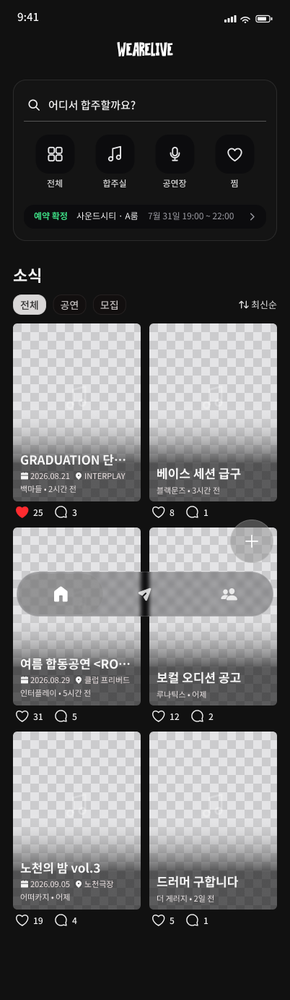 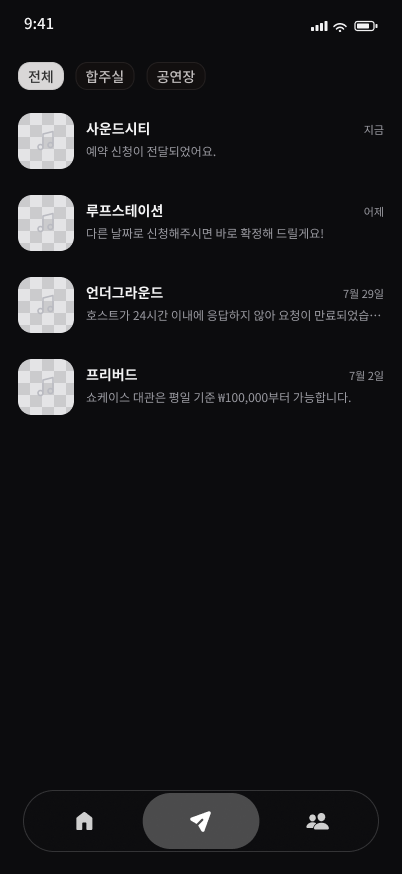 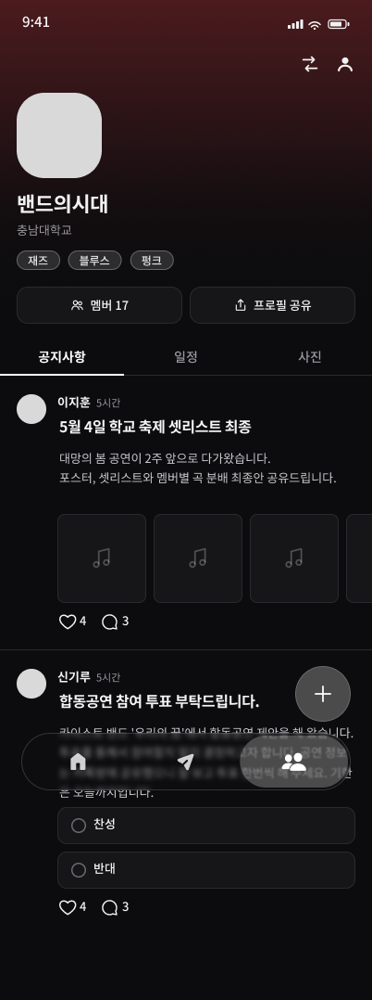

_홈 — 대관 검색·카테고리·예약 배너·소식 피드 · 메시지 — 호스트 대화 목록 · 프로필 — 밴드 페이지(공지사항 탭)_

네비게이션 바 [F]: 356×62, 모서리 100(필), 배경 rgba(16,16,18,.32) + 흰 16% 보더 + blur 3(글래스). 활성 탭은 116.7×56 rgba(139,139,139,.5) 필. 아이콘 24(비활성)/28(활성). 배지·도트 없음.

### 2.2 진입 관계 (주요 경로)

| 출발 | 동작 | 도착 |
|---|---|---|
| 앱 실행 | 미로그인 | 온보딩_로그인 (스플래시 프레임 없음) |
| 온보딩_로그인 | 소셜 인증 성공 · 신규 | 온보딩_프로필(1/3) → 온보딩_밴드선택(2/3) → 밴드생성 또는 초대코드(3/3) → 프로필(밴드 페이지) + 토스트 |
| 온보딩_로그인 | 소셜 인증 성공 · 기존 회원 | 홈 [결정 Q2] |
| 홈 | 검색바 탭 | 검색 모달 → 결과 → 상세 |
| 홈 | 카테고리 칩(전체/합주실/공연장/찜) | 대관 리스트(대관_전체 · 합주실 · 공연장 · 찜) |
| 홈 | 예약 확정 배너 탭 | 예약 상세 [결정 D-31] |
| 홈 | 소식 카드 탭 / FAB(+) | 소식상세 / 소식올리기 |
| 대관 리스트 · 결과 | 카드 탭 | 상세 / A룸 |
| 상세 | 호스트 카드 › / '전체 보기' | 호스트프로필 / 후기전체 |
| 상세 | 하단 일시 영역 탭 | 오버레이_날짜시간(바텀시트) → 적용 → 상세 하단 바 갱신 |
| 상세 | [예약하기] | 예약확인 → [₩N 결제하기] → 예약완료 |
| 예약확인 | '수정' | 오버레이_예약수정(바텀시트) |
| 예약완료 | [예약 내역 보기] / [홈으로 돌아가기] | 예약내역 / 홈 |
| 호스트프로필 | [호스트에게 메시지 보내기] | 채팅방(사전 문의 DM) |
| 채팅목록 | 행 탭 | 채팅방(예약 대화 또는 문의 대화) |
| 프로필 | ⇄ / 👤 / [👥 멤버 N] / [⇧ 프로필 공유] | 밴드전환 / 내정보 / 프로필_멤버 / OS 공유 시트 [추정] |
| 프로필 공지사항 탭 | FAB(+) / 공지 카드 탭 | 공지작성 / 공지상세 |
| 프로필 일정 탭 | FAB(+) | 일정만들기 |
| 프로필 사진 탭 | 앨범 타일 / FAB(+) | 앨범 상세 / 사진올리기(OS 갤러리) |
| 프로필_멤버 | [멤버 초대하기 ›] / 행 탭 / ⚙ | 초대 코드 발급(코드·복사·공유) [결정 D-08, 화면 추가] / 멤버프로필 / 멤버 관리(강퇴·대표 넘기기·관리자) [결정 D-07, 화면 추가] |
| 내정보 | 메뉴 6 | 계정정보 / 예약 내역 [결정 D-31] / 밴드 관리(→ 밴드전환 [추정]) / 알림설정 / 좋아요 / 결제수단 / 고객센터(1:1 문의 = 카카오톡 채널) / 회원 탈퇴 [결정 D-38] |

### 2.3 화면 목록

| 화면 ID | 화면 | 대표 프레임 (노드 ID · 치수) | 상태 변형 프레임 | 요구 ID |
|---|---|---|---|---|
| S-A1 | 로그인 | 온보딩_로그인 (351:33098 · 402×874) | — | WL-AUTH-01 |
| S-A2 | 프로필 설정 1/3 | 온보딩_프로필 (352:33119) | _입력 · _이름 · _빈 | WL-AUTH-02 |
| S-A3 | 밴드 선택 2/3 | 온보딩_밴드선택 (353:33143) | — | WL-AUTH-03 |
| S-A4 | 밴드 만들기 3/3 | 온보딩_밴드생성 (353:33178) | _입력 · _이름 · _소속 · _장르1 · _장르2 | WL-AUTH-04 |
| S-A5 | 초대 코드 3/3 | 온보딩_초대코드 (358:33421) | _빈 | WL-AUTH-05 |
| S-A6 | 완료(밴드 프로필+토스트) | 온보딩_생성완료 (360:33251) | 온보딩_참여완료 (360:34470 · 402×1088) | WL-AUTH-06 |
| S-H1 | 홈 | 홈 (66:15814 · 402×1382) | 홈_소식_인기순 · _공연 · _모집 | WL-NEWS-01 · WL-VENUE-01 · WL-BOOK-06 |
| S-N1 | 소식 상세 | 소식상세_여름합동공연 (153:24724 · 402×1090) | _좋아요 · 소식상세_보컬오디션 | WL-NEWS-02 |
| S-N2 | 소식 올리기 | 소식올리기 (166:24810 · 402×922) | _캘린더 · _날짜선택 · _모집 | WL-NEWS-03 |
| S-V1 | 대관 리스트 | 대관_전체 (27:1896 · 402×1342) | _합주실 · _공연장 · _찜 · _찜_있음 · _공연장_찜 | WL-VENUE-02 · 03 |
| S-V2 | 검색 모달 | 검색 (27:1853) | _어디서(_서울) · _언제_선택전/선택 · _시간_선택전/선택 · _인원_선택전/선택 · _필터_선택전/주차/주차드럼 · _완료_필터 | WL-VENUE-04 |
| S-V3 | 검색 결과 | 결과_필터 (43:6399 · 402×882) | _정렬메뉴 · _가격순 · _합주실_8월2일 · _공연장_9월12일 | WL-VENUE-05 |
| S-V4 | 공간 상세 | 상세 / A룸 (49:7596 · 402×2112) | / B룸 · / C룸 · / 소개펼침 · / 정책펼침(2,3) · / 11일 | WL-VENUE-06 · 07 |
| S-V5 | 일시 선택 바텀시트 | 오버레이_날짜시간 (96:20346) | _11일 · _11일_20시 · _11일_4시간 · 오버레이_예약수정 | WL-BOOK-01 |
| S-V6 | 호스트 프로필 | 호스트프로필 (61:10984 · 402×1046) | — | WL-VENUE-08 |
| S-V7 | 후기 전체 | 후기전체 (61:11297 · 402×1027) | — | WL-VENUE-09 |
| S-B1 | 예약 확인(결제) | 예약확인_11일 (104:15492) | _카카오 · _토스 · _삼성 · _애플 | WL-BOOK-02 · WL-PAY-01 · 02 |
| S-B2 | 예약 완료(신청) | 예약완료_11일 (106:16967) | — | WL-BOOK-03 |
| S-B3 | 예약 내역 | 예약내역 (376:32227) | — | WL-BOOK-04 |
| S-C1 | 채팅 목록 | 채팅목록 (108:15074) | _확정 · _합주실 · _공연장 | WL-CHAT-01 |
| S-C2 | 채팅방 | 채팅방 (108:16198) | _확정 · _루프스테이션(거절) · _언더그라운드(만료) · _프리버드(문의) | WL-CHAT-02 ~ 04 |
| S-P1 | 밴드 프로필 · 공지사항 탭 | 프로필 (236:27197 · 402×1078) | _공지_새공지 · _공지_투표공지 · _공지_일정공유 · 프로필_인터하이 | WL-BAND-01 · WL-NOTICE-01 |
| S-P2 | 공지 작성 | 공지작성_빈 (332:28058) | _작성 · _투표on | WL-NOTICE-02 · 03 |
| S-P3 | 공지 상세(일정 공유형) | 공지상세_일정 (318:28110) | — | WL-NOTICE-04 · WL-SCHED-03 |
| S-P4 | 일정 탭 | 프로필_일정 (249:27341 · 402×978) | _추가됨 | WL-SCHED-01 |
| S-P5 | 일정 만들기 | 일정만들기_빈 (329:28046) | _작성 · _제목입력 · _캘린더(20) · _시간휠 · _시간6시 · _종료9시 · _종료10시 | WL-SCHED-02 |
| S-P6 | 사진 탭(앨범 목록) | 프로필_사진 (249:27505 · 402×1065) | _연습영상 | WL-PHOTO-01 |
| S-P7 | 앨범 상세 | 앨범_공연_NEW (339:28593) | 앨범_공연 · _추억_NEW · _연습영상_NEW | WL-PHOTO-02 |
| S-P8 | 사진 올리기 · 앨범 선택 · 앨범 만들기 | 사진올리기_갤러리 (339:29262) | _1선택 · _시트 · 앨범선택(_공연 · _연습영상) · 앨범만들기_모달 · _입력 | WL-PHOTO-03 · 04 |
| S-P9 | 멤버 목록 | 프로필_멤버 (253:27409 · 402×1705) | — | WL-MEMBER-01 · 02 · 04 |
| S-P10 | 멤버 프로필 | 멤버프로필 (259:27463 · 402×922) | — | WL-MEMBER-03 |
| S-P11 | 밴드 전환 | 밴드전환 (253:27529 · 402×922) | _인터하이 | WL-BAND-02 |
| S-M1 | 내정보 | 내정보 (253:27594 · 402×922) | — | WL-MY-01 |
| S-M2 | 계정 정보 / 수정 | 계정정보 (272:27595) | 계정정보수정 (272:27543) | WL-MY-02 |
| S-M3 | 알림 설정 | 알림설정 (274:27585) | — | WL-NOTI-01 |
| S-M4 | 좋아요 | 좋아요 (274:27637) | — | WL-MY-03 |
| S-M5 | 결제수단 | 결제수단 (274:27850) | — | WL-PAY-03 |
| S-M6 | 고객센터 | 고객센터 (274:27896) | — | WL-MY-04 |

> 프레임이 없는 화면 (v2.1) — 결정으로 새로 그려야 할 화면: 예약 상세·취소 · 일정 상세 · 초대 코드 발급 · 멤버 관리(강퇴·대표 넘기기·관리자) · 밴드 삭제/활동 종료 투표 · 신고·차단 · 회원 탈퇴 · 예약 확인의 밴드 선택 · 후기 작성 · 가게용 웹 전체(14장). 여전히 미정: 스플래시 · 공유 시트(D-19) · 지도(D-22) · 결제 실패(D-29 일부). 1차에 만들지 않음: 알림 센터(D-42) · 이메일 가입(D-01) · 1:1 문의 폼(D-40).

---

## 3 · 회원가입 · 온보딩 (AUTH)

첫 실행부터 밴드에 소속되기까지의 공통 3단계. 신 시안은 소셜 로그인 2종만 제공하고, 프로필 → 밴드 선택 → 밴드 만들기/초대 코드 참여를 모든 사용자가 거친다.

### WL-AUTH-01 소셜 로그인 (카카오 · 구글)

앱의 첫 화면. 이메일 폼 없이 카카오·구글 계정으로 시작한다.

**화면:** 온보딩_로그인 (351:33098 · 402×874)  
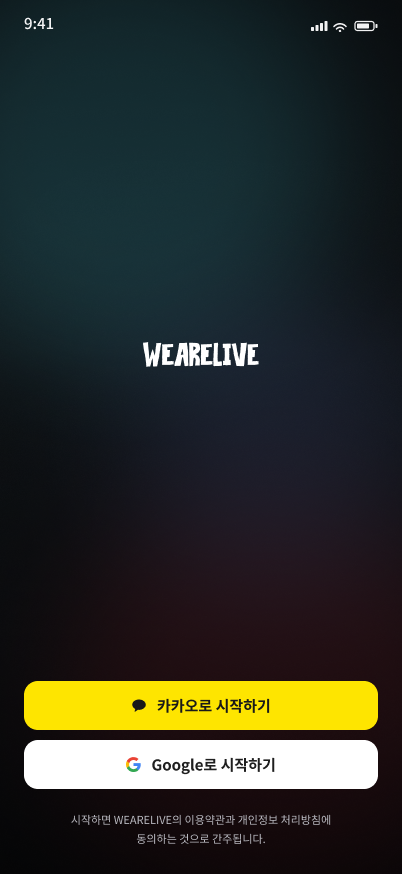

**화면 구성(있음)**

- 풀스크린 배경 이미지(무대 사진) 위 WEARELIVE 로고 [F]
- [카카오로 시작하기] — 노랑 버튼 / [Google로 시작하기] — 흰 버튼 [F]
- 하단 안내: '시작하면 WEARELIVE의 이용약관과 개인정보 처리방침에 동의하는 것으로 간주됩니다.' [F]

**사용자 흐름**

- 앱 실행 → (스플래시 프레임 없음) → 로그인 화면
- 버튼 탭 → 제공자 OAuth → 성공 시: 신규 사용자 → 온보딩_프로필(1/3) / 기존 사용자 → 홈 [결정 Q2]
- 실패·취소 → 로그인 화면 유지 [추정, 오류 상태 프레임 없음]

**규칙·정책**

- 회원가입 = 로그인 (별도 가입 폼 없음). 최초 소셜 인증 시 계정 생성.
- 일반(이메일·비밀번호) 가입: 시안 없음 → [결정 D-01] 1차(안드로이드)엔 카카오·구글만, 이메일 가입은 iOS 출시 때 재검토
- Sign in with Apple: 없음. iOS 배포 시 App Store 심사 지침 4.8(서드파티 로그인 제공 시 애플 로그인 요구) 검토 필요 → [결정 D-02] 1차엔 없음, iOS 출시 때 애플 로그인(또는 4.8 동급 대안) 재결정
- 약관·개인정보처리방침 '동의 간주' 문구만 있고 링크·페이지 없음 → [결정 D-03] 로그인 문구의 '이용약관'·'개인정보 처리방침'에 웹 링크
- 게스트(비로그인) 둘러보기 없음 — 로그인이 첫 화면 [F]

**데이터**

- USER(id, provider ∈ {kakao, google}, provider_uid, email?, created_at)
- 동일인이 카카오·구글 둘 다로 가입할 때 → 병합하지 않고, 같은 이메일이면 두 번째 가입을 막고 안내 [결정 Q5] (카카오가 이메일을 주지 않으면 판별 불가 — 처리 방식 별도)

**예외·미정**

- 탈퇴 계정 재가입, 인증 실패, 네트워크 오류 화면 없음
- 로그인 유지(세션·토큰 만료) 정책 없음

### WL-AUTH-02 프로필 설정 (1/3)

가입 직후 밴드 멤버에게 보여질 사진·이름·포지션을 입력한다. 초대 코드로 합류하는 사용자도 이 단계를 거친다.

**화면:** 온보딩_프로필 (352:33119 · 402×874)  
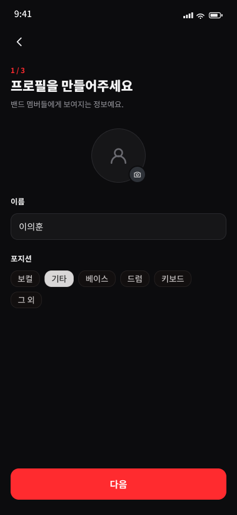

**화면 구성(있음)**

- 진행 표시 '1/3' · 제목 '프로필을 만들어주세요' · 부제 '밴드 멤버들에게 보여지는 정보예요' [F]
- 프로필 사진(원형 플레이스홀더 + 카메라 배지) [F]
- 이름 입력 필드 [F] (상태 프레임: 온보딩_프로필_입력 · _이름)
- 포지션 칩 6: 보컬 / 기타 / 베이스 / 드럼 / 키보드 / 그 외 — 한 개 선택된 상태만 존재 [F]
- [다음] 버튼(레드, 366 폭) [F]

**사용자 흐름**

- 사진 탭 → OS 사진 선택 [추정] → 이름 입력 → 포지션 선택 → [다음] → 온보딩_밴드선택

**규칙·정책**

- 이름·포지션 필수 [추정 — 버튼 비활성 조건은 프레임에 없음]
- 포지션 단일 선택 [추정 — 다중 선택 상태 프레임 없음]. 멤버 목록에는 바이올린·퍼커션·코러스 등 6종 밖의 값이 보이므로 '그 외' 선택 시 자유 입력이 필요할 수 있음 → [결정 D-04] 6종 칩 유지 + '그 외' 선택 시 직접 입력
- 이름은 실명 정책과 연결됨(계정정보수정: '실명과 실제 활동 지역을 입력해주세요') [F]

**데이터**

- USER.avatar_url, USER.name, USER.position

**예외·미정**

- 이름 길이·중복·금칙어 규칙 없음
- 사진 용량·크롭 규격 없음

### WL-AUTH-03 밴드 선택 (2/3)

새 밴드를 만들지, 초대 코드로 기존 밴드에 참여할지 고른다. 밴드 없이 진행하는 경로는 없다.

**화면:** 온보딩_밴드선택 (353:33143 · 402×874)  
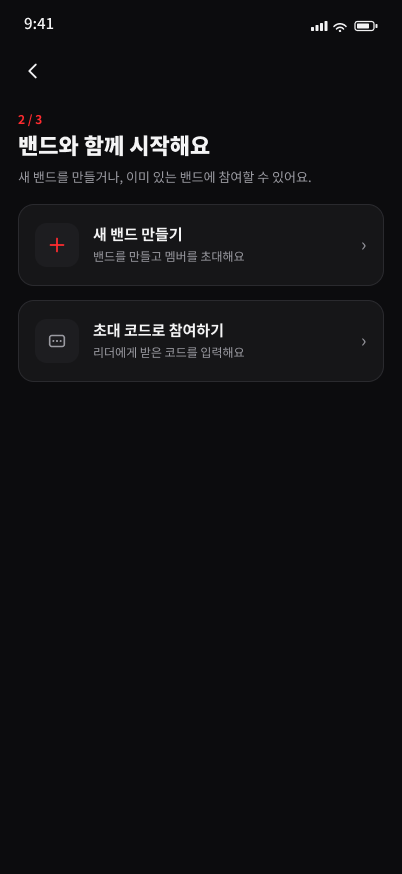

**화면 구성(있음)**

- 진행 표시 '2/3' · 제목 '밴드와 함께 시작해요' [F]
- 카드 ① '새 밴드 만들기 — 밴드를 만들고 멤버를 초대해요' [F]
- 카드 ② '초대 코드로 참여하기 — 리더에게 받은 코드를 입력해요' [F]

**사용자 흐름**

- 카드 ① → 온보딩_밴드생성(3/3) / 카드 ② → 온보딩_초대코드(3/3)

**규칙·정책**

- 건너뛰기 없음 → 모든 계정은 최소 1개 밴드에 소속 [F]. 대관만 쓰려는 사용자(밴드 없는 개인)의 경로가 없음 → [결정 D-05] '나중에 하기' 허용 → 프로필 탭은 빈 상태 + 밴드 만들기/참여 안내

**데이터**

- —

**예외·미정**

- 뒤로 가기 시 프로필 입력값 보존 여부

### WL-AUTH-04 밴드 만들기 (3/3)

밴드 이름·소속·장르를 입력해 밴드를 생성한다. 만든 사람이 밴드의 대표(리더)가 된다.

**화면:** 온보딩_밴드생성 (353:33178 · 402×874)  
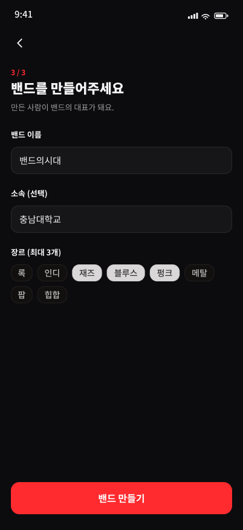

**화면 구성(있음)**

- 진행 표시 '3/3' · 제목 '밴드를 만들어주세요' · 부제 '만든 사람이 밴드의 대표가 돼요' [F]
- 밴드 이름 입력 [F]
- 소속(선택) — 자유 텍스트, 더미 '충남대학교' [F]
- 장르(최대 3개) 칩 8: 록 / 인디 / 재즈 / 블루스 / 펑크 / 메탈 / 팝 / 힙합 [F] (상태: _장르1 · _장르2)
- [밴드 만들기] [F]

**사용자 흐름**

- 입력 → [밴드 만들기] → 밴드 생성 → 프로필(밴드 페이지, 공지 빈 상태) + 토스트 '밴드의시대 밴드를 만들었어요' · 멤버 1 [F 온보딩_생성완료]

**규칙·정책**

- 밴드 이름 필수, 소속 선택, 장르 0~3개 [추정: 최대 3 표기는 F, 최소는 미표시]
- 생성자 = 대표(리더). 대표는 소식 올리기 권한을 가짐(WL-NEWS-03) [F]
- 밴드 유형(상설/기한제)·활동 기간·산하 여부 입력 없음 [F] — 기한제 밴드 개념 삭제
- '소속'이 학교인지 단체인지 정의 없음 → [결정 D-06] 학교(목록 선택) / 직장인 밴드 / 기타(직접 입력). 밴드 프로필 헤더에 그대로 노출됨

**데이터**

- BAND(id, name, affiliation?, genres[≤3], image_url?, created_by, created_at)
- BAND_MEMBER(band_id, user_id, role ∈ {leader, member}, position, joined_at, sort_order)

**예외·미정**

- 밴드 이름 중복 허용 여부
- 밴드 이미지 업로드 = 밴드 프로필 편집에서만(온보딩에는 없음) [결정 Q16]
- 대표 위임·복수 대표 여부 → [결정 D-07] ⚙ = 강퇴 + 대표 넘기기 + 관리자 지정·해제(대표 전용)

### WL-AUTH-05 초대 코드로 참여 (3/3)

리더에게 받은 6자리 코드를 입력해 기존 밴드에 합류한다.

**화면:** 온보딩_초대코드 (358:33421 · 402×874)  
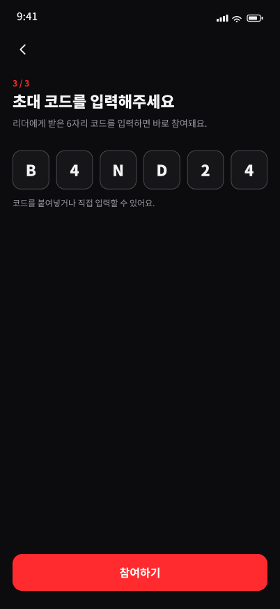

**화면 구성(있음)**

- 제목 '초대 코드를 입력해주세요' 계열 · 안내 '리더에게 받은 6자리 코드를 입력하면 바로 참여돼요' [F]
- 6칸 코드 입력(더미 B4ND24 — 영숫자) · 안내 '코드를 붙여넣거나 직접 입력할 수 있어요' [F] (빈 상태: 온보딩_초대코드_빈)
- [참여하기] [F]

**사용자 흐름**

- 코드 입력(붙여넣기 지원) → [참여하기] → 검증 성공 → 프로필(기존 공지가 있는 밴드 페이지) + 토스트 '밴드의시대에 참여했어요' · 멤버 17 [F 온보딩_참여완료]

**규칙·정책**

- 코드 형식: 6자리 영숫자 [F]
- 발급 주체: 밴드 리더 — 프로필_멤버의 [멤버 초대하기 ›] (WL-MEMBER-02) [F, 발급 화면은 없음]
- 오류(존재하지 않음·만료·이미 소속) 상태 프레임 없음 → [결정 D-08] 7일 만료·기간 내 여러 명 사용·재발급, 발급 화면 = 코드 + 복사 + 공유
- 코드 만료·1회성·재발급 규칙 없음 → [결정 D-08] 7일 만료·기간 내 여러 명 사용·재발급, 발급 화면 = 코드 + 복사 + 공유

**데이터**

- INVITE_CODE(code, band_id, created_by, expires_at?, max_uses?) [추정 엔티티]
- 성공 시 BAND_MEMBER(role=member) 생성

**예외·미정**

- 가입 승인(리더 확인) 단계 없음 — 코드만 있으면 즉시 합류 [F]

### WL-AUTH-06 온보딩 완료 · 첫 진입

별도 완료 화면 없이 밴드 프로필로 진입하고 토스트로 결과를 알린다.

**화면:** 온보딩_생성완료 (360:33251 · 402×874) · 온보딩_참여완료 (360:34470 · 402×1088)  
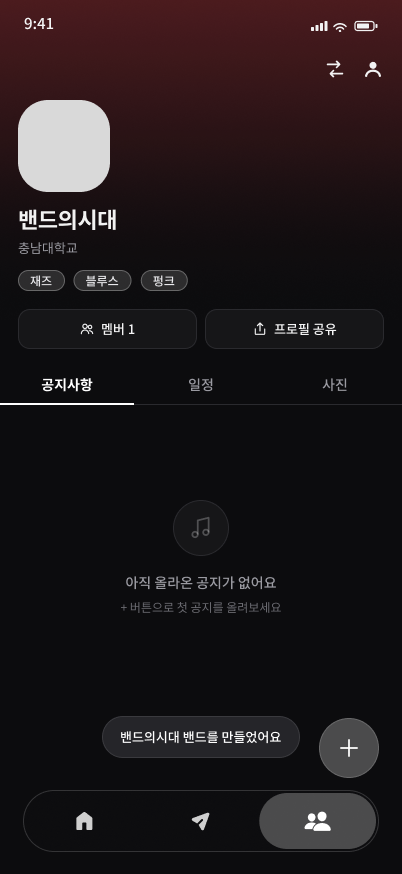 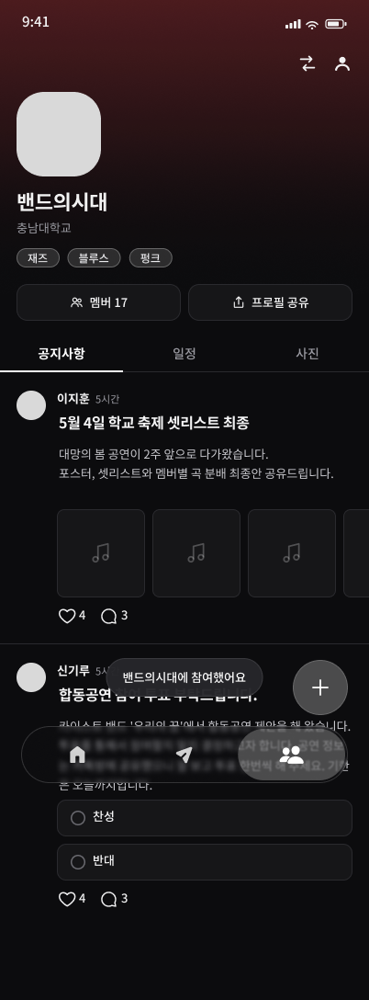

**화면 구성(있음)**

- 생성: 공지 빈 상태 '아직 올라온 공지가 없어요 / + 버튼으로 첫 공지를 올려보세요' + 토스트 '밴드의시대 밴드를 만들었어요' · 멤버 1 [F]
- 참여: 기존 공지 카드가 있는 프로필 + 토스트 '밴드의시대에 참여했어요' · 멤버 17 [F]

**사용자 흐름**

- 완료 후 첫 화면 = 프로필 탭(밴드 페이지) [F]. 홈이 아님

**규칙·정책**

- 토스트 컴포넌트 신설 — 표시 시간·위치 규격 [미정]

**데이터**

- USER.current_band_id = 방금 만들거나 참여한 밴드 [추정]

**예외·미정**

- 온보딩 중 이탈(앱 종료) 시 멈춘 단계부터 재개 [결정 Q7]

---

## 4 · 밴드 (BAND · NOTICE · SCHED · PHOTO · MEMBER)

'프로필' 탭은 현재 선택된 밴드의 페이지다. 헤더 아래 공지사항 / 일정 / 사진 3개 서브탭이 있고, FAB(+)는 탭별 작성 화면으로 연결된다. 멤버·밴드 전환·내정보는 헤더에서 진입한다.

### 4.1 밴드 프로필 · 전환

### WL-BAND-01 밴드 프로필 헤더 · 서브탭

밴드의 대표 이미지·이름·소속·장르·멤버 수를 보여주는 페이지 헤더와 3개 서브탭.

**화면:** 프로필 (236:27197 · 402×1078)  

**화면 구성(있음)**

- 상단 라디얼 레드 그라디언트 헤더 [F] · 우상단 ⇄(밴드 전환) · 👤(내정보) [F]
- 밴드 이미지(원형) · 밴드명 '밴드의시대' · 소속 '충남대학교' · 장르 칩(재즈/블루스/펑크) [F]
- [👥 멤버 17] · [⇧ 프로필 공유] [F]
- 서브탭 3: 공지사항 / 일정 / 사진 [F]
- FAB(+) · 하단 3탭 네비(프로필 활성) [F]

**사용자 흐름**

- [👥 멤버 N] → 프로필_멤버 · [⇧ 프로필 공유] → OS 공유 시트 [추정, 프레임 없음] · ⇄ → 밴드전환 · 👤 → 내정보

**규칙·정책**

- 헤더에 알림 종 없음(구 명세와 다름) [F]
- 밴드 소개 글·활동 이력·프로필 서브탭 없음 [F]
- 밴드 이미지·이름·소속·장르 수정 화면 없음 → [결정 D-09] 대표 + 관리자(대표가 지정, 여러 명)

**데이터**

- BAND 표시 필드: image_url, name, affiliation, genres[], member_count(집계)

**예외·미정**

- 프로필 공유 URL(딥링크) 형식 [미정] D-19
- 다른 밴드의 프로필(비소속 밴드 페이지) 열람 경로 없음 — 밴드 탐색 기능 삭제됨 [F]

### WL-BAND-02 밴드 전환 · 순서 변경

여러 밴드에 소속된 사용자가 프로필 탭에 표시할 밴드를 바꾸고, 목록 순서를 조정한다.

**화면:** 밴드전환 (253:27529 · 402×922)  
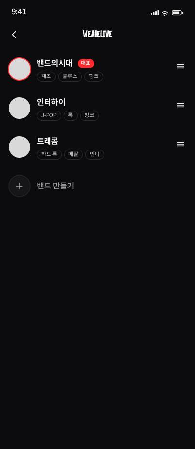

**화면 구성(있음)**

- 밴드 목록 행: 아바타 · 이름 · '대표' 배지(대표인 밴드) · 장르 칩 · ≡ 드래그 핸들 [F] — 더미: 밴드의시대 / 인터하이 / 트래콤
- [+ 밴드 만들기] [F]

**사용자 흐름**

- 행 탭 → 해당 밴드가 프로필 탭에 반영(프로필_인터하이: 대전대학교 · J-POP/록/펑크) [F]
- ≡ 드래그 → 순서 변경 [F] · [+ 밴드 만들기] → 온보딩_밴드생성과 같은 폼 [추정]

**규칙·정책**

- 한 사용자가 여러 밴드에 소속 가능(다중 소속) [F]. 밴드별 역할(대표/멤버)은 독립
- 소식올리기의 밴드 선택, 내정보·계정정보의 '소속 밴드' 복수 표기와 데이터 정합 필요

**데이터**

- USER.current_band_id
- BAND_MEMBER.sort_order(사용자별 정렬)

**예외·미정**

- 밴드 탈퇴·삭제 없음 → [결정 D-10] 멤버 탈퇴 가능 · 밴드 삭제 = 대표 제안 → 3일 투표, 전체 2/3 찬성 · 활동 종료(아카이빙) = 과반
- 내정보 '밴드 관리' 메뉴의 목적지가 이 화면인지 [추정]

### 4.2 공지사항

### WL-NOTICE-01 공지사항 피드

밴드 멤버에게만 보이는(private) 공지 목록. 카드에 투표·사진·좋아요·댓글이 붙는다.

**화면:** 프로필 (236:27197 · 402×1078) · 프로필_공지_투표공지 (335:28200 · 402×1477)  
 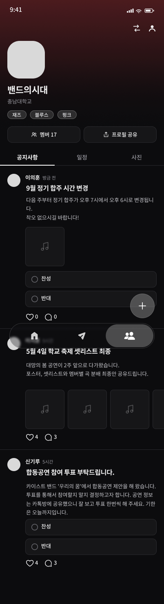

**화면 구성(있음)**

- 공지 카드: 작성자 · N시간 전 · 제목 · 본문 · 사진 타일 · 찬성/반대 투표 블록 · ♡4 · 💬3 [F]
- 빈 상태: '아직 올라온 공지가 없어요 / + 버튼으로 첫 공지를 올려보세요' [F 온보딩_생성완료]
- 일정 공유형 공지 카드(일정 박스 포함) [F 프로필_공지_일정공유]
- FAB(+) → 공지작성 [F]

**사용자 흐름**

- 카드 탭 → 공지 상세 [추정: 일정 공유형만 프레임 있음] · ♡ 탭 → 좋아요 토글 · 투표 버튼 탭 → 투표 반영

**규칙·정책**

- 정렬 최신순 [추정]
- 핀 고정 없음 [F]
- 공지는 밴드 멤버만 열람 [결정 Q19] — 밖에 알릴 내용은 소식(홈 피드)으로

**데이터**

- NOTICE(id, band_id, author_id, title, body, photos[≤10], poll_id?, event_id?, created_at) — scope=band
- NOTICE_LIKE, COMMENT(target=notice)

**예외·미정**

- 작성 권한(대표만? 전원?) 표시 없음 → [결정 D-11] 공지·일정·사진 작성 = 멤버 전원
- 수정·삭제 UI 없음 → [결정 D-12] 공지·일정·사진·앨범 수정·삭제 = 작성자·대표·관리자, 소식 = 대표

### WL-NOTICE-02 공지 작성

제목·본문·사진(최대 10)·투표를 넣어 공지를 올린다. 소식(public)과 완전히 분리된 화면.

**화면:** 공지작성_빈 (332:28058 · 402×874)  
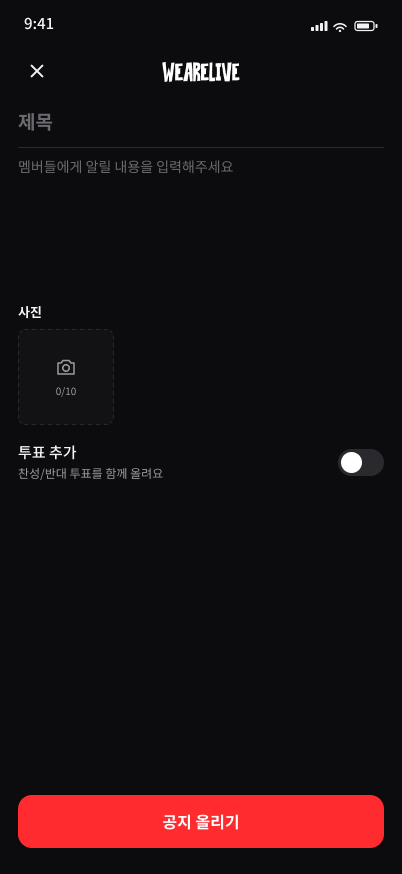

**화면 구성(있음)**

- 제목 입력 · 본문 입력('멤버들에게 알릴 내용을 입력해주세요') [F]
- 사진 타일: 추가(0/10) · 각 타일 ✕ 삭제 [F]
- '투표 추가 — 찬성/반대 투표를 함께 올려요' 토글 [F]
- [공지 올리기] [F]

**사용자 흐름**

- 작성(공지작성_작성) → 투표 토글 on → 찬성/반대 미리보기 표시(공지작성_투표on) → [공지 올리기] → 피드 상단에 카드(프로필_공지_새공지) [F]

**규칙·정책**

- 제목 필수 [추정] · 사진 최대 10장 [F] · 공개 범위 선택 없음(항상 밴드 내부) [F]

**데이터**

- NOTICE + PHOTO[] + POLL(options=[찬성, 반대])

**예외·미정**

- 임시 저장·이탈 경고 없음
- 사진 순서 변경 없음

### WL-NOTICE-03 공지 투표 (찬성 / 반대)

공지에 붙는 2지선다 투표.

**화면:** 공지작성_투표on (335:28142 · 402×874) · 프로필_공지_투표공지 (335:28200 · 402×1477)  
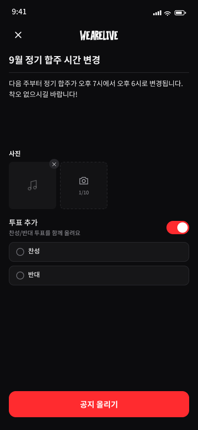 

**화면 구성(있음)**

- 작성 시: 토글 on → 찬성/반대 미리보기 [F]
- 피드 카드: 찬성 / 반대 버튼 블록 [F]

**사용자 흐름**

- 카드에서 찬성 또는 반대 탭 → 선택 반영 [F, 결과 집계 표시는 프레임에서 명확하지 않음]

**규칙·정책**

- 옵션 고정 2개(자유 항목 없음) [F]
- 1인 1표, 투표 변경 가능 [결정 Q17]
- 마감 시각·익명 여부 없음 → [결정 D-13] 마감 없음·변경 가능·공개, 결과 = 인원 수

**데이터**

- POLL(id, notice_id, options=[찬성, 반대]) · POLL_VOTE(poll_id, user_id, option, voted_at)

**예외·미정**

- 투표 결과 표시 = 인원 수(찬성 5 · 반대 2) [결정 Q18]

### WL-NOTICE-04 공지 상세 (일정 공유형)

일정 만들기에서 '게시글로 공유'한 공지의 상세. 일반 공지(사진·투표) 상세 프레임은 없다.

**화면:** 공지상세_일정 (318:28110 · 402×874)  
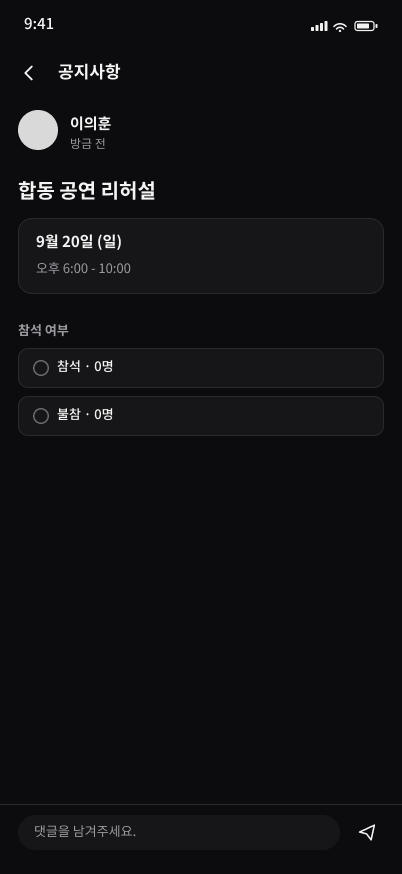

**화면 구성(있음)**

- 헤더 '‹ 공지사항' [F]
- 작성자 · '방금 전' · 제목 '합동 공연 리허설' [F]
- 일정 박스: 9월 20일 (일) · 오후 6:00-10:00 [F]
- 참석 여부: 참석 · 0명 / 불참 · 0명 (라디오) [F]
- 하단 댓글 입력 바 [F]

**사용자 흐름**

- 참석/불참 선택 → 집계 갱신(WL-SCHED-03) · 댓글 입력 → 목록 추가

**규칙·정책**

- 핀 고정·수정·삭제 UI 없음 [F]
- 일반 공지 상세는 같은 구조에서 일정 박스 대신 사진·투표가 들어가는 것으로 본다 [추정]

**데이터**

- NOTICE.event_id → SCHEDULE_EVENT · EVENT_RSVP

**예외·미정**

- 댓글 목록 표시 형식(작성자·시간·내용)은 소식 상세와 동일 [추정]

### WL-NOTICE-05 공지 댓글 · 좋아요

공지 카드의 ♡·💬 카운트와 상세의 댓글 입력.

**화면:** 프로필_공지_투표공지 (335:28200 · 402×1477)  

**화면 구성(있음)**

- 카드 하단 ♡4 · 💬3 [F] · 상세 하단 댓글 입력 바 [F]

**규칙·정책**

- 밴드 멤버만 댓글·좋아요 [추정]
- 댓글 수정·삭제·신고 없음 → [결정 D-12] 공지·일정·사진·앨범 수정·삭제 = 작성자·대표·관리자, 소식 = 대표

**데이터**

- COMMENT(id, target_type ∈ {news, notice}, target_id, author_id, body, created_at)
- LIKE(user_id, target_type, target_id)

### 4.3 일정

### WL-SCHED-01 일정 탭 (월 캘린더 · 목록)

밴드 일정을 월 캘린더와 일자별 리스트로 본다. 합주 조율(when2meet)·레디체크 기능은 없다.

**화면:** 프로필_일정 (249:27341 · 402×978)  
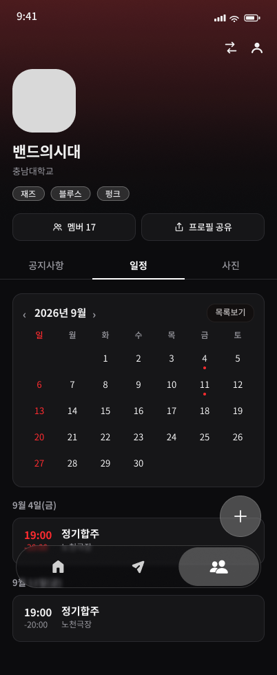

**화면 구성(있음)**

- 월 캘린더(2026년 9월): 일요일 빨강, 일정 있는 날 빨간 점 [F] · [목록보기] 버튼 [F]
- 일자별 리스트: '9월 4일(금) 19:00-20:00 정기합주 노천극장' / 9월 11일(금) … / (추가됨) 9월 20일(일) 18:00-22:00 합동 공연 리허설 [F]
- FAB(+) → 일정만들기 [F]

**사용자 흐름**

- 날짜 탭 → 해당 일자 리스트로 스크롤 [추정] · [목록보기] → 리스트 뷰 [F, 뷰 프레임 없음] · 리스트 항목 탭 → 일정 상세 [결정 Q21, 화면 추가 — WL-SCHED-05]

**규칙·정책**

- 일정 유형(공연/합주/회의)·색 구분 없음 — 시간만 빨강 텍스트 [F]
- 합주실 예약 확정과 밴드 일정 자동 연동 없음 [F] → 예약 확정 시 밴드 일정 자동 등록 [결정 Q22 — WL-BOOK-10]

**데이터**

- SCHEDULE_EVENT(id, band_id, title, all_day, start_at, end_at, place?, rsvp_enabled, share_to_feed, created_by)

**예외·미정**

- 일정 상세·수정·삭제 화면 없음 → [결정 D-12] 공지·일정·사진·앨범 수정·삭제 = 작성자·대표·관리자, 소식 = 대표
- 리스트에 장소('노천극장')가 보이지만 입력 필드는 없음 → [결정 D-14] 이번 버전엔 장소 필드 없음

### WL-SCHED-02 일정 만들기

제목과 시작/종료 일시를 입력하고, 참석 여부 확인·게시글 공유를 옵션으로 켠다.

**화면:** 일정만들기_빈 (329:28046 · 402×874) · 일정만들기_시간휠 (309:27940 · 402×874) · 일정만들기_종료10시 (315:28107 · 402×874)  
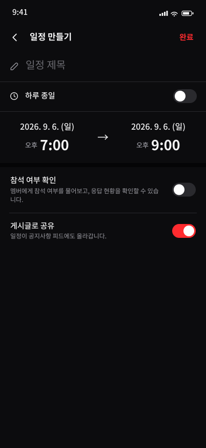 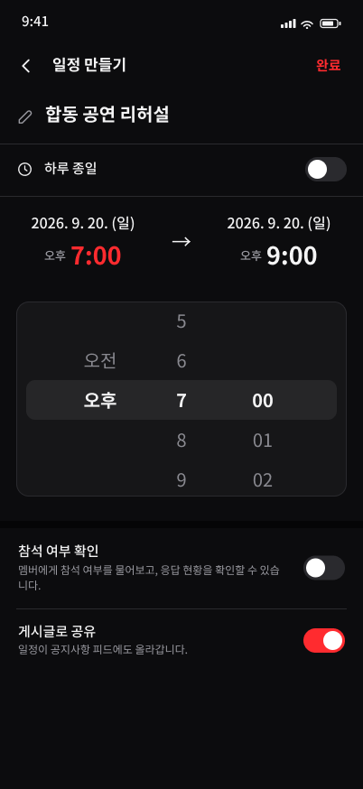 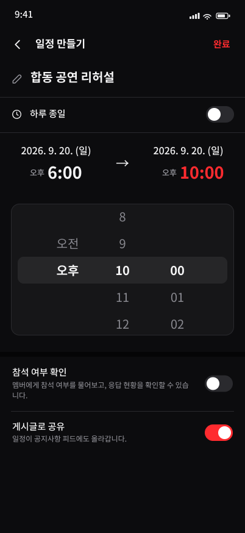

**화면 구성(있음)**

- 헤더 '‹ 일정 만들기' · [완료] [F]
- ✎ 제목 입력 · '하루 종일' 토글 [F]
- 시작 / 종료 일시 행: '2026. 9. 20. (일) 오후 6:00 → 오후 10:00' [F] — 날짜 탭 시 캘린더(일정만들기_캘린더), 시간 탭 시 오전/오후 · 시 · 분 휠(일정만들기_시간휠) [F]
- '참석 여부 확인 — 멤버에게 참석 여부를 물어보고, 응답 현황을 확인할 수 있습니다' 토글 [F]
- '게시글로 공유 — 일정이 공지사항 피드에도 올라갑니다' 토글 [F]

**사용자 흐름**

- 제목 입력(일정만들기_제목입력) → 시작·종료 선택(캘린더·휠) → 옵션 토글 → [완료] → 일정 탭에 추가(프로필_일정_추가됨) [F]
- 게시글로 공유 on → 공지 피드에 일정 공유 카드 생성(프로필_공지_일정공유) [F]

**규칙·정책**

- 종료 ≥ 시작 검증 [추정]
- 하루 종일 on → 시간 선택 숨김 [추정]
- 참석 여부 off인데 공지상세_일정에 참석/불참이 표시되는 프레임 불일치 → 상세는 rsvp_enabled=true일 때만 표시로 정의 [추정]

**데이터**

- SCHEDULE_EVENT + (share_to_feed → NOTICE.event_id)

**예외·미정**

- 장소 입력 없음 → [결정 D-14] 이번 버전엔 장소 필드 없음
- 반복 일정·알림(리마인드) 없음
- 작성·수정 권한 미표시 → [결정 D-11] 공지·일정·사진 작성 = 멤버 전원

### WL-SCHED-03 참석 여부 응답 (RSVP)

일정 공유 공지에서 멤버가 참석/불참을 선택하고 인원을 확인한다.

**화면:** 공지상세_일정 (318:28110 · 402×874)  

**화면 구성(있음)**

- 참석 · 0명 / 불참 · 0명 라디오 [F]

**규칙·정책**

- 1인 1응답, 변경 가능 [추정]
- 임계값(N−1 등) 없음 — 응답 현황만 표시 [F]
- 응답자 명단 표시 여부 [미정]

**데이터**

- EVENT_RSVP(event_id, user_id, status ∈ {attend, absent}, responded_at)

### WL-SCHED-04 게시글로 공유

일정을 공지사항 피드에 카드로 올린다(프레임: 프로필_공지_일정공유).

**화면:** 프로필_공지_투표공지 (335:28200 · 402×1477)  

**규칙·정책**

- 공유 카드 = 일정 박스 + 참석 여부 + 댓글(WL-NOTICE-04) [F]
- 일정 수정 시 공유 카드 동기화 [추정]

**데이터**

- NOTICE(kind=event, event_id)

### 4.4 사진 · 앨범

### WL-PHOTO-01 사진 탭 (앨범 목록)

밴드 사진을 앨범 단위로 관리한다. 기본 앨범 4개가 더미로 있고 사용자가 새 앨범을 만들 수 있다.

**화면:** 프로필_사진 (249:27505 · 402×1065)  
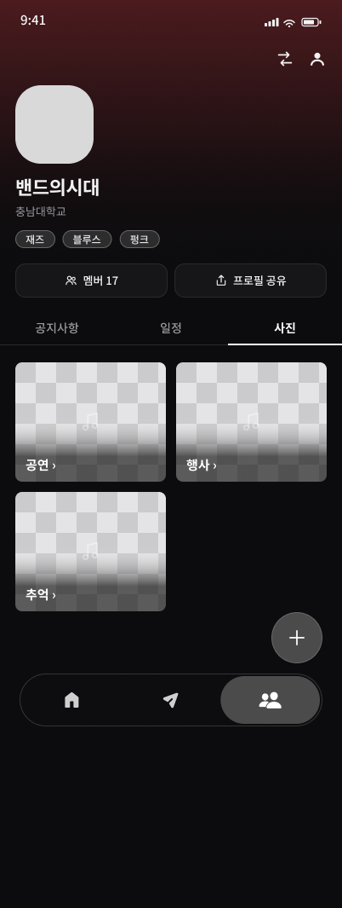

**화면 구성(있음)**

- 앨범 타일 2열: 공연 › / 행사 › / 추억 › / 연습 영상 › [F] (프로필_사진_연습영상: 연습 영상 앨범 강조 상태)
- FAB(+) → 사진올리기 [F]

**사용자 흐름**

- 타일 탭 → 앨범 상세 · FAB → OS 갤러리

**규칙·정책**

- 앨범 이름은 사용자 생성(앨범만들기) [F] — '연습 영상'처럼 영상도 앨범으로 취급하나 영상 재생 UI 없음 [미정]
- 공개 범위(public/members) 없음 → 밴드 멤버만 열람 [추정]

**데이터**

- ALBUM(id, band_id, name, cover_photo_id?, created_at) · PHOTO(id, band_id, album_id?, url, uploaded_by, created_at)

**예외·미정**

- 앨범 삭제·이름 변경·커버 변경 없음 → [결정 D-12] 공지·일정·사진·앨범 수정·삭제 = 작성자·대표·관리자, 소식 = 대표

### WL-PHOTO-02 앨범 상세

앨범의 사진을 3열 그리드로 본다.

**화면:** 앨범_공연_NEW (339:28593 · 402×874)  
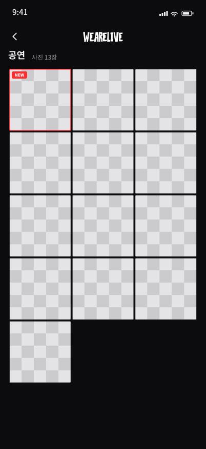

**화면 구성(있음)**

- 헤더 '공연 · 사진 13장' [F] · 3열 그리드 [F] · 새로 올라온 사진에 NEW 배지 [F]

**규칙·정책**

- NEW 기준 = 내가 마지막으로 본 뒤 올라온 사진 [결정 Q24b]
- 사진 탭 → 전체 화면 보기 [미정] · 사진 삭제 = 올린 사람·대표·관리자 [결정 Q24]

**데이터**

- PHOTO.created_at, USER_ALBUM_SEEN(user_id, album_id, seen_at) [추정]

### WL-PHOTO-03 사진 올리기 (다중 선택 → 올리기 방식 선택)

OS 갤러리에서 여러 장을 고른 뒤 바로 올리거나 앨범을 지정해 올린다.

**화면:** 사진올리기_갤러리 (339:29262 · 402×874) · 사진올리기_시트 (339:31896 · 402×874)  
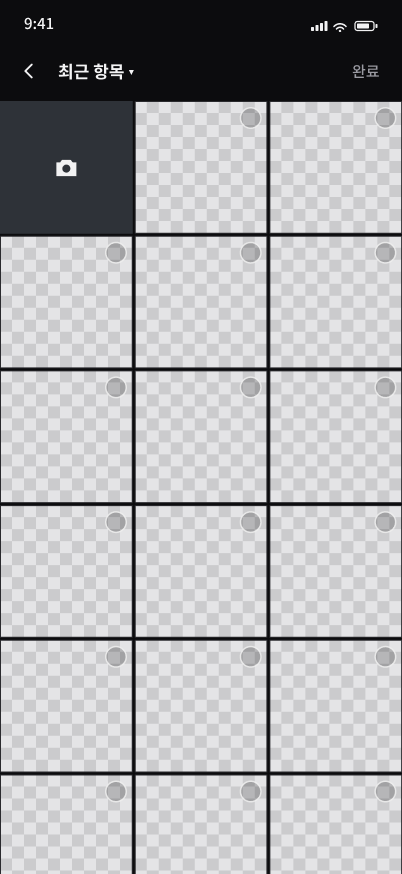 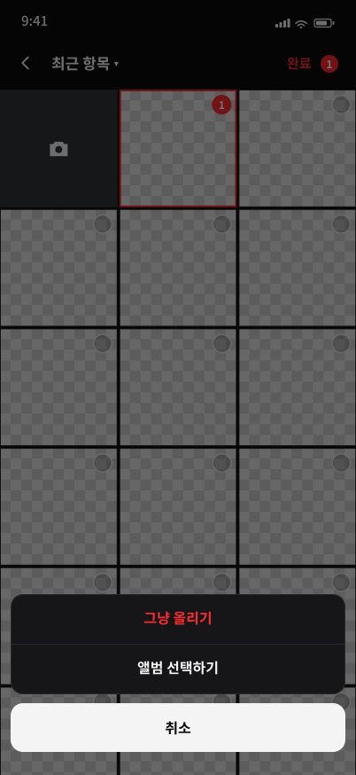

**화면 구성(있음)**

- OS 갤러리: '최근 항목 ▾' · 카메라 타일 · 다중 선택 카운트 · [완료 1] [F] (사진올리기_1선택)
- 액션시트: 그냥 올리기 / 앨범 선택하기 / 취소 [F]

**사용자 흐름**

- FAB(+) → 갤러리 → 선택 → [완료 N] → 액션시트 → '그냥 올리기' → 업로드 / '앨범 선택하기' → 앨범선택

**규칙·정책**

- 다중 업로드 [F] · 촬영(카메라 타일) 지원 [F]
- '그냥 올리기'의 소속(앨범 없음 vs 기본 앨범) → [결정 D-15] 앨범 없이 '전체 사진'에만 표시
- 업로드 권한(전원/관리자) 미표시 → [결정 D-11] 공지·일정·사진 작성 = 멤버 전원

**데이터**

- PHOTO[] (album_id nullable)

**예외·미정**

- 용량·개수 제한, 실패 재시도 없음

### WL-PHOTO-04 앨범 선택 · 앨범 만들기

올릴 앨범을 라디오로 고르거나 새 앨범을 만든다.

**화면:** 앨범선택_연습영상 (342:33099 · 402×874) · 앨범만들기_모달 (342:32985 · 402×874)  
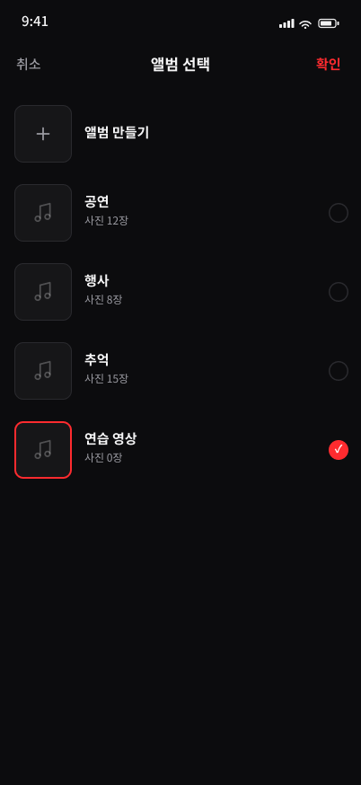 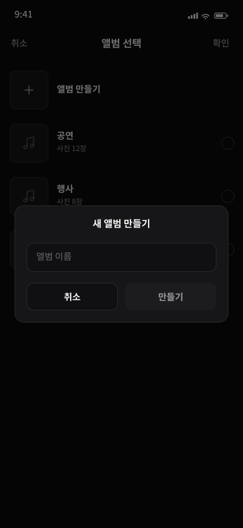

**화면 구성(있음)**

- 앨범 선택: [앨범 만들기] · 앨범 라디오(공연 12장 / 행사 8장 / 추억 15장 / 연습 영상 0장) · 취소 / 확인 [F]
- 새 앨범 만들기 모달: 이름 입력 · 취소 / 만들기 [F] (앨범만들기_입력)

**사용자 흐름**

- 앨범 선택 → 확인 → 업로드 · [앨범 만들기] → 모달 → 만들기 → 새 앨범이 라디오에 추가·선택 [추정]

**규칙·정책**

- 앨범 이름 필수, 중복 허용 여부 [미정]

**데이터**

- ALBUM 생성 후 PHOTO.album_id 지정

### 4.5 멤버

### WL-MEMBER-01 멤버 목록

밴드 멤버 전체를 이름·포지션과 함께 나열한다. 대표에게는 배지가 붙는다.

**화면:** 프로필_멤버 (253:27409 · 402×1705)  
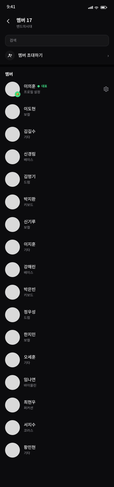

**화면 구성(있음)**

- 헤더 '‹ 멤버 17 / 밴드의시대' · 검색 [F]
- [멤버 초대하기 ›] (목록 상단) [F]
- 멤버 행 17: 아바타 · 이름 · 포지션 [F] — 대표 행: 👑 배지 · 초록 '대표' · '프로필 설정' · ⚙ [F]

**사용자 흐름**

- 행 탭 → 멤버프로필 · [멤버 초대하기 ›] → 초대 코드 발급(WL-MEMBER-02) · ⚙ → 멤버 관리(WL-MEMBER-04)

**규칙·정책**

- 검색 = 이름 필터 [추정]
- 정렬: 대표 우선 → 가입순 [추정]
- 포지션 값에 바이올린·퍼커션·코러스 등 온보딩 칩(6종) 밖의 값 존재 → 포지션 마스터 확장 또는 자유 입력 → [결정 D-04] 6종 칩 유지 + '그 외' 선택 시 직접 입력

**데이터**

- BAND_MEMBER + USER(name, avatar, position)

### WL-MEMBER-02 멤버 초대 (초대 코드 발급)

리더가 초대 코드를 발급해 공유한다. 진입점은 있으나 발급 화면 프레임은 없다.

**화면:** 프로필_멤버 (253:27409 · 402×1705)  

**사용자 흐름**

- [멤버 초대하기 ›] → 코드 표시·복사·공유 [추정]

**규칙·정책**

- 코드 6자리 영숫자(WL-AUTH-05와 동일) [F]
- 발급 권한: 리더만 [추정 — 문구 '리더에게 받은 코드']
- 만료·재발급·사용 횟수 → [결정 D-08] 7일 만료·기간 내 여러 명 사용·재발급, 발급 화면 = 코드 + 복사 + 공유

**데이터**

- INVITE_CODE

**예외·미정**

- 발급 화면 자체가 없음 → [결정 D-08] 7일 만료·기간 내 여러 명 사용·재발급, 발급 화면 = 코드 + 복사 + 공유

### WL-MEMBER-03 멤버 프로필

멤버 한 명의 정보를 읽기 전용 카드로 본다.

**화면:** 멤버프로필 (259:27463 · 402×922)  
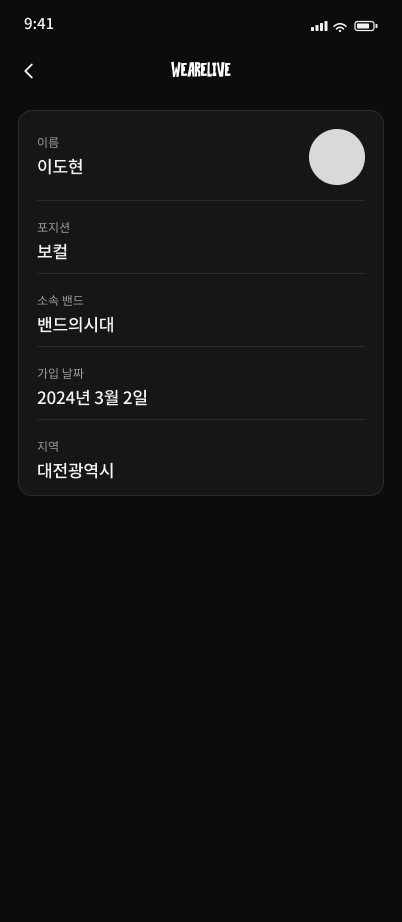

**화면 구성(있음)**

- 이름 / 포지션 / 소속 밴드 / 가입 날짜 / 지역 카드 [F]

**규칙·정책**

- DM 보내기·연락처 없음 [F] — 멤버 간 채팅 기능 없음
- 타 밴드 멤버 프로필 열람 경로 없음 [F]

**데이터**

- USER + BAND_MEMBER.joined_at, USER.region

### WL-MEMBER-04 멤버 관리 (⚙)

대표 행의 ⚙ 아이콘만 있고 관리 화면은 없다.

**화면:** 프로필_멤버 (253:27409 · 402×1705)  

**규칙·정책**

- ⚙ 멤버 관리 = 강퇴 · 대표 넘기기 · 관리자 지정·해제(대표 전용), 멤버 탈퇴는 본인이 [결정 D-07·D-10]
- '프로필 설정' 버튼(대표 행) → 밴드 프로필 편집으로 추정 → [결정 D-09] 대표 + 관리자(대표가 지정, 여러 명)

**예외·미정**

- 관리 화면 프레임 없음 — 최소 세트는 결정됨(D-07), 화면 추가 필요

---

## 5 · 소식 · 커뮤니티 (NEWS)

홈 하단의 공개(public) 피드. 밴드 대표만 소식을 올릴 수 있고, 누구나(로그인 사용자) 읽고 좋아요·댓글을 남긴다. 분류는 공연/모집 2종.

### WL-NEWS-01 홈 소식 피드

홈 화면 하단의 2열 카드 피드. 분류 칩과 정렬 토글이 있다.

**화면:** 홈 (66:15814 · 402×1382)  

**화면 구성(있음)**

- 섹션 타이틀 '소식' · 칩(전체 / 공연 / 모집) · 정렬 토글 '최신순'(→ 인기순, 홈_소식_인기순) [F]
- 2열 카드 177×270: 이미지 · 제목(17 Bold) · 📅 날짜 · 📍 장소 · 밴드명 · N시간 전 · ♡ 수 · 💬 수 [F]
- FAB(+) → 소식올리기 [F]
- 분류별 상태 프레임: 홈_소식_공연 · 홈_소식_모집 [F]

**사용자 흐름**

- 카드 탭 → 소식상세 · 칩 탭 → 필터 · 정렬 탭 → 최신순/인기순 전환

**규칙·정책**

- 분류 = performance(공연) / recruit(모집) 2종 [F] — '자유'·'공지' 없음
- 인기순 기준(좋아요·댓글·조회 가중치) → [결정 D-16] 좋아요 + 댓글 수
- HOT 배지 없음 [F]
- 무한 스크롤 [추정]

**데이터**

- NEWS(id, band_id, author_id, category ∈ {performance, recruit}, title, body, event_date?, place?, photos[≤10], like_count, comment_count, created_at)

**예외·미정**

- 빈 상태·로딩·오류 상태 프레임 없음

### WL-NEWS-02 소식 상세

히어로 이미지 위에 시트가 올라오는 상세. 댓글 목록과 입력 바를 포함한다.

**화면:** 소식상세_여름합동공연 (153:24724 · 402×1090)  
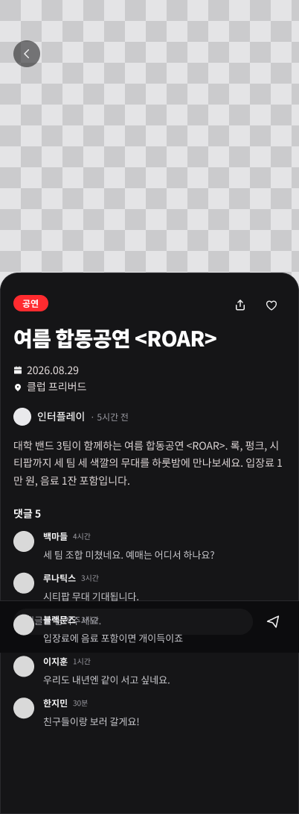

**화면 구성(있음)**

- 상단 이미지 402×395 + ‹ 원형 버튼 [F]
- 시트: 배지(공연/모집) · 공유 · ♡ · 제목 · 📅 2026.08.29 · 📍 클럽 프리버드 · 작성 밴드(인터플레이) · 5시간 전 · 본문 [F]
- '댓글 5' 목록: 작성자 · 시간 · 내용 [F] · 하단 댓글 입력 바 [F]
- 좋아요 눌린 상태(소식상세_여름합동공연_좋아요) · 모집 글 예시(소식상세_보컬오디션) [F]

**사용자 흐름**

- ♡ → 좋아요 토글(카운트 ±1) · 댓글 입력 → 목록 추가 · 공유 → 공유 시트 [추정, 프레임 없음 — 형식 미정 D-19]

**규칙·정책**

- 작성자 문의(DM) 버튼 없음 [F] → 모집 글 지원 연락은 소식 댓글로 [결정 D-17] (연락처가 공개 댓글에 남을 수 있어 안내 문구 [추정])
- 댓글 작성 = 로그인 사용자 누구나(밴드 없는 사용자 포함) [결정 Q27]
- 이미지 여러 장일 때 캐러셀 여부 [미정]

**데이터**

- NEWS + COMMENT(target=news) + LIKE(target=news)

**예외·미정**

- 신고·차단 없음 → [결정 D-18] 1차에 글·댓글 신고 + 사용자 차단
- 수정·삭제 없음 → [결정 D-12] 공지·일정·사진·앨범 수정·삭제 = 작성자·대표·관리자, 소식 = 대표

### WL-NEWS-03 소식 올리기 (밴드 대표만)

대표인 밴드를 골라 공연 또는 모집 소식을 올린다. 공연이면 날짜·장소를 함께 입력한다.

**화면:** 소식올리기 (166:24810 · 402×922) · 소식올리기_캘린더 (172:25979 · 402×1212) · 소식올리기_모집 (172:26181 · 402×922)  
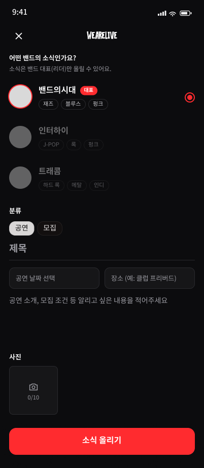 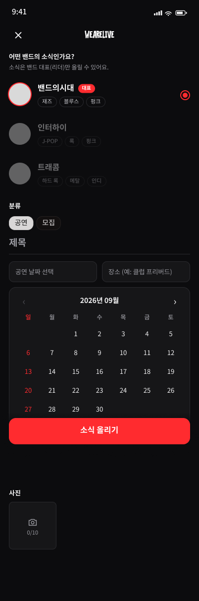 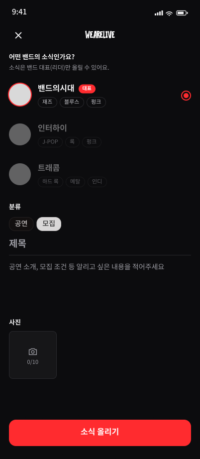

**화면 구성(있음)**

- 안내 '어떤 밴드의 소식인가요? — 소식은 밴드 대표(리더)만 올릴 수 있어요' [F]
- 밴드 라디오 목록: 밴드의시대 '대표'(활성) / 인터하이 · 트래콤(비활성) [F]
- 분류 칩(공연 / 모집) · 제목 [F]
- 공연: 공연 날짜 선택(캘린더 팝업, 소식올리기_캘린더 → _날짜선택) · 장소 입력 [F]
- 모집: 날짜·장소 필드 없음(소식올리기_모집) [F]
- 본문 · 사진 0/10 · [소식 올리기] [F]

**사용자 흐름**

- 밴드 선택 → 분류 → 제목 → (공연) 날짜·장소 → 본문 → 사진 → [소식 올리기] → 홈 피드 상단 [추정]

**규칙·정책**

- 작성 권한 = 밴드 대표(리더)만 [F]. 대표가 아닌 밴드는 라디오 비활성 [F]
- 공연 날짜는 미래 날짜만 [추정]
- 사진 최대 10장 [F]
- 관리자는 소식 작성·수정·삭제 불가(대표 전용) [결정 Q25·Q30]

**데이터**

- NEWS(band_id 필수, category, event_date, place)

**예외·미정**

- 모집 글의 모집 포지션·마감일 필드 없음 [미정]
- 임시 저장 없음

### WL-NEWS-04 좋아요 · 댓글 · 공유 (소식)

소식에 대한 반응 3종.

**화면:** 소식상세_여름합동공연 (153:24724 · 402×1090)  

**규칙·정책**

- 좋아요 토글 · 내정보 '좋아요' 목록에 누적(WL-MY-03) [F]
- 댓글: 작성만 있음(수정·삭제·답글 없음) [F]
- 공유: 아이콘만, 시트·링크 형식 없음 [미정] D-19

**데이터**

- LIKE, COMMENT, NEWS.share_url [추정]

---

## 6 · 대관 — 탐색 · 검색 · 공간 상세 (VENUE)

합주실·공연장을 찾는 경로는 두 가지다. ① 홈 카테고리 → 대관 리스트(둘러보기) ② 검색바 → 조건 검색 → 결과. 둘 다 공간 상세로 모인다.

### WL-VENUE-01 홈 대관 진입 (검색바 · 카테고리 · 예약 배너)

홈 상단은 대관의 관문이다.

**화면:** 홈 (66:15814 · 402×1382)  

**화면 구성(있음)**

- 검색바 '어디서 합주할까요?' [F] → 검색 모달
- 카테고리 4: 전체 / 합주실 / 공연장 / 찜 [F] → 대관 리스트(해당 칩 활성)
- 예약 확정 배너: '예약 확정 · 사운드시티·A룸 · 7월 31일 19:00~22:00 ›' [F] (WL-BOOK-06)

**규칙·정책**

- 홈에는 알림 종 없음 — 대관 리스트 헤더에만 🔔 [F]

**데이터**

- —

### WL-VENUE-02 대관 리스트 (전체 / 합주실 / 공연장 / 찜)

세로 풀폭 카드 리스트. 카테고리 칩과 정렬을 갖는다.

**화면:** 대관_전체 (27:1896 · 402×1342)  
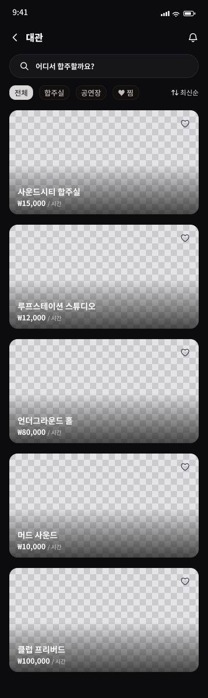

**화면 구성(있음)**

- 헤더 '‹ 대관' + 🔔 [F] · 검색바 [F]
- 칩: 전체 / 합주실 / 공연장 / ♥찜 + '최신순' [F]
- 섹션 타이틀(예: '무대가 필요할 때, 공연장', '내가 찜한 공간') [F]
- 풀폭 카드(366): 이미지 위 이름 · ₩N/시간 · ♡ [F] — 더미: 사운드시티 합주실 ₩15,000 / 루프스테이션 스튜디오 ₩12,000 / 언더그라운드 홀 ₩80,000 / 머드 사운드 ₩10,000 / 클럽 프리버드 ₩100,000
- 상태 프레임: 대관_합주실 · 대관_공연장 · 대관_찜(빈 상태) · 대관_찜_있음 [F]

**사용자 흐름**

- 카드 탭 → 상세 · ♡ 탭 → 찜 토글 · 🔔 아이콘 제거 [결정 D-42] (1차엔 푸시 알림만)

**규칙·정책**

- 공연장도 시간당 가격으로 표기 [F]
- '최신순' 기준(등록일) [추정] · 다른 정렬 옵션 없음 [F]
- 노출 범위(전국? 사용자 지역?) → [결정 D-20] 서울·대전 파일럿, 리스트는 계정 지역 우선 + 다른 지역도 표시
- 가격은 사용자 수수료 5%를 포함한 금액으로 표시 [결정 D-34 — WL-PAY-07]

**데이터**

- VENUE(id, host_id, name, type ∈ {rehearsal, stage}, region, address, price_from(대표 룸 시간당), cover_images[], rating_avg, review_count, is_superhost, created_at)

**예외·미정**

- 카드에 지역·평점 미표시 — 결과 카드와 동일 컴포넌트 여부 [추정]

### WL-VENUE-03 찜 (베뉴 즐겨찾기)

카드의 ♡로 공간을 저장하고 찜 탭에서 모아본다.

**화면:** 대관_찜_있음 (72:17583 · 402×874)  
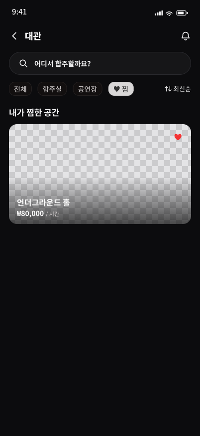

**화면 구성(있음)**

- 찜 빈 상태: '아직 찜한 공간이 없어요. 카드의 ♡를 눌러 마음에 드는 공간을 담아보세요.' [F]
- 찜 있음: '내가 찜한 공간' 섹션 + 카드 [F]
- 상세 상단 ♡ 원형 버튼 [F]

**규칙·정책**

- 찜 대상 = 공간(VENUE). 밴드 팔로우 기능은 없음 [F]

**데이터**

- VENUE_FAVORITE(user_id, venue_id, created_at)

### WL-VENUE-04 검색 모달 (공간 유형 · 어디서 · 언제 · 시간 · 인원 · 필터)

카드 + 아코디언 5행으로 조건을 모아 [검색]한다. 각 행은 펼치면 선택 UI가 나타나고 접히면 우측에 선택값이 요약된다.

**화면:** 검색 (27:1853 · 402×874) · 검색_어디서_서울 (38:4952 · 402×874) · 검색_언제_선택 (38:5085 · 402×910)  
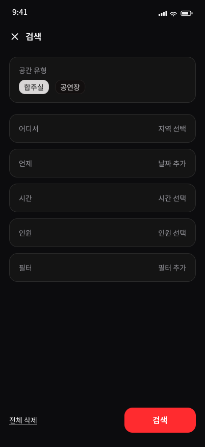 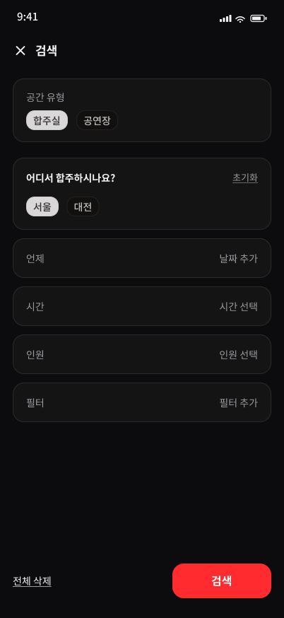 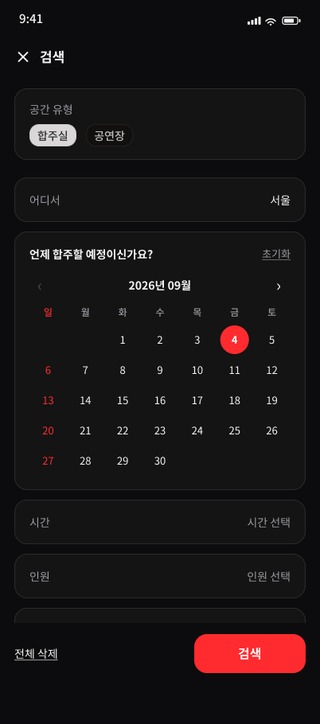

**화면 구성(있음)**

- 헤더 '✕ 검색' [F]
- 카드 '공간 유형': 합주실 / 공연장 칩 [F]
- 아코디언 5행: 어디서 · 언제 · 시간 · 인원 · 필터 (우측에 선택값) [F]
- 어디서: '어디서 합주하시나요?' — 서울 / 대전 칩 + 초기화 [F]
- 언제: '언제 합주할 예정이신가요?' — 월 캘린더(일요일 빨강 · 선택일 레드 원) [F]
- 시간: '몇 시부터 이용하시나요?' — 시작 시간 칩 17:00 / 18:00 / 19:00 / 20:00 / 21:00 + 이용 시간 스테퍼(− 3시간 +) [F]
- 인원: 스테퍼 [F]
- 필터: '필요한 조건을 선택해주세요' — 서비스(주차가능 / 24시간 / 녹음지원) · 장비 구비 여부(드럼 / 건반 / 세컨 / 일렉기타 / 베이스기타) [F]
- 하단: '전체 삭제' + [검색](레드 140×49) [F]

**사용자 흐름**

- 행 탭 → 펼침(선택전 프레임) → 값 선택(선택 프레임) → 다음 행 → [검색] → 결과
- '초기화'(행 단위) / '전체 삭제'(전체) [F]

**규칙·정책**

- 지역 = 서울 / 대전 2개 [F] — 파일럿 범위로 보임 → [결정 D-20] 서울·대전 파일럿, 리스트는 계정 지역 우선 + 다른 지역도 표시
- 시작 시간 칩 5종(17~21시)만 존재 — 다른 시간대 → [결정 D-21] 운영시간 기준 전체 시간대, '세컨'은 세컨 기타(기타 앰프 2대)로 유지
- 이용 시간 스테퍼: 공간마다 가게가 최소·최대 이용시간 설정 [결정 Q35] · 1시간 단위 [추정] · 검색 모달은 공통 범위, 상세·예약에서 공간 설정 적용 [추정]
- '세컨' 칩의 의미(세컨 기타?) → [결정 D-21] 운영시간 기준 전체 시간대, '세컨'은 세컨 기타(기타 앰프 2대)로 유지
- 공간 유형·어디서·언제 필수 여부 [미정]

**데이터**

- SEARCH_QUERY{space_type, region, date, start_time, duration_hours, headcount, services[], equipment[]}
- VENUE.services[], VENUE.equipment[] (필터 매칭용 마스터)

**예외·미정**

- 온라인형(비대면) 공간 폐기 [F]

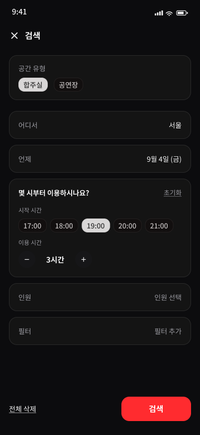 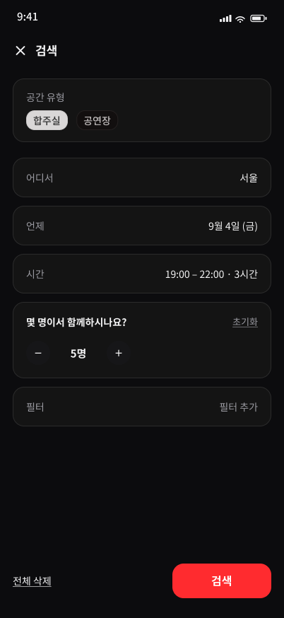 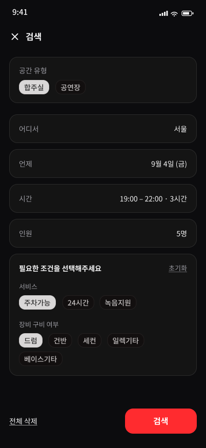

_시간 — 시작 칩 + 이용 시간 스테퍼 · 인원 — 스테퍼 · 필터 — 서비스 3 · 장비 5_

### WL-VENUE-05 검색 결과 · 정렬 · 지도 보기

조건 요약 필 아래 결과 카드가 나열된다. 정렬 4종과 플로팅 [지도 보기]가 있다.

**화면:** 결과_필터 (43:6399 · 402×882) · 결과_정렬메뉴 (51:7663 · 402×882)  
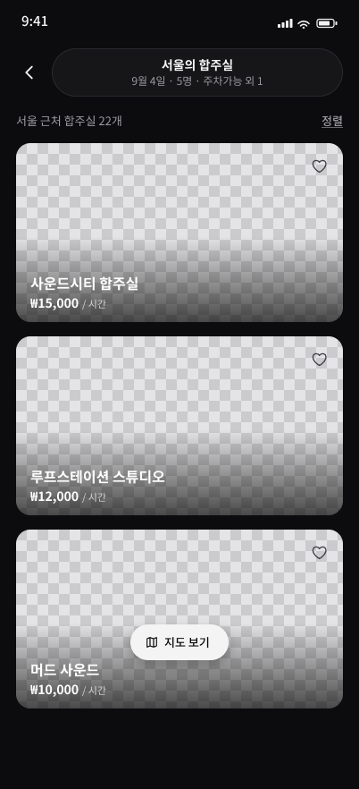 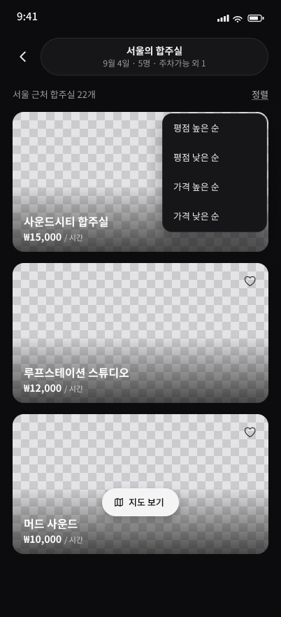

**화면 구성(있음)**

- 상단 요약 필: '서울의 합주실 / 9월 4일 · 5명 · 주차가능 외 1' + ‹ [F]
- '서울 근처 합주실 22개' · '정렬' → 메뉴(평점 높은 순 / 평점 낮은 순 / 가격 높은 순 / 가격 낮은 순) [F]
- 풀폭 카드 리스트 [F] · 플로팅 [지도 보기] [F]
- 상태 프레임: 결과_가격순 · 결과_합주실_8월2일 · 결과_공연장_9월12일 [F]

**사용자 흐름**

- 요약 필 탭 → 검색 모달로 복귀(조건 유지) [추정] · 정렬 선택 → 재정렬 · [지도 보기] → 지도 화면 [미정, 프레임 없음] D-22

**규칙·정책**

- 기본 정렬 [미정] · '근처' 거리 기준(지역=서울 전체?) → [결정 D-20] 서울·대전 파일럿, 리스트는 계정 지역 우선 + 다른 지역도 표시
- 가용성(선택 일시에 예약 가능한 공간만) 필터링 여부 → [결정 D-23] 예약 가능한 공간만 표시 · 정원 초과 룸 선택 불가 · 불가 시간 비활성 · 대기 요청 최대 3건
- 0건 결과 상태 없음 [미정]

**데이터**

- 결과 = VENUE 검색 + 정렬 파라미터(sort ∈ {rating_desc, rating_asc, price_desc, price_asc})

### WL-VENUE-06 공간 상세

가장 긴 화면(402×2112). 소개·시설·장비·룸·정책·취소 규정·호스트·후기·사업자 정보를 한 페이지에 두고, 하단 고정 바에서 예약으로 넘어간다.

**화면:** 상세 / A룸 (49:7596 · 402×2112)  
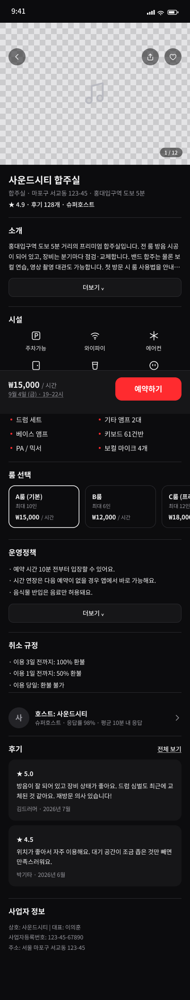

**화면 구성(있음)**

- 히어로 이미지 캐러셀(1/12) + ‹ · 공유 · ♡ 원형 버튼 [F]
- 이름 · '합주실 · 마포구 서교동 123-45 · 홍대입구역 도보 5분' · '★ 4.9 · 후기 128개 · 슈퍼호스트' [F]
- 소개 + [더보기 ∨](상세 / 소개펼침) [F]
- 시설 아이콘 6: 주차가능 / 와이파이 / 에어컨 / 화장실 / 음료대 / 콘센트 [F]
- 보유 장비: 드럼 세트 / 기타 앰프 2대 / 베이스 앰프 / 키보드 61건반 / PA·믹서 / 보컬 마이크 4개 [F]
- 룸 선택 카드 150×90: A룸(기본) 최대 10인 ₩15,000 / B룸 최대 6인 ₩12,000 / C룸(프리미엄) 최대 12인 ₩18,000 [F]
- 운영정책(3~5항) + 더보기(상세 / 정책펼침) · 취소 규정(이용 3일 전 100% / 1일 전 50% / 당일 불가) [F]
- 호스트 카드: 사운드시티 · 슈퍼호스트 · 응답률 98% · 평균 10분 내 응답 › [F]
- 후기 2건 + '전체 보기' [F] · 사업자 정보(상호 / 대표 / 사업자등록번호 / 주소) [F]
- 하단 고정 바: ₩15,000/시간 · 선택 일시(9월 4일(금) · 19–22시) · [예약하기] [F]

**사용자 흐름**

- 룸 카드 탭 → 선택 룸 변경, 하단 가격 갱신(상세 / B룸 · / C룸) [F]
- 하단 일시 탭 → 오버레이_날짜시간 [F] · [예약하기] → 예약확인 [F]
- 호스트 카드 › → 호스트프로필 · '전체 보기' → 후기전체 · 공유 → 공유 시트 [추정] · ♡ → 찜

**규칙·정책**

- [사장님 문의] 버튼 없음 — 문의는 호스트프로필 → 메시지 보내기 경로 [F]
- 취소 규정이 공간별인지 플랫폼 공통인지 → [결정 D-24] 플랫폼 공통 규정(1차)
- 사업자 정보 표시 항목·의무 범위(전자상거래법) → [결정 D-25] 상호·대표·사업자등록번호·주소 + 전화번호·이메일
- 선택 일시가 없을 때 [예약하기] 동작(일시 선택 유도) [추정]
- 가격은 사용자 수수료 5%를 포함한 금액으로 표시 [결정 D-34 — WL-PAY-07]

**데이터**

- VENUE += intro, facilities[], equipment[], policies[], cancel_policy, business_info{name, owner, reg_no, address}, images[≤12], transit_note
- ROOM(id, venue_id, name, label ∈ {기본, 프리미엄, —}, capacity, price_per_hour, is_default)
- REVIEW(id, venue_id, user_id, rating, body, month)

**예외·미정**

- 히어로 12장 갤러리 전체 보기 없음
- 룸별 이미지·설명 없음 [미정]

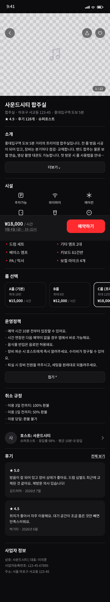

_운영정책 펼침 상태 — 취소 규정 3단계_

### WL-VENUE-07 룸 (다중 룸 · 룸별 정원 · 시간당 가격)

한 공간이 여러 룸을 가지며, 예약·가격은 룸 단위다.

**화면:** 상세 / A룸 (49:7596 · 402×2112)  

**규칙·정책**

- 기본 룸 1개(is_default) → 상세 진입 시 선택 [F]
- 룸 라벨: 기본 / 프리미엄 [F]
- 정원(최대 N인)과 검색 인원 조건의 관계(정원 초과 룸 비활성?) → [결정 D-23] 예약 가능한 공간만 표시 · 정원 초과 룸 선택 불가 · 불가 시간 비활성 · 대기 요청 최대 3건

**데이터**

- ROOM · RESERVATION.room_id

### WL-VENUE-08 호스트 프로필

공간 운영자(호스트)의 신뢰 정보와 메시지 진입점.

**화면:** 호스트프로필 (61:10984 · 402×1046)  
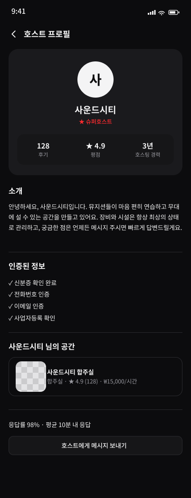

**화면 구성(있음)**

- 이니셜 아바타 '사' · 사운드시티 · ★ 슈퍼호스트 [F]
- 128 후기 / ★4.9 평점 / 3년 호스팅 경력 [F]
- 소개 · 인증된 정보(✓ 신분증 확인 완료 ✓ 전화번호 인증 ✓ 이메일 인증 ✓ 사업자등록 확인) [F] → 1차엔 운영자가 실제로 확인한 '사업자 확인'만 표시 [결정 Q42]
- '사운드시티 님의 공간' 카드 · 응답률 98% [F]
- [호스트에게 메시지 보내기] [F]

**사용자 흐름**

- [호스트에게 메시지 보내기] → 채팅방(사전 문의 DM, WL-CHAT-04)

**규칙·정책**

- 슈퍼호스트 기준·응답률·평균 응답 시간 산식 → [결정 D-26] 슈퍼호스트는 운영자가 지정, 응답률·응답 시간은 데이터가 쌓인 뒤 자동
- 인증 4종은 호스트 측 KYC 절차를 전제 — 호스트 화면 없음 → [결정 D-27] 가게용 웹 페이지

**데이터**

- HOST(user_id, display_name, intro, is_superhost, response_rate, avg_response_min, verifications{id, phone, email, business}, hosting_since, venues[])

### WL-VENUE-09 후기 (보기 전용)

공간의 후기를 모두 본다. 작성 화면은 없다.

**화면:** 후기전체 (61:11297 · 402×1027)  
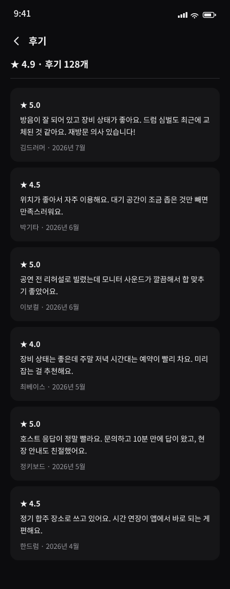

**화면 구성(있음)**

- 헤더 '★ 4.9 · 후기 128개' [F] · 후기 카드: 평점 · 본문 · 작성자 · 연월 [F]

**규칙·정책**

- 후기 작성 진입(이용 완료 후) 없음 → [결정 D-28] 이용 완료 후 앱에서 평점 + 글
- 정렬·필터 없음 [F]

**데이터**

- REVIEW

---

## 7 · 예약 (BOOK)

예약은 '요청형'이다. 사용자가 일시·룸·인원을 정해 결제하면 '확정 대기중'이 되고, 호스트가 확정해야 '예약 확정'이 된다. 거절·24시간 무응답(만료)은 자동 환불된다.

### WL-BOOK-01 일시 선택 바텀시트 (상세 · 예약 수정)

상세 화면 안에서 날짜·시작 시간·이용 시간을 고른다. 예약 확인의 '수정'도 같은 시트를 쓴다.

**화면:** 오버레이_날짜시간 (96:20346 · 402×874)  
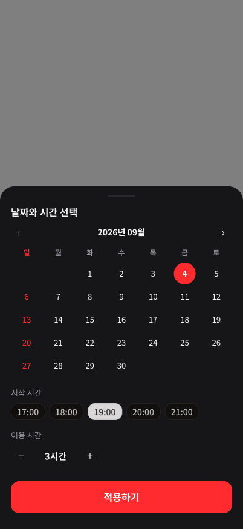

**화면 구성(있음)**

- 바텀시트 '날짜와 시간 선택': 월 캘린더 · 시작 시간 칩 · 이용 시간 스테퍼(4시간) · [적용하기] [F] (상태: 오버레이_11일 · _20시 · _4시간)
- 오버레이_예약수정: 예약확인 → '수정' 시 동일 시트 [F]

**사용자 흐름**

- 적용 → 상세 하단 바에 일시 반영(상세 / 11일) → [예약하기]

**규칙·정책**

- 검색 모달의 언제/시간과 동일한 값 집합(시작 칩 17~21시) [F]
- 불가 시간대(이미 예약됨·휴무) 표시 없음 → [결정 D-23] 예약 가능한 공간만 표시 · 정원 초과 룸 선택 불가 · 불가 시간 비활성 · 대기 요청 최대 3건
- 가용성 검사 시점 = [적용하기] 또는 [예약하기] → [결정 D-23] 예약 가능한 공간만 표시 · 정원 초과 룸 선택 불가 · 불가 시간 비활성 · 대기 요청 최대 3건

**데이터**

- RESERVATION 초안{date, start_time, duration_hours}

### WL-BOOK-02 예약 확인 (결제 전 요약)

예약 정보·요금·결제 방법을 확인하고 결제한다.

**화면:** 예약확인_11일 (104:15492 · 402×874)  
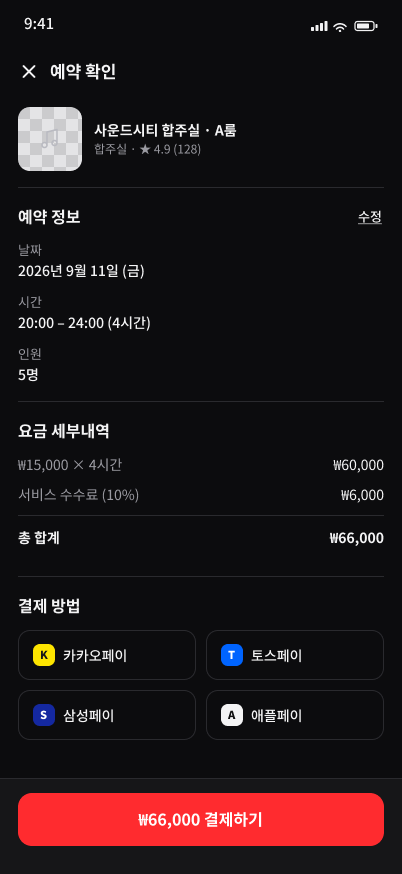

**화면 구성(있음)**

- 헤더 '✕ 예약 확인' [F]
- 공간 썸네일 · '사운드시티 합주실 · A룸' · '합주실 · ★ 4.9 (128)' [F]
- 예약 정보: 날짜 2026년 9월 11일 (금) / 시간 20:00–24:00 (4시간) / 인원 5명 + '수정' [F]
- 요금 세부내역: ₩15,000 × 4시간 ₩60,000 / 서비스 수수료 (10%) ₩6,000 / 총 합계 ₩66,000 [F] → v2.1: 사용자 수수료 5%(₩3,000), 총 ₩63,000 [결정 D-34]
- 결제 방법: 카카오페이 / 토스페이 / 삼성페이 / 애플페이 (선택 시 흰 보더) [F] (상태: _카카오 · _토스 · _삼성 · _애플)
- [₩66,000 결제하기] [F] → ₩63,000 [결정 D-34]
- v2.1 추가: '밴드' 선택 — 기본 = 지금 보는 밴드 · '개인 예약(일정 등록 안 함)' · 밴드 없는 사용자에겐 숨김 [결정 Q22 — WL-BOOK-10]

**사용자 흐름**

- '수정' → 오버레이_예약수정 → 재계산 · 결제 방법 선택 → [결제하기] → 결제 승인 → 예약완료

**규칙·정책**

- 결제 방법 미선택 시 버튼 비활성 [추정]
- 결제 = 예약 요청 시 선결제(확정 전) [F 예약완료 문구] → 요청 때 승인만, 가게 확정 시 청구 [결정 D-35]
- 인원은 검색 조건에서 승계, 여기서 수정 가능 여부 [미정]

**데이터**

- RESERVATION(id, user_id, venue_id, room_id, date, start_time, duration_hours, headcount, unit_price, base_amount, user_fee_amount, host_fee_amount, total_amount, payout_amount, band_id?, payment_method, status, number, created_at)

**예외·미정**

- 결제 실패·시간 충돌(중복 예약) 화면 없음 → [결정 D-29] 시간 충돌 = 대기 요청 최대 3건 · 확정 시 나머지 자동 거절 (결제 실패 화면은 미정)

### WL-BOOK-03 예약 완료 (신청 완료 · 확정 대기중)

결제 직후 화면. 예약이 '신청' 상태임을 명확히 알린다.

**화면:** 예약완료_11일 (106:16967 · 402×874)  
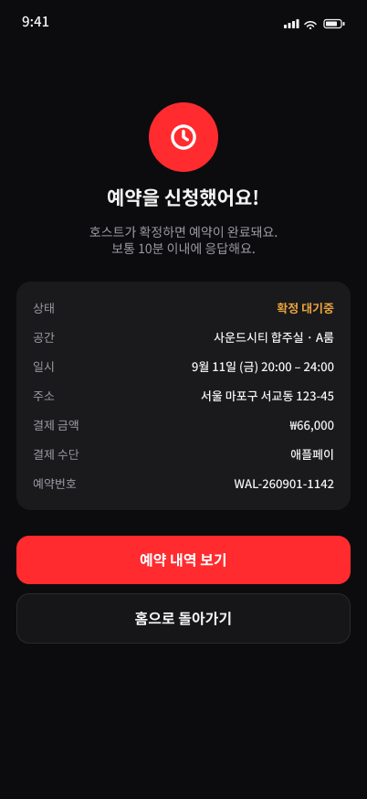

**화면 구성(있음)**

- 시계 아이콘 · '예약을 신청했어요!' · '호스트가 확정하면 예약이 완료돼요. 보통 10분 이내에 응답해요.' [F]
- 요약 카드: 상태 '확정 대기중'(노랑) / 공간 / 일시 / 주소 / 결제 금액 ₩66,000 / 결제 수단 애플페이 / 예약번호 WAL-260901-1142 [F]
- [예약 내역 보기] · [홈으로 돌아가기] [F]

**사용자 흐름**

- [예약 내역 보기] → 예약내역 · [홈으로 돌아가기] → 홈
- 동시에 채팅방에 '요청됨' 카드 + 시스템 메시지 생성(WL-CHAT-02) [F]

**규칙·정책**

- '보통 10분 이내 응답'은 가게의 실제 응답 기록에서 산출, 데이터가 쌓이기 전엔 표시하지 않음 [결정 D-26 · 표시 방식 추정]
- 예약번호 규칙 WAL-YYMMDD-NNNN(요청 날짜 + 그날 일련번호 4자리) [결정 D-30]
- 즉시 확정 공간은 '확정 대기중' 없이 바로 '예약 확정'으로 표시 [결정 — WL-BOOK-08, 문구·화면 추가 필요]

**데이터**

- RESERVATION.status = requested, RESERVATION.number

### WL-BOOK-04 예약 내역

예정된 예약과 지난 예약을 카드로 본다.

**화면:** 예약내역 (376:32227 · 402×874)  
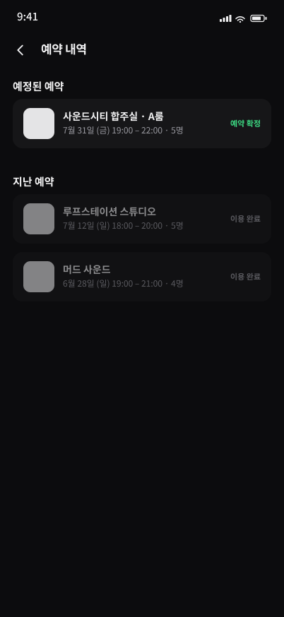

**화면 구성(있음)**

- 헤더 '‹ 예약 내역' [F]
- 예정된 예약: 사운드시티 합주실·A룸 · 7월 31일 (금) 19:00–22:00 · 5명 · '예약 확정'(초록) [F]
- 지난 예약: 루프스테이션 7월 12일 · 머드 사운드 6월 28일 · '이용 완료'(회색) [F]

**사용자 흐름**

- 카드 탭 → 예약 상세 → [결정 D-31] 예약 상세 신설 · 홈 배너 → 예약 상세 · 내정보에 '예약 내역' 메뉴

**규칙·정책**

- 진입점 = 예약완료 화면 · 홈 예약 확정 배너 [F]. 내정보 메뉴에는 없음 [F] → 진입점 추가 검토 D-31
- 확정 대기중·거절·만료 예약의 표시 여부 [미정]
- 사용자 취소 버튼 없음 [F] D-32

**데이터**

- RESERVATION 목록(status 기준 예정/지난 분리)

### WL-BOOK-05 예약 상태 머신

시안에 나타나는 상태 5종과 전이. v2.1에서 취소됨과 즉시 확정·자동 거절 전이를 더했다.

**화면:** 채팅방_확정 (115:16716 · 402×874) · 예약내역 (376:32227 · 402×874)  
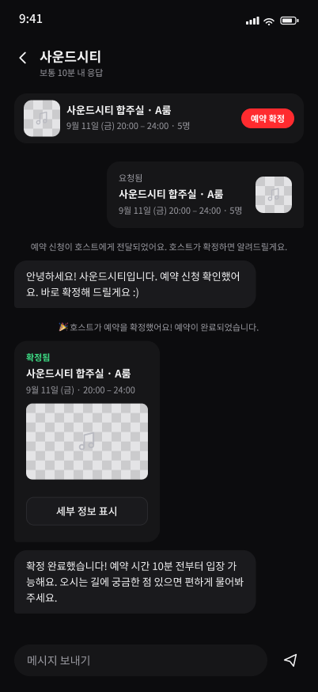 

**화면 구성(있음)**

- 확정 대기중(노랑) — 예약완료 · 채팅방 카드 [F]
- 예약 확정(초록 · 채팅 배지는 레드) — 예약내역 · 채팅방_확정 · 채팅목록_확정 [F] → 초록 통일 [결정 D-37]
- 요청 거절됨(빨강) — 채팅방_루프스테이션 [F]
- 요청 만료됨 — 채팅방_언더그라운드 [F]
- 이용 완료(회색) — 예약내역 [F]

**규칙·정책**

- requested → confirmed (호스트 확정) [F]
- requested → rejected (호스트 거절) → 자동 환불 [F]
- requested → expired (24시간 무응답) → 자동 환불 [F]
- confirmed → completed (이용 시간 종료 후) [추정]
- confirmed → cancelled (사용자 취소, 취소 규정 적용) — 화면 없음 → [결정 D-32] 앱에서 직접 취소(예상 환불액) · 대기 중 전액 · 확정 후 규정 비율(사용자 수수료도 같은 비율)
- 만료 타이머 기준(요청 시각 vs 결제 승인 시각) → [결정 D-33] 결제 완료 + 24시간, 이용 시작이 더 빠르면 시작 전 만료
- requested → rejected (겹치는 다른 요청이 확정됨) → 승인 취소(전액) [결정 — WL-BOOK-09]
- requested → cancelled (사용자 취소, 전액) [결정 D-32]
- 즉시 확정 공간: 결제 → confirmed (requested 없음) [결정 — WL-BOOK-08]

**데이터**

- RESERVATION.status ∈ {requested, confirmed, rejected, expired, completed, cancelled} · status_changed_at · 상태 변경 시 MESSAGE(system/reservation_card) 생성 + 알림

### WL-BOOK-06 홈 예약 확정 배너

확정된 다음 예약을 홈 상단에 노출한다.

**화면:** 홈 (66:15814 · 402×1382)  

**화면 구성(있음)**

- '예약 확정 · 사운드시티·A룸 · 7월 31일 19:00~22:00 ›' [F]

**규칙·정책**

- 표시 조건: status=confirmed 이고 이용일이 가장 가까운 예약 1건 [추정]
- 탭 목적지(예약내역 / 채팅방) → [결정 D-31] 예약 상세 신설 · 홈 배너 → 예약 상세 · 내정보에 '예약 내역' 메뉴
- 확정 대기중 예약도 배너로 보일지 [미정]

**데이터**

- RESERVATION(next confirmed)

---

## 8 · 결제 · 환불 (PAY)

요금 산식, 간편결제, 결제수단 관리, 환불 규칙을 정의한다. 호스트 정산과 PG 연동 범위는 시안 밖이다.

### WL-PAY-01 요금 계산

시간당 가격 × 이용 시간에 사용자 수수료 5%를 더한 금액을 사용자가 결제하고, 가게 정산에서 3%를 뗀다(v2.1 결정 — 시안 표기는 사용자 10%).

**화면:** 예약확인_11일 (104:15492 · 402×874)  

**규칙·정책**

- base = ROOM.price_per_hour × duration_hours (예 ₩15,000 × 4 = ₩60,000) [F]
- user_fee = base × 5% (₩3,000) [결정 D-34] — 시안 표기는 10%(₩6,000)
- total = base + user_fee (₩63,000) · host_fee = base × 3% (₩1,800), 가게 정산 = base − host_fee (₩58,200) [결정 D-34] · 상한 없음
- 호스트 정산 수수료(플랫폼 수취) 별도 여부 → [결정 D-34] 가게 3% + 사용자 5%, 상한 없음, 목록부터 수수료 포함 가격 표시
- 원 단위 절사·반올림 규칙 [미정]
- 목록·상세·예약 확인 모두 사용자 수수료 포함 가격으로 표시(개정 전자상거래법의 순차공개 가격책정 금지 대응, 법무 확인) [결정 D-34] · 부가세 포함 여부는 세무 확인

**데이터**

- RESERVATION.unit_price, base_amount, user_fee_rate(0.05), user_fee_amount, host_fee_rate(0.03), host_fee_amount, total_amount, payout_amount

### WL-PAY-02 간편결제 (카카오페이 · 토스페이 · 삼성페이 · 애플페이)

결제 수단 4종 중 하나를 선택해 결제한다.

**화면:** 예약확인_11일 (104:15492 · 402×874)  

**화면 구성(있음)**

- 결제 방법 4 카드(178×50): 카카오페이 / 토스페이 / 삼성페이 / 애플페이 — 선택 시 흰 보더 [F] → 1차(안드로이드)는 애플페이 제외 3종 [결정 D-36]

**규칙·정책**

- 카드·계좌이체·현장 결제 없음 [F]
- 결제 시점 = 예약 요청 시 선결제(승인) → 확정 대기 [F] → 가게 확정 시 청구(매입) [결정 D-35]
- PG(결제대행) 선정·연동 범위 → [결정 D-35] 토스페이먼츠, 요청 때 승인만 → 확정 시 청구
- 결제 승인 후 호스트 확정 전까지의 자금 처리(승인 보류 vs 매입 후 환불) → [결정 D-35] 토스페이먼츠, 요청 때 승인만 → 확정 시 청구

**데이터**

- PAYMENT(id, reservation_id, method, amount, status ∈ {authorized, captured, refunded, failed}, pg_tid, paid_at)

**예외·미정**

- 결제 실패 화면·재시도 없음 [미정 — D-29 중 결제 실패 부분] · 시간 충돌은 결정됨(WL-BOOK-09)

### WL-PAY-03 결제수단 관리 (내정보)

연결된 간편결제를 보고 대표 결제수단을 지정한다.

**화면:** 결제수단 (274:27850 · 402×922)  
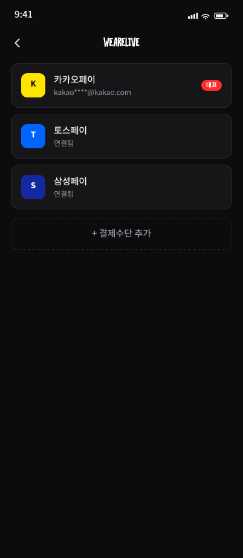

**화면 구성(있음)**

- 카카오페이(kakao****@kakao.com · 대표) · 토스페이(연결됨) · 삼성페이(연결됨) [F]
- [+ 결제수단 추가] [F]

**규칙·정책**

- 대표 결제수단 = 예약확인의 기본 선택 [추정]
- 목록에 애플페이 없음 vs 예약확인·예약완료에는 애플페이 → 불일치 정리 필요 → [결정 D-36] 1차 간편결제 3종(카카오·토스·삼성페이), 애플페이는 iOS 출시 때
- 연결 해제·대표 변경 UI 없음 [미정]

**데이터**

- PAYMENT_METHOD(id, user_id, provider, masked_account, is_default, linked_at)

### WL-PAY-04 환불 (거절 · 만료 자동 환불)

호스트가 거절하거나 24시간 안에 응답하지 않으면 결제 금액이 자동 환불된다.

**화면:** 채팅방_루프스테이션 (126:19775 · 402×874) · 채팅방_언더그라운드 (126:20375 · 402×874)  
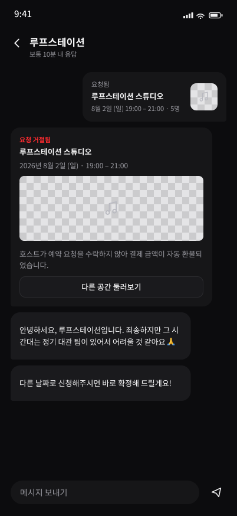 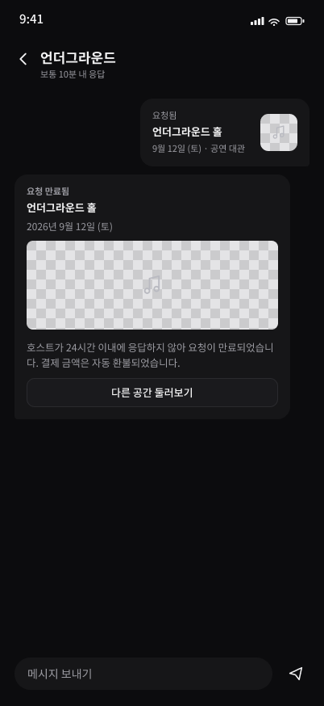

**화면 구성(있음)**

- 거절: '호스트가 예약 요청을 수락하지 않아 결제 금액이 자동 환불되었습니다.' + [다른 공간 둘러보기] [F]
- 만료: '호스트가 24시간 이내에 응답하지 않아 요청이 만료되었습니다. 결제 금액은 자동 환불되었습니다.' [F]

**규칙·정책**

- 거절·만료 = 승인 취소로 전액(수수료 포함) [결정 D-35에 따름]
- 환불 소요 기간·수단별 취소 처리 안내 [미정]
- 채팅 카드 + 푸시(예약 알림) 동시 발생 [추정]

**데이터**

- PAYMENT.status = refunded, REFUND(id, payment_id, amount, reason ∈ {rejected, expired, user_cancel}, refunded_at)

### WL-PAY-05 취소 규정 · 사용자 취소

취소 규정은 상세에 표시되지만, 사용자가 취소하는 화면은 없다(v2.1: 예약 상세에서 직접 취소 — WL-BOOK-07).

**화면:** 상세 / 정책펼침 (86:18946 · 402×2186)  

**화면 구성(있음)**

- 취소 규정: 이용 3일 전 100% / 1일 전 50% / 당일 불가 [F]
- 고객센터 FAQ '예약을 취소하면 환불은 어떻게 되나요?' [F]

**규칙·정책**

- 환불률 산정 기준 시각(이용 시작 시각 기준 D-3·D-1·D-0) [추정]
- 취소 시 서비스 수수료 환불 여부 → [결정 D-32] 앱에서 직접 취소(예상 환불액) · 대기 중 전액 · 확정 후 규정 비율(사용자 수수료도 같은 비율)
- 확정 대기중 상태에서의 취소(전액?) → [결정 D-32] 앱에서 직접 취소(예상 환불액) · 대기 중 전액 · 확정 후 규정 비율(사용자 수수료도 같은 비율)
- 규정 = 플랫폼 공통(1차) [결정 D-24]

**데이터**

- PLATFORM_POLICY.cancel_rules[] [결정 D-24]

**예외·미정**

- 사용자 취소 화면·버튼 없음 [F] → 예약 상세에 [예약 취소] 신설 [결정 D-32 — WL-BOOK-07]

### WL-PAY-06 예약번호

예약 식별 번호. 더미 'WAL-260901-1142'.

**화면:** 예약완료_11일 (106:16967 · 402×874)  

**규칙·정책**

- 형식 WAL-YYMMDD-NNNN [추정] — 날짜부는 요청일, 뒤 4자리 일련 [추정] D-30
- 예약 내역·채팅 카드·고객센터 문의에서 조회 키로 사용 [추정]

**데이터**

- RESERVATION.number (unique)

---

## 9 · 채팅 (CHAT)

대화 상대는 호스트(공간)뿐이다. 예약의 요청·확정·거절·만료가 카드 메시지로 대화에 남고, 예약 전 사전 문의도 같은 채팅방을 쓴다. 밴드·멤버 간 채팅과 AI 챗봇은 없다.

### WL-CHAT-01 채팅 목록

호스트별 대화 목록. 공간 유형으로 필터한다.

**화면:** 채팅목록 (108:15074 · 402×874)  

**화면 구성(있음)**

- 칩: 전체 / 합주실 / 공연장 [F] (상태: 채팅목록_합주실 · _공연장)
- 행: 썸네일 · 호스트명 · 마지막 메시지 · 시간 [F] — 더미: 사운드시티 / 루프스테이션 / 언더그라운드 / 프리버드
- 예약 확정 시 썸네일에 초록 체크 배지(채팅목록_확정) [F]
- 하단 3탭 네비(메시지 활성) [F]

**사용자 흐름**

- 행 탭 → 채팅방

**규칙·정책**

- 정렬 = 마지막 메시지 시각 내림차순 [추정]
- 읽지 않음 표시·빈 상태 없음 [F]

**데이터**

- CONVERSATION(id, user_id, host_id, venue_id, last_message_at, last_message_preview, active_reservation_id?)

### WL-CHAT-02 채팅방 — 예약 대화 (요청 · 확정)

예약 요약 카드가 상단에 고정되고, 예약 이벤트가 카드 메시지로 흐른다.

**화면:** 채팅방 (108:16198 · 402×874) · 채팅방_확정 (115:16716 · 402×874)  
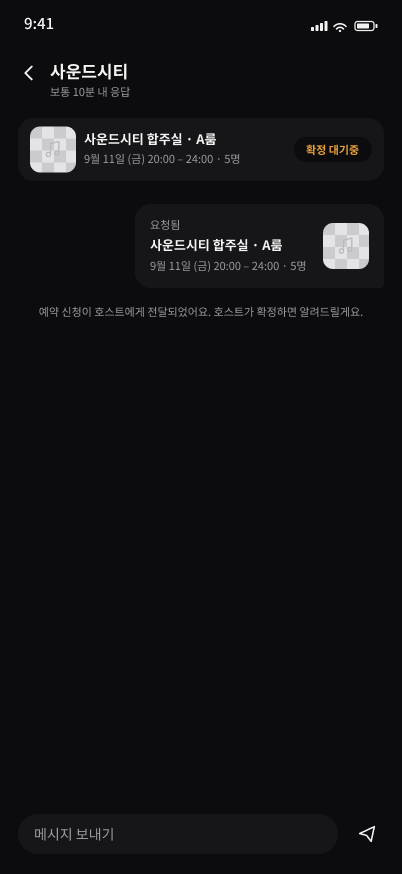 

**화면 구성(있음)**

- 헤더: 호스트명 · '보통 10분 내 응답' [F]
- 예약요약 카드: 공간·룸 · 9월 11일 (금) 20:00–24:00 · 5명 + 상태 배지 '확정 대기중'(노랑) / '예약 확정'(레드) [F] → 초록 [결정 D-37]
- '요청됨' 카드(우측, 썸네일) · 시스템 문구 '예약 신청이 호스트에게 전달되었어요…' [F]
- 호스트 버블(좌 · 다크) [F]
- '🎉 호스트가 예약을 확정했어요!' · '확정됨' 카드(이미지 · [세부 정보 표시]) [F 채팅방_확정]
- 입력 바 '메시지 보내기' [F]

**사용자 흐름**

- 예약 요청 → 자동으로 '요청됨' 카드 + 시스템 메시지 → 호스트 확정 → '확정됨' 카드 + 시스템 메시지 · [세부 정보 표시] → 예약 상세 [결정 D-31, 화면 추가 — WL-BOOK-07]

**규칙·정책**

- 예약 1건 = 대화 1개가 아니라 가게당 대화방 1개에 예약 카드가 누적 [결정 Q53]
- 상태 배지 색: 확정 대기중 노랑 · 예약 확정 레드(채팅) / 초록(목록) — 통일 필요 → [결정 D-37] 초록으로 통일
- 공연장 예약도 합주실과 같은 시간 단위 — 채팅 시안의 '공연 대관'(날짜만) 표기는 시간 표기로 정리, 음향·조명 옵션은 대화로 협의 [결정 — 공연장 예약 단위]

**데이터**

- MESSAGE(id, conversation_id, sender ∈ {user, host, system}, type ∈ {text, system, reservation_card}, body, reservation_id?, created_at)

### WL-CHAT-03 채팅방 — 거절 · 만료 카드

거절·만료 결과와 환불 안내가 카드로 기록된다.

**화면:** 채팅방_루프스테이션 (126:19775 · 402×874) · 채팅방_언더그라운드 (126:20375 · 402×874)  
 

**화면 구성(있음)**

- '요청 거절됨' 카드: 안내 문구 + [다른 공간 둘러보기] + 호스트 버블 [F]
- '요청 만료됨' 카드: 24시간 무응답 · 자동 환불 안내 [F]

**사용자 흐름**

- [다른 공간 둘러보기] → 대관 리스트 또는 검색 [추정]

**규칙·정책**

- 카드 생성 = 상태 전이 시 시스템 발신 [추정]

**데이터**

- MESSAGE(type=reservation_card, reservation.status)

### WL-CHAT-04 사전 문의 DM (호스트 프로필에서)

예약 없이 호스트에게 문의하는 대화.

**화면:** 채팅방_프리버드 (126:20971 · 402×874)  
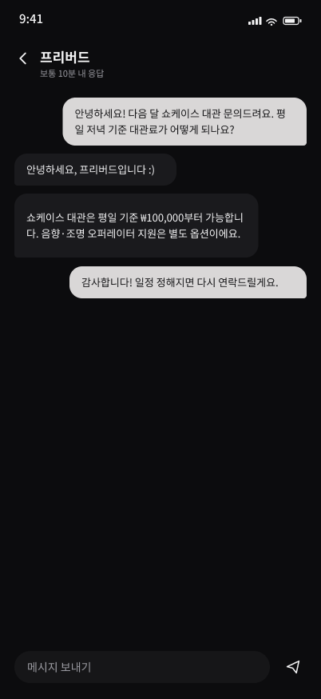

**화면 구성(있음)**

- 예약 카드 없는 대화: '다음 달 쇼케이스 대관 문의드려요…' / 호스트 답변 [F]
- 버블: 내 메시지 = 밝은 회색 배경 · 어두운 글자 · 우측 / 상대 = 다크 배경 · 좌측 [F]

**사용자 흐름**

- 호스트프로필 [호스트에게 메시지 보내기] → 기존 대화가 있으면 열고 없으면 생성(findOrCreate) [추정]

**규칙·정책**

- 첨부(사진·파일)·읽음 표시·날짜 구분 칩 없음 [F] → 1차엔 첨부·읽음 표시 없음 [결정 Q55]
- 호스트가 먼저 대화를 시작하는 경로 없음(호스트 화면 부재)

**데이터**

- CONVERSATION(active_reservation_id = null)

### WL-CHAT-05 메시지 타입 · 표시 규칙

대화에 흐르는 메시지의 종류.

**화면:** 채팅방 (108:16198 · 402×874)  

**규칙·정책**

- text: 사용자·호스트 텍스트 [F]
- system: 예약 진행 안내 문구(중앙 정렬 회색) [F]
- reservation_card: 요청됨 / 확정됨 / 거절됨 / 만료됨 카드 — 상태별 문구·버튼 고정 [F]
- 이모지 텍스트('🎉') 사용 [F]
- 시간 표시·전송 실패·재전송 규칙 [미정]

**데이터**

- MESSAGE.type

### WL-CHAT-06 대화 생성 · 상대 규칙

누구와 대화가 열리는지.

**화면:** 채팅목록 (108:15074 · 402×874)  

**규칙·정책**

- 사용자 ↔ 호스트(공간) 1:1만 [F]. 밴드 DM · 멤버 DM · 소식 작성자 문의 없음 [F]
- 예약 요청 시 자동 생성, 사전 문의 시 수동 생성 [F]
- 가게 측 응답 채널 = 가게용 웹 [결정 D-27] (새 메시지를 가게에 알리는 방법은 미정 — WL-HOST-01)

**데이터**

- CONVERSATION unique(user_id, host_id) [결정 Q53]

---

## 10 · 내정보 · 알림 (MY · NOTI)

프로필 탭 우상단 👤로 진입하는 개인 설정 영역. 알림은 '설정'만 있고 알림 센터(목록)는 없다.

### WL-MY-01 내정보

사용자 카드와 설정 메뉴.

**화면:** 내정보 (253:27594 · 402×922)  
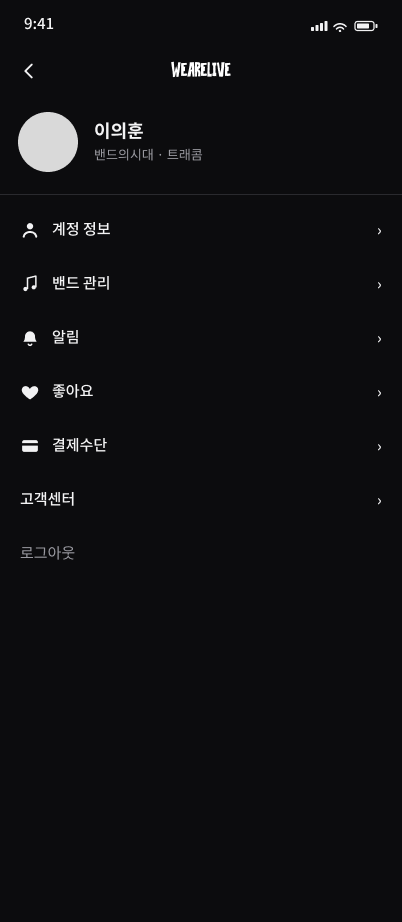

**화면 구성(있음)**

- 헤더 ‹ · 로고 [F]
- 사용자 카드: 이의훈 · 밴드의시대 · 트래콤(소속 밴드 복수 표기) [F]
- 메뉴: 계정 정보 / 밴드 관리 / 알림 / 좋아요 / 결제수단 / 고객센터 [F] · 로그아웃 [F] → v2.1 추가: 예약 내역 [결정 D-31] · 회원 탈퇴 [결정 D-38]

**사용자 흐름**

- 계정 정보 → 계정정보 · 밴드 관리 → 밴드전환 [추정] · 알림 → 알림설정 · 좋아요 → 좋아요 · 결제수단 → 결제수단 · 고객센터 → 고객센터 · 로그아웃 → 확인 다이얼로그 [추정] → 온보딩_로그인

**규칙·정책**

- 내 예약·찜 메뉴 없음(각각 예약완료/홈 배너, 대관 찜 탭에서 진입) [F] → '예약 내역' 메뉴 추가 [결정 D-31]
- 회원 탈퇴 없음 → [결정 D-38] 1차에 앱 내 탈퇴(대표는 대표 넘기기 또는 삭제 투표 통과 후)

**데이터**

- USER

### WL-MY-02 계정 정보 · 수정

이름·지역을 관리한다. 소속 밴드는 읽기 전용.

**화면:** 계정정보 (272:27595 · 402×922) · 계정정보수정 (272:27543 · 402×922)  
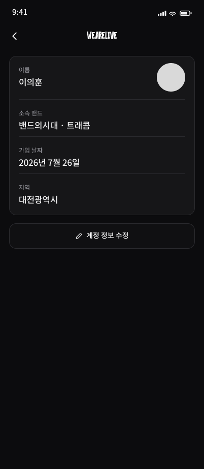 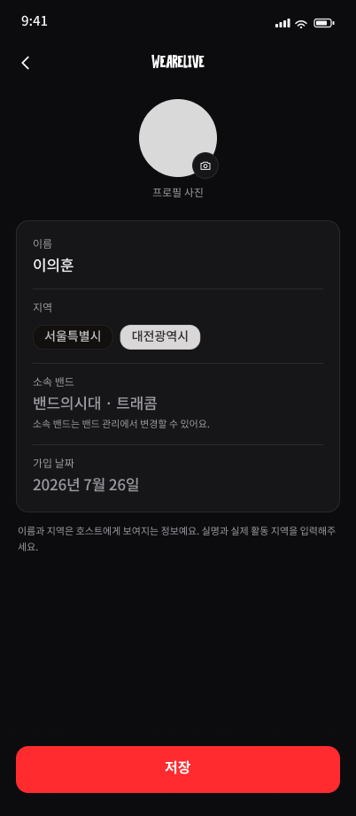

**화면 구성(있음)**

- 계정정보: 이름 / 소속 밴드(밴드의시대 · 트래콤) / 가입 날짜 / 지역 + [계정 정보 수정] [F]
- 수정: 프로필 사진 · 이름 · 지역 칩(서울특별시 / 대전광역시) · 소속 밴드(읽기, '밴드 관리에서 변경') · 가입 날짜 · 안내 '이름과 지역은 호스트에게 보여지는 정보예요. 실명과 실제 활동 지역을 입력해주세요.' · [저장] [F]

**규칙·정책**

- 실명 정책: 이름·지역이 호스트에게 노출 [F] — 예약 시 호스트에게 전달되는 사용자 정보 범위 정의 필요 → [결정 D-39] 이름·지역 + 밴드명
- 지역 값 = 검색 '어디서'와 동일 집합(서울/대전) [F]
- 이메일·전화번호 필드 없음(소셜 계정 기반) [F]
- 계정정보 안내 문구에 밴드명 추가(가게에 이름·지역·밴드명이 전달됨) [결정 Q58b]

**데이터**

- USER.name, USER.region ∈ {seoul, daejeon}, USER.avatar_url, USER.created_at

### WL-MY-03 좋아요 목록

내가 좋아요한 소식 카드 목록.

**화면:** 좋아요 (274:27637 · 402×922)  
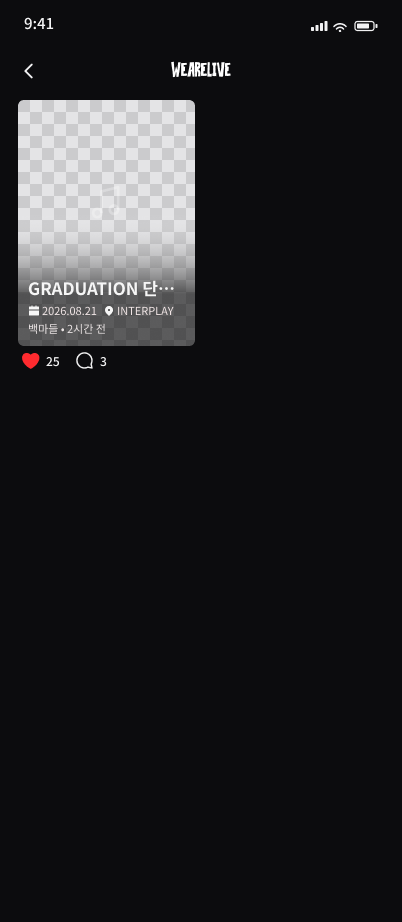

**화면 구성(있음)**

- 카드: GRADUATION 단독공연 · ♥25 [F]

**규칙·정책**

- 소식만 대상(공지 좋아요는 미포함) [추정]

**데이터**

- LIKE(target=news) join NEWS

### WL-MY-04 고객센터

FAQ와 1:1 문의 진입, 운영시간.

**화면:** 고객센터 (274:27896 · 402×922)  
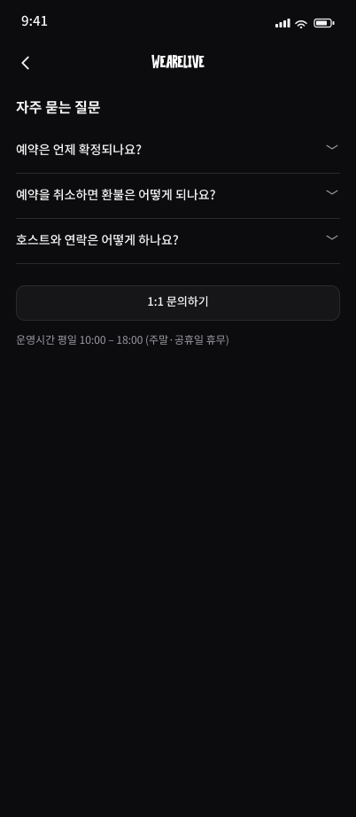

**화면 구성(있음)**

- 자주 묻는 질문 3: '예약은 언제 확정되나요?' / '예약을 취소하면 환불은 어떻게 되나요?' / '호스트와 연락은 어떻게 하나요?' [F]
- [1:1 문의하기] [F] · 운영시간 평일 10:00–18:00 [F]

**규칙·정책**

- 1:1 문의 화면 없음(외부 채널/이메일/카카오 채널?) → [결정 D-40] 카카오톡 채널
- FAQ 답변 본문 프레임 없음 [미정]

**데이터**

- FAQ(id, question, answer) · INQUIRY(id, user_id, body, reservation_number?, created_at) [추정]

### WL-MY-05 로그아웃 · 계정 수명주기

로그아웃만 있고 탈퇴·약관·개인정보 페이지는 없다.

**화면:** 내정보 (253:27594 · 402×922)  

**규칙·정책**

- 로그아웃 → 토큰 폐기 → 온보딩_로그인 [추정]
- 탈퇴(계정 삭제)·개인정보 열람·약관 페이지 없음 → [결정 D-38·D-03] 1차에 앱 내 탈퇴(대표는 대표 넘기기 또는 삭제 투표 통과 후) / 로그인 문구의 '이용약관'·'개인정보 처리방침'에 웹 링크

**데이터**

- SESSION/TOKEN

### WL-MY-06 밴드 관리 메뉴

내정보의 '밴드 관리' 항목.

**화면:** 내정보 (253:27594 · 402×922)  

**규칙·정책**

- 목적지 = 밴드전환(소속 밴드 목록·순서·만들기) [추정] — 밴드 탈퇴·삭제 투표·활동 종료 진입 추가 [결정 D-10 — WL-BAND-04·05]

**데이터**

- BAND_MEMBER 목록

### WL-NOTI-01 알림 설정

5종 토글과 설명 문구.

**화면:** 알림설정 (274:27585 · 402×922)  
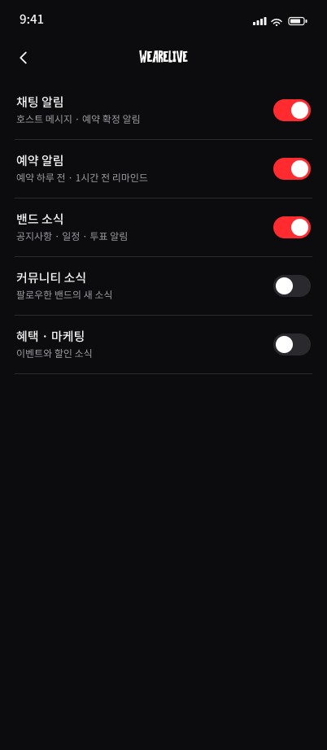

**화면 구성(있음)**

- 채팅 알림(호스트 메시지 · 예약 확정) ON [F]
- 예약 알림(하루 전 · 1시간 전 리마인드) ON [F]
- 밴드 소식(공지사항 · 일정 · 투표) ON [F]
- 커뮤니티 소식(팔로우한 밴드의 새 소식) OFF [F] → 토글 삭제 [결정 D-41]
- 혜택 · 마케팅 OFF [F]

**규칙·정책**

- '팔로우한 밴드'는 앱에 팔로우 기능이 없음 → 문구 수정 또는 기능 추가 결정 → [결정 D-41] '커뮤니티 소식' 토글 삭제
- 마케팅 수신 동의는 알림설정 토글로 받고 동의 기록(일시·방법)을 남김 [결정 Q4 · 정보통신망법]
- OS 푸시 권한 요청 시점 화면 없음 [미정]

**데이터**

- NOTIFICATION_SETTING(user_id, chat, reservation, band, community, marketing, marketing_agreed_at?)

### WL-NOTI-02 알림 이벤트 (설정 문구에서 도출)

알림 센터 화면은 없고, 대관 헤더의 🔔만 존재한다. 발송 이벤트는 설정 문구에서 도출한다.

**화면:** 알림설정 (274:27585 · 402×922) · 대관_전체 (27:1896 · 402×1342)  
 

**규칙·정책**

- 채팅: 호스트 새 메시지 · 예약 확정 [F]
- 예약: 이용 하루 전 · 1시간 전 리마인드 [F] · 거절·만료(자동 환불)도 예약 알림으로 본다 [추정]
- 밴드: 새 공지 · 새 일정 · 투표 [F] · 일정 공유·RSVP 요청 [추정]
- 커뮤니티: 팔로우 밴드 새 소식 [F, 기능 없음] → 삭제 [결정 D-41]
- 혜택·마케팅 [F]
- 🔔 탭 목적지(알림 센터) 없음 → [결정 D-42] 1차엔 푸시 알림만, 🔔 제거

**데이터**

- NOTIFICATION(id, user_id, type, payload, read_at?) [결정 D-42: 1차는 푸시만 — 발송 기록용]

---

## 11 · 공통 규칙 · 권한 · 상태 · UI (SYS)

여러 화면에 걸치는 규칙을 한곳에 둔다. v2.1 권한 매트릭스는 시안 문구로 확인된 것([F])에 확인 문답 결정([결정])을 합친 것이다. 관리자 열은 v2.1에서 추가했다.

### WL-SYS-01 권한 매트릭스

| 기능 | 비로그인 | 일반 멤버 | 관리자 | 밴드 대표 | 호스트 | 근거 |
|---|---|---|---|---|---|---|
| 앱 열람(홈·대관·소식) | ✕ (로그인 필수) | ✓ | ✓ | ✓ | — | [F] 로그인이 첫 화면 |
| 소식 올리기·수정·삭제 | ✕ | ✕ | ✕ | ✓ | — | [F] · [결정 D-12] |
| 소식 좋아요·댓글 | ✕ | ✓ (밴드 없는 사용자 포함) | ✓ | ✓ | — | [결정 Q27] |
| 공지·일정·사진 작성 | ✕ | ✓ | ✓ | ✓ | — | [결정 D-11] |
| 공지·일정·사진·앨범 수정·삭제 | ✕ | 본인 글만 | ✓ | ✓ | — | [결정 D-12] |
| 밴드 프로필 편집 | ✕ | ✕ | ✓ | ✓ | — | [결정 D-09] |
| 초대 코드 발급 | ✕ | ✕ | ✕ [추정] | ✓ | — | [F] '리더에게 받은 코드' |
| 강퇴 · 대표 넘기기 · 관리자 지정 | ✕ | ✕ | ✕ | ✓ | — | [결정 D-07] |
| 밴드 삭제·활동 종료 제안 | ✕ | ✕ | ✕ | ✓ | — | [결정 D-10] |
| 밴드 삭제·활동 종료 투표 | ✕ | ✓ | ✓ | ✓ | — | [결정 D-10] 삭제 2/3 · 종료 과반 |
| 공간 검색·찜·예약·결제·취소 | ✕ | ✓ | ✓ | ✓ | — | [F] · [결정 D-32] |
| 호스트에게 메시지 | ✕ | ✓ | ✓ | ✓ | 응답(가게용 웹) | [F] · [결정 D-27] |
| 예약 확정·거절 · 즉시 확정 설정 | — | — | — | — | ✓ (가게용 웹) | [결정 D-27] |
| 후기 작성 | ✕ | ✓ (이용 완료 예약) | ✓ | ✓ | — | [결정 D-28] |
| 신고 · 차단 | ✕ | ✓ | ✓ | ✓ | — | [결정 D-18] |

### WL-SYS-02 상태 · 색 정의

| 상태 | 코드 | 표시(색) | 나타나는 곳 | 전이 |
|---|---|---|---|---|
| 확정 대기중 | requested | 노랑 배지 | 예약완료 · 채팅 예약요약 카드 · 예약 상세 | 결제(승인) 완료 직후. 즉시 확정 공간은 거치지 않음 |
| 예약 확정 | confirmed | 초록 (통일) [결정 D-37] | 예약내역 · 예약 상세 · 채팅 · 홈 배너 | 가게 확정 또는 즉시 확정 → 청구(매입) |
| 요청 거절됨 | rejected | 빨강 | 채팅 카드 · 예약 상세 | 가게 거절, 또는 겹치는 다른 요청이 확정됨 → 승인 취소(전액) |
| 요청 만료됨 | expired | 회색 [추정] | 채팅 카드 · 예약 상세 | 결제 완료 + 24시간(이용 시작이 더 빠르면 그 전) 무응답 → 승인 취소(전액) [결정 D-33] |
| 취소됨 | cancelled | 회색 [추정] | 예약 상세 · 예약내역 | 사용자 취소: 대기 중 전액 / 확정 후 3일 전 100%·1일 전 50%·당일 불가, 수수료도 같은 비율 [결정 D-32] |
| 이용 완료 | completed | 회색 | 예약내역 지난 예약 · 후기 작성 진입 | 이용 시간 종료 [추정] |

### WL-SYS-03 공통 UI 규격 (Figma WL 컴포넌트에서 읽은 값)

| 항목 | 값 |
|---|---|
| 기준 프레임 | 402×874 (iPhone 계열) · 상태바 48 + 헤더 47 · 콘텐츠 좌우 패딩 18(콘텐츠 폭 366) |
| 배경 / 카드 | #0C0C0E 솔리드 / 카드 #141414 · 보더 rgba(255,255,255,.1) · r16 (검색행 h56) · 라디얼 레드는 밴드 프로필 헤더에만 |
| 주요 CTA | #FF2B2F · r16 · h49 · 16 Bold 흰색 (검색 140×49, 결제·소식 올리기 366 폭) |
| 칩 | r12 · px10 py4 · 14 Medium · 선택 bg #D9D7D7 보더 #CAC8C8 텍스트 #323232 / 기본 bg #120F0F 보더 #242020 텍스트 #C1BDBD |
| 텍스트 색 | #F4F4F5(주) · #9A9AA1(보조) · #C1BDBD(칩 기본) · 소식 카드 #F6F6F6/#F0E5E5/#EAE4E4/#F2F2F2 |
| 서체 | Noto Sans KR (Regular / Medium / Bold) — 17 Bold 헤더·카드 제목 · 16 Bold CTA · 15 Medium 상태바 · 14 본문·행·칩 · 13 Bold 룸 카드 · 12 Medium 카운트 · 11 메타 |
| 하단 네비 | 356×62 · r100 · rgba(16,16,18,.32) + 보더 rgba(255,255,255,.16) + blur3 · 3탭 · 활성 필 116.7×56 rgba(139,139,139,.5) · 아이콘 24/28 |
| 카드 | 소식 177×270(이미지 246 r6, 하단 셰이드) · 베뉴 풀폭 366(이미지 위 이름/₩·♡) · 룸 150×90 r14 보더 #2A2A2E, 선택 1.5px #F4F4F5 · 결제수단 178×50 |
| 아바타 | 회색 원형 플레이스홀더 · 호스트 이니셜 흰 원(검정 글자) |
| Figma 변수/스타일 | 미정의(get_variable_defs 빈 값) → 색·타이포 하드코딩. 변수화 요청 D-43 |

### WL-SYS-04 문구 사전 (시안 카피 그대로)

| 위치 | 문구 |
|---|---|
| 로그인 | 시작하면 WEARELIVE의 이용약관과 개인정보 처리방침에 동의하는 것으로 간주됩니다. |
| 온보딩 1/3 | 프로필을 만들어주세요 — 밴드 멤버들에게 보여지는 정보예요 |
| 온보딩 2/3 | 밴드와 함께 시작해요 / 새 밴드 만들기 — 밴드를 만들고 멤버를 초대해요 / 초대 코드로 참여하기 — 리더에게 받은 코드를 입력해요 |
| 온보딩 3/3 | 밴드를 만들어주세요 — 만든 사람이 밴드의 대표가 돼요 / 리더에게 받은 6자리 코드를 입력하면 바로 참여돼요 / 코드를 붙여넣거나 직접 입력할 수 있어요 |
| 토스트 | 밴드의시대 밴드를 만들었어요 / 밴드의시대에 참여했어요 |
| 공지 빈 상태 | 아직 올라온 공지가 없어요 / + 버튼으로 첫 공지를 올려보세요 |
| 찜 빈 상태 | 아직 찜한 공간이 없어요. 카드의 ♡를 눌러 마음에 드는 공간을 담아보세요. |
| 검색 | 어디서 합주할까요? / 어디서 합주하시나요? / 언제 합주할 예정이신가요? / 몇 시부터 이용하시나요? / 필요한 조건을 선택해주세요 / 전체 삭제 |
| 소식 올리기 | 어떤 밴드의 소식인가요? — 소식은 밴드 대표(리더)만 올릴 수 있어요 |
| 공지 작성 | 멤버들에게 알릴 내용을 입력해주세요 / 투표 추가 — 찬성/반대 투표를 함께 올려요 |
| 일정 만들기 | 참석 여부 확인 — 멤버에게 참석 여부를 물어보고, 응답 현황을 확인할 수 있습니다 / 게시글로 공유 — 일정이 공지사항 피드에도 올라갑니다 |
| 예약 완료 | 예약을 신청했어요! / 호스트가 확정하면 예약이 완료돼요. 보통 10분 이내에 응답해요. |
| 채팅 시스템 | 예약 신청이 호스트에게 전달되었어요… / 🎉 호스트가 예약을 확정했어요! / 호스트가 예약 요청을 수락하지 않아 결제 금액이 자동 환불되었습니다. / 호스트가 24시간 이내에 응답하지 않아 요청이 만료되었습니다. 결제 금액은 자동 환불되었습니다. |
| 계정 정보 수정 | 이름과 지역은 호스트에게 보여지는 정보예요. 실명과 실제 활동 지역을 입력해주세요. |
| 고객센터 FAQ | 예약은 언제 확정되나요? / 예약을 취소하면 환불은 어떻게 되나요? / 호스트와 연락은 어떻게 하나요? · 운영시간 평일 10:00–18:00 |

---

## 12 · 데이터 모델

화면에서 확인되는 필드만으로 구성한 엔티티 목록. [추정] 필드는 흐름상 필요한 것.

| 엔티티 | 주요 필드 | 근거 화면 |
|---|---|---|
| USER | id · provider(kakao/google) · provider_uid · name · avatar_url · position · region(seoul/daejeon) · current_band_id · created_at | 온보딩_로그인·프로필 · 계정정보수정 · 밴드전환 |
| BAND | id · name · affiliation? · genres[≤3] · image_url? · created_by · created_at | 온보딩_밴드생성 · 프로필 |
| BAND_MEMBER | band_id · user_id · role(leader/member) · position · joined_at · sort_order | 프로필_멤버 · 멤버프로필 · 밴드전환 |
| INVITE_CODE [추정] | code(6, 영숫자) · band_id · created_by · expires_at? · max_uses? | 온보딩_초대코드 · 프로필_멤버 |
| NOTICE | id · band_id · author_id · title · body · photos[≤10] · poll_id? · event_id? · created_at | 공지작성 · 프로필 공지 카드 · 공지상세_일정 |
| POLL / POLL_VOTE | poll_id · notice_id · options[찬성, 반대] / poll_id · user_id · option · voted_at | 공지작성_투표on · 프로필_공지_투표공지 |
| SCHEDULE_EVENT | id · band_id · title · all_day · start_at · end_at · place? · rsvp_enabled · share_to_feed · created_by | 일정만들기 · 프로필_일정 |
| EVENT_RSVP | event_id · user_id · status(attend/absent) · responded_at | 공지상세_일정 |
| ALBUM / PHOTO | album_id · band_id · name · created_at / photo_id · band_id · album_id? · url · uploaded_by · created_at | 프로필_사진 · 앨범_공연_NEW · 사진올리기 · 앨범만들기 |
| NEWS | id · band_id · author_id · category(performance/recruit) · title · body · event_date? · place? · photos[≤10] · like_count · comment_count · created_at | 홈 · 소식상세 · 소식올리기 |
| COMMENT / LIKE | id · target_type(news/notice) · target_id · author_id · body · created_at / user_id · target_type · target_id | 소식상세 · 공지 카드 · 좋아요 |
| VENUE | id · host_id · name · type(rehearsal/stage) · region · address · transit_note · intro · images[≤12] · facilities[] · equipment[] · services[] · policies[] · cancel_policy · business_info{name, owner, reg_no, address} · rating_avg · review_count | 상세 / A룸 · 대관_전체 · 검색 필터 |
| ROOM | id · venue_id · name · label(기본/프리미엄) · capacity · price_per_hour · is_default | 상세 룸 카드 |
| VENUE_FAVORITE | user_id · venue_id · created_at | 대관_찜_있음 |
| HOST | user_id · display_name · intro · is_superhost · response_rate · avg_response_min · verifications{id, phone, email, business} · hosting_since | 호스트프로필 |
| REVIEW | id · venue_id · user_id · rating · body · month | 후기전체 · 상세 |
| RESERVATION | id · number(WAL-…) · user_id · venue_id · room_id · date · start_time · duration_hours · headcount · unit_price · base_amount · user_fee_amount(5%) · host_fee_amount(3%) · payout_amount · total_amount · payment_method · status(requested/confirmed/rejected/expired/completed/cancelled) · status_changed_at · created_at | 예약확인 · 예약완료 · 예약내역 · 채팅 카드 |
| PAYMENT / REFUND | id · reservation_id · method · amount · status(authorized/captured/refunded/failed) · pg_tid · paid_at / id · payment_id · amount · reason(rejected/expired/user_cancel) · refunded_at | 예약확인 · 채팅 거절/만료 카드 |
| PAYMENT_METHOD | id · user_id · provider(kakaopay/tosspay/samsungpay/applepay) · masked_account · is_default · linked_at | 결제수단 |
| CONVERSATION / MESSAGE | id · user_id · host_id · venue_id · last_message_at · active_reservation_id? / id · conversation_id · sender(user/host/system) · type(text/system/reservation_card) · body · reservation_id? · created_at | 채팅목록 · 채팅방 |
| NOTIFICATION_SETTING | user_id · chat · reservation · band · community · marketing · marketing_agreed_at? | 알림설정 |
| FAQ / INQUIRY [추정] | id · question · answer / id · user_id · body · reservation_number? · created_at | 고객센터 |

> 제거 근거(신 시안에 대응 화면 없음): USER.school · BAND.band_type/start_date/end_date/parent_band_id · AVAILABILITY_POLL/SLOT(합주 조율) · SONG_*(선곡) · MILESTONE/QUEST(떡밥) · ALLIANCE_*(연합) · AGENT_THREAD(밴톡) · PHOTO.visibility · SCHEDULE_EVENT.type/color · NEWS.category 'free'/'notice' · FOLLOW(문구만 잔존).

> v2.1 결정으로 추가되는 데이터: BAND_MEMBER.role += admin · BAND.status(active/archived) · BAND_VOTE / BAND_VOTE_BALLOT(삭제·활동 종료 투표) · INVITE_CODE.expires_at(발급 + 7일) · RESERVATION += band_id(nullable), user_fee_rate(0.05)·user_fee_amount, host_fee_rate(0.03)·host_fee_amount, payout_amount, cancelled_at, refund_amount · SCHEDULE_EVENT.reservation_id(자동 등록) · VENUE += instant_confirm, 운영시간·휴무 · ROOM += min_hours, max_hours · REPORT(신고) · USER_BLOCK(차단) · USER_ALBUM_SEEN(NEW 배지).

---

## 13 · 결정 요청 · 결정 결과

v2.0에서 [미정]으로 모은 43개 항목의 결정 결과. 2026-09-27~28 확인 문답으로 40개를 정했고, D-19(공유 시트·링크) · D-22(지도 화면) · D-43(Figma 변수화)와 D-29의 결제 실패 화면은 미정으로 남았다. 문답에서 새로 정한 항목(1차 출시 형태, 공연장 단위, 시간대 선점, 즉시 확정, 밴드 삭제·활동 종료, 관리자 역할 등)은 14장과 부록 D에 있다.

| D# | 우선 | 항목 | 결정 (2026-09-28) | 관련 ID |
|---|---|---|---|---|
| D-01 | B | 일반(이메일) 회원가입 | [결정] 1차(안드로이드)엔 카카오·구글만, 이메일 가입은 iOS 출시 때 재검토 | WL-AUTH-01 |
| D-02 | A | Sign in with Apple | [결정] 1차엔 없음, iOS 출시 때 애플 로그인(또는 4.8 동급 대안) 재결정 | WL-AUTH-01 |
| D-03 | A | 약관·개인정보처리방침 페이지 | [결정] 로그인 문구의 '이용약관'·'개인정보 처리방침'에 웹 링크 | WL-AUTH-01 · WL-MY-05 |
| D-04 | C | 포지션 값 집합 | [결정] 6종 칩 유지 + '그 외' 선택 시 직접 입력 | WL-AUTH-02 · WL-MEMBER-01 |
| D-05 | B | 밴드 없는 사용자 경로 | [결정] '나중에 하기' 허용 → 프로필 탭은 빈 상태 + 밴드 만들기/참여 안내 | WL-AUTH-03 |
| D-06 | C | '소속' 정의 | [결정] 학교(목록 선택) / 직장인 밴드 / 기타(직접 입력) | WL-AUTH-04 |
| D-07 | A | 멤버 관리 최소 세트 | [결정] ⚙ = 강퇴 + 대표 넘기기 + 관리자 지정·해제(대표 전용) | WL-MEMBER-04 · WL-MEMBER-05 |
| D-08 | A | 초대 코드 발급 화면·규칙 | [결정] 7일 만료·기간 내 여러 명 사용·재발급, 발급 화면 = 코드 + 복사 + 공유 | WL-AUTH-05 · WL-MEMBER-02 |
| D-09 | B | 밴드 프로필 편집 | [결정] 대표 + 관리자(대표가 지정, 여러 명) | WL-BAND-01 · WL-MEMBER-04 · WL-MEMBER-05 |
| D-10 | B | 밴드 탈퇴·삭제 | [결정] 멤버 탈퇴 가능 · 밴드 삭제 = 대표 제안 → 3일 투표, 전체 2/3 찬성 · 활동 종료(아카이빙) = 과반 | WL-BAND-02 · WL-MY-06 · WL-BAND-04 · 05 |
| D-11 | A | 공지·일정·사진 작성 권한 | [결정] 공지·일정·사진 작성 = 멤버 전원 | WL-NOTICE-01 · WL-SCHED-02 · WL-PHOTO-03 |
| D-12 | B | 수정·삭제 UI | [결정] 공지·일정·사진·앨범 수정·삭제 = 작성자·대표·관리자, 소식 = 대표 | WL-NOTICE-01 · WL-SCHED-01 · WL-PHOTO-01 · WL-NEWS-02 · WL-SCHED-05 |
| D-13 | C | 투표 규칙 | [결정] 마감 없음·변경 가능·공개, 결과 = 인원 수 | WL-NOTICE-03 |
| D-14 | C | 일정 장소 필드 | [결정] 이번 버전엔 장소 필드 없음 | WL-SCHED-01 · 02 |
| D-15 | C | '그냥 올리기' 사진의 소속 | [결정] 앨범 없이 '전체 사진'에만 표시 | WL-PHOTO-03 |
| D-16 | C | 인기순 산식 | [결정] 좋아요 + 댓글 수 | WL-NEWS-01 |
| D-17 | B | 밴드에 연락할 방법 | [결정] 소식 댓글로 연락 | WL-NEWS-02 |
| D-18 | B | 신고·차단 | [결정] 1차에 글·댓글 신고 + 사용자 차단 | WL-NEWS-02 · WL-SYS-05 |
| D-19 | C | 공유 시트·링크 | [미정] OS 공유 시트 + 딥링크 형식 | WL-NEWS-04 · WL-BAND-01 |
| D-20 | B | 지역·노출 범위 | [결정] 서울·대전 파일럿, 리스트는 계정 지역 우선 + 다른 지역도 표시 | WL-VENUE-02 · 04 · 05 |
| D-21 | B | 시작 시간 칩·'세컨' 칩 | [결정] 운영시간 기준 전체 시간대, '세컨'은 세컨 기타(기타 앰프 2대)로 유지 | WL-VENUE-04 |
| D-22 | C | 지도 화면 | [미정] [지도 보기] 버튼만 | WL-VENUE-05 |
| D-23 | A | 가용성(예약 가능 여부) 검사 | [결정] 예약 가능한 공간만 표시 · 정원 초과 룸 선택 불가 · 불가 시간 비활성 · 대기 요청 최대 3건 | WL-VENUE-05 · 07 · WL-BOOK-01 · WL-BOOK-09 |
| D-24 | B | 취소 규정 소유 | [결정] 플랫폼 공통 규정(1차) | WL-VENUE-06 · WL-PAY-05 |
| D-25 | B | 사업자 정보 표시 범위 | [결정] 상호·대표·사업자등록번호·주소 + 전화번호·이메일 | WL-VENUE-06 |
| D-26 | C | 슈퍼호스트·응답률 산식 | [결정] 슈퍼호스트는 운영자가 지정, 응답률·응답 시간은 데이터가 쌓인 뒤 자동 | WL-VENUE-08 |
| D-27 | A | 호스트 측 채널 | [결정] 가게용 웹 페이지 | WL-VENUE-08 · WL-BOOK-05 · WL-CHAT-06 · WL-HOST-01 |
| D-28 | B | 후기 작성 | [결정] 이용 완료 후 앱에서 평점 + 글 | WL-VENUE-09 |
| D-29 | A | 결제 실패·시간 충돌 | [결정] 시간 충돌 = 대기 요청 최대 3건 · 확정 시 나머지 자동 거절 (결제 실패 화면은 미정) | WL-BOOK-02 · WL-PAY-02 · WL-BOOK-09 |
| D-30 | C | 예약번호 규칙 | [결정] WAL-YYMMDD-NNNN 확정 | WL-PAY-06 |
| D-31 | B | 예약 상세·진입점 | [결정] 예약 상세 신설 · 홈 배너 → 예약 상세 · 내정보에 '예약 내역' 메뉴 | WL-BOOK-04 · 06 · WL-BOOK-07 |
| D-32 | A | 사용자 예약 취소 | [결정] 앱에서 직접 취소(예상 환불액) · 대기 중 전액 · 확정 후 규정 비율(사용자 수수료도 같은 비율) | WL-BOOK-05 · WL-PAY-05 · WL-BOOK-07 |
| D-33 | B | 만료 타이머 기준 | [결정] 결제 완료 + 24시간, 이용 시작이 더 빠르면 시작 전 만료 | WL-BOOK-05 |
| D-34 | A | 수수료 정책 | [결정] 가게 3% + 사용자 5%, 상한 없음, 목록부터 수수료 포함 가격 표시 | WL-PAY-01 · WL-PAY-07 |
| D-35 | A | PG·자금 흐름 | [결정] 토스페이먼츠, 요청 때 승인만 → 확정 시 청구 | WL-PAY-02 |
| D-36 | C | 애플페이 불일치 | [결정] 1차 간편결제 3종(카카오·토스·삼성페이), 애플페이는 iOS 출시 때 | WL-PAY-03 |
| D-37 | C | '예약 확정' 색 통일 | [결정] 초록으로 통일 | WL-CHAT-02 · WL-SYS-02 |
| D-38 | B | 회원 탈퇴 | [결정] 1차에 앱 내 탈퇴(대표는 대표 넘기기 또는 삭제 투표 통과 후) | WL-MY-05 · WL-SYS-05 |
| D-39 | B | 호스트에게 전달되는 사용자 정보 | [결정] 이름·지역 + 밴드명 | WL-MY-02 |
| D-40 | C | 1:1 문의 채널 | [결정] 카카오톡 채널 | WL-MY-04 |
| D-41 | C | '팔로우한 밴드' 문구 | [결정] '커뮤니티 소식' 토글 삭제 | WL-NOTI-01 |
| D-42 | B | 알림 센터 | [결정] 1차엔 푸시 알림만, 🔔 제거 | WL-NOTI-02 · WL-NOTI-03 |
| D-43 | C | Figma 변수화 | [미정] 색·radius·타이포 변수 정의(현재 하드코딩) | WL-SYS-03 |

### 화면 정리 (v2.1)

- 결정으로 새로 그려야 할 화면: 예약 상세·취소 · 일정 상세 · 초대 코드 발급 · 멤버 관리(강퇴·대표 넘기기·관리자 지정) · 밴드 삭제/활동 종료 투표 · 신고·차단 · 회원 탈퇴 · 예약 확인의 밴드 선택 · 후기 작성 · 가게용 웹 전체
- 여전히 정의하지 않은 화면: 스플래시 · 공유 시트(D-19) · 지도(D-22) · 결제 실패(D-29 일부)
- 1차에 만들지 않기로 한 화면: 알림 센터(D-42, 푸시만) · 이메일 가입(D-01) · 1:1 문의 폼(D-40, 카카오톡 채널)

---

## 14 · 결정으로 추가·변경된 요구 (v2.1)

확인 문답에서 새로 생기거나 시안과 달라진 요구. 시안 프레임이 없어 이미지 없이 정의한다. 요구 ID는 기존 영역 번호를 이어서 쓰고, 가게용 웹은 새 영역 HOST로 둔다.

### WL-BAND-04 밴드 삭제 (대표 제안 → 멤버 투표)

대표가 밴드 삭제를 제안하면 멤버 투표로 결정한다(게임의 항복 투표 방식). 되돌릴 수 없어 기준을 높게 둔다. [결정 D-10]

**화면:** 시안 없음 (결정으로 추가된 요구)

**사용자 흐름**

- 대표: 멤버 관리(⚙) 또는 밴드 설정 → '밴드 삭제 제안' → 확인 → 투표 시작, 멤버에게 푸시 [추정]
- 멤버: 밴드 프로필 상단 투표 카드에서 찬성/반대 [추정]
- 3일 안에 전체 멤버의 2/3 이상 찬성 → 삭제 · 미달 → 부결

**규칙·정책**

- 통과 기준 = 전체 멤버 수의 2/3 이상 찬성(투표하지 않은 멤버는 찬성으로 세지 않음)
- 투표 기간 3일, 기간 안에 기준을 못 넘으면 부결
- 결과 표시 = 인원 수(찬성 N · 반대 N)
- 1인 밴드는 대표 혼자 찬성으로 통과
- 진행 중인 삭제·종료 투표는 밴드당 1건 [추정]

**데이터**

- BAND_VOTE(id, band_id, type ∈ {delete, archive}, proposed_by, starts_at, ends_at, status ∈ {open, passed, rejected}) · BAND_VOTE_BALLOT(vote_id, user_id, choice, voted_at)

**예외·미정**

- 삭제 후 공지·사진 데이터 보존 기간
- 투표 카드·제안 화면 시안 필요

### WL-BAND-05 밴드 활동 종료 (아카이빙)

밴드를 지우지 않고 활동을 끝내 기록을 보관한다. 삭제와 별개 기능이다. [결정 D-10]

**화면:** 시안 없음 (결정으로 추가된 요구)

**규칙·정책**

- 대표가 제안[추정] → 3일 투표, 전체 멤버 과반 찬성
- 종료 후 읽기 전용: 공지·일정·사진 열람 가능, 새 글·일정·사진·예약 불가
- 밴드 전환 목록에 '활동 종료' 표시
- 대표가 다시 활동으로 되돌릴 수 있음(재개는 투표 없음)

**데이터**

- BAND.status ∈ {active, archived}, archived_at

**예외·미정**

- 활동 종료 밴드의 소식(홈 피드) 노출 여부
- 활동 종료 상태에서 멤버 탈퇴·초대 가능 여부

### WL-SCHED-05 일정 상세 · 수정 · 삭제

일정 목록에서 한 일정을 눌러 보는 상세 화면을 새로 둔다. [결정 D-12·D-14]

**화면:** 시안 없음 (결정으로 추가된 요구)

**규칙·정책**

- 수정·삭제 = 작성자·대표·관리자
- 장소 필드는 이번 버전에 없음(목록 시안의 장소 표기는 정리)
- 게시글로 공유한 일정은 공지 카드와 동기화 [추정]
- 예약 확정으로 자동 등록된 일정은 예약 상세로 연결 [추정]

**데이터**

- SCHEDULE_EVENT(+ reservation_id)

### WL-MEMBER-05 관리자 역할

대표가 멤버 중 여러 명을 관리자로 지정해 운영을 나눈다. [결정 D-07·D-09·D-12]

**화면:** 시안 없음 (결정으로 추가된 요구)

**규칙·정책**

- 지정·해제 = 대표만(멤버 관리 ⚙)
- 관리자 권한: 밴드 프로필 편집, 공지·일정·사진·앨범 수정·삭제(남의 글 포함)
- 대표 전용: 강퇴, 대표 넘기기, 관리자 지정, 밴드 삭제·활동 종료 제안, 소식 올리기·수정·삭제
- 초대 코드 발급 = 대표 [추정]

**데이터**

- BAND_MEMBER.role ∈ {leader, admin, member}

### WL-BOOK-07 예약 상세 · 사용자 취소

예약 한 건의 정보와 취소를 한곳에서 다룬다. [결정 D-31·D-32]

**화면:** 시안 없음 (결정으로 추가된 요구)

**화면 구성(제안 · 시안 없음)**

- 예약 상태 배지 · 공간·룸 · 일시 · 인원 · 밴드(고른 경우) · 예약번호
- 결제 금액(요금 + 사용자 수수료 5%) · 결제수단
- [예약 취소] → 예상 환불액 안내 → 확인
- 가게 채팅으로 가기

**사용자 흐름**

- 진입: 예약 내역 카드 · 홈 '예약 확정' 배너 · 채팅 카드 [세부 정보 표시]

**규칙·정책**

- 확정 대기 중 취소 = 전액(승인 취소)
- 확정 후 취소 = 이용 시작 기준 3일 전 100% / 1일 전 50% / 당일 불가, 사용자 수수료도 같은 비율
- 취소 규정 = 플랫폼 공통(D-24)

**데이터**

- RESERVATION.status += cancelled, cancelled_at, refund_amount · REFUND(reason = user_cancel)

**예외·미정**

- 취소 사유 입력 여부
- 가게 3% 수수료의 부분 환불 처리 [추정: 환불 후 실제 정산액 기준]

### WL-BOOK-08 즉시 확정

가게가 켜두면 요청 없이 결제와 동시에 확정된다(에어비앤비의 즉시 예약). [결정]

**화면:** 시안 없음 (결정으로 추가된 요구)

**규칙·정책**

- 가게용 웹에서 공간 단위로 켜고 끔(룸 단위 여부 [추정])
- 켠 공간: 결제 = 승인 + 청구, 상태가 바로 '예약 확정'
- 대기 요청·24시간 만료가 생기지 않음
- 검색 결과·상세에 '즉시 확정' 표시 [추정]

**데이터**

- VENUE.instant_confirm (bool)

### WL-BOOK-09 대기 요청 규칙 (시간대 선점 없음)

요청형 공간은 확정 전까지 시간대를 잡아두지 않는다. 가게는 여러 요청 중 고를 수 있다. [결정]

**화면:** 시안 없음 (결정으로 추가된 요구)

**규칙·정책**

- 같은 룸·시간대의 대기 요청은 최대 3건, 3건이 차면 그 시간은 요청 불가
- 일시 선택·상세에 '이 시간 요청 N건 대기 중' 표시
- 가게가 하나를 확정하면 겹치는 나머지 요청은 자동 거절 + 승인 취소(전액)
- 만료 = 결제 완료 + 24시간, 이용 시작이 더 빠르면 시작 전(버퍼 미정) [결정 D-33]
- 검색의 '예약 가능' 판정: 확정된 예약과 대기 3건이 찬 시간만 제외 [추정]

**데이터**

- 요청 생성 시 같은 룸·시간대 requested 수 확인(≤ 3) · 확정 트랜잭션에서 겹치는 요청 일괄 거절

### WL-BOOK-10 예약할 때 밴드 선택 · 밴드 일정 자동 등록

예약을 어느 밴드의 합주로 할지 고르고, 확정되면 그 밴드 일정에 자동으로 들어간다. [결정 Q22 · D-39]

**화면:** 시안 없음 (결정으로 추가된 요구)

**화면 구성(제안 · 시안 없음)**

- 예약 확인 화면에 '밴드' 선택: 기본 = 지금 보는 밴드, '개인 예약' 선택 가능, 밴드 없는 사용자에게는 숨김

**규칙·정책**

- 확정 시 SCHEDULE_EVENT 자동 생성(제목에 공간·룸 이름 [추정], 장소 필드는 없음 D-14)
- 가게에 전달되는 사용자 정보 = 이름·지역 + 밴드명(개인 예약이면 밴드명 없음)

**데이터**

- RESERVATION.band_id (nullable) · SCHEDULE_EVENT.reservation_id (nullable)

**예외·미정**

- 예약 취소·거절 시 자동 등록된 일정 삭제 여부 [추정: 삭제]

### WL-PAY-07 수수료 · 가격 표시

가게 3% + 사용자 5%로 나눠 받는다. 가격은 처음부터 사용자 수수료를 포함해 보여준다. [결정 D-34]

**화면:** 시안 없음 (결정으로 추가된 요구)

**규칙·정책**

- 예) 합주실 ₩15,000 × 4시간: 사용자 결제 ₩63,000 · 가게 정산 ₩58,200 · 플랫폼 ₩4,800 (PG 수수료·부가세 차감 전)
- 예) 공연장 ₩100,000 × 4시간(가정 가격): 사용자 ₩420,000 · 가게 ₩388,000 · 플랫폼 ₩32,000
- 상한 없음
- 리스트·결과·상세의 시간당 가격 = 수수료 포함 금액(예: ₩15,000 → ₩15,750/시간), 예약 확인에서 요금·수수료를 나눠 표시 [추정 표기]
- 취소 시 사용자 수수료도 요금과 같은 비율로 환불(D-32)

**예외·미정**

- 사용자 수수료의 부가세 포함 여부(세무)
- 가게 3% 세금계산서 발행
- 여러 가게 대금 정산 = 토스페이먼츠 오픈마켓·지급대행 상품 사용 여부
- 원 단위 절사·반올림 규칙

### WL-NOTI-03 알림 방식 (1차 = 푸시만)

알림 목록 화면(알림 센터) 없이 휴대폰 푸시 알림만 보낸다. [결정 D-42]

**화면:** 시안 없음 (결정으로 추가된 요구)

**규칙·정책**

- 대관 화면의 🔔 아이콘 제거
- 예약 상태는 채팅·예약 내역에, 밴드 소식은 공지 피드에 남아 목록 없이도 다시 확인 가능
- 알림 설정 토글 4종(채팅·예약·밴드 소식·혜택/마케팅), '커뮤니티 소식' 삭제(D-41)
- 밴드 삭제·활동 종료 투표 시작도 푸시로 알림 [추정]

**예외·미정**

- 안드로이드 13+ 알림 권한 요청 시점

### WL-HOST-01 가게용 웹

가게(호스트)가 예약과 공간을 관리하는 웹 페이지. 앱에는 가게 화면을 만들지 않는다. [결정 D-27]

**화면:** 시안 없음 (결정으로 추가된 요구)

**화면 구성(제안 · 시안 없음)**

- 예약: 요청 목록 · 확정/거절 · 즉시 확정 켜기/끄기
- 공간·룸: 사진·소개·시설·장비·룸(정원·시간당 가격)·운영시간·휴무·최소/최대 이용시간(Q35)
- 채팅: 사용자 메시지 답장 [추정]
- 정산: 예약별 금액 − 가게 수수료 3%
- 가입·인증: 사업자등록증 제출 → 운영자 확인 → '사업자 확인' 표시, 사업자 정보·연락처 입력(D-25)

**규칙·정책**

- 슈퍼호스트는 운영자가 지정(D-26)
- 확인하지 않은 인증 표시는 두지 않음(1차엔 사업자등록만)

**예외·미정**

- 가게에 새 요청을 알리는 방법(알림톡·문자·이메일)
- 가게용 웹 화면 설계 전체(시안 없음)

### WL-SYS-05 스토어 · 법 대응

1차 안드로이드 출시부터 필요한 항목과 출시 전 확인할 것. [결정]

**화면:** 시안 없음 (결정으로 추가된 요구)

**규칙·정책**

- 회원 탈퇴: 내정보에서 앱 내 탈퇴 + 웹 삭제 요청 경로(구글플레이 계정 삭제 정책). 대표는 대표 넘기기 또는 밴드 삭제 투표 통과 후 탈퇴
- 신고·차단: 소식·공지·댓글 신고, 사용자 차단, 운영자 처리(구글플레이 UGC 정책 · 애플 1.2)
- 약관·개인정보처리방침: 로그인 문구에 웹 링크(D-03)
- 가게 사업자 정보 + 전화번호·이메일 표시(D-25, 전자상거래법 20조)
- 목록부터 수수료 포함 가격 표시(개정 전자상거래법의 순차공개 가격책정 금지)
- 대관 결제는 앱 밖에서 쓰는 서비스라 인앱결제 대상 아님(애플 3.1.3(e))
- iOS 출시 전: 애플 로그인(4.8) · 애플페이 · 차단 재점검

**예외·미정**

- 법무·세무 확인(가격 표시, 부가세, 정산 구조)

---

## 부록 A · 삽입 프레임 인덱스 (61)

노드 ID는 figma.com/design/KNjSBM9a9OCpcaOkf0KZuI 의 node-id(콜론을 하이픈으로)로 바로 열 수 있다. 파일 경로는 이 패키지의 screens/ 폴더.

| # | 프레임명 | 노드 ID | 치수 | 파일 |
|---|---|---|---|---|
| 1 | 온보딩_로그인 | 351:33098 | 402×874 | `screens/온보딩_로그인.png` |
| 2 | 온보딩_프로필 | 352:33119 | 402×874 | `screens/온보딩_프로필.png` |
| 3 | 온보딩_밴드선택 | 353:33143 | 402×874 | `screens/온보딩_밴드선택.png` |
| 4 | 온보딩_밴드생성 | 353:33178 | 402×874 | `screens/온보딩_밴드생성.png` |
| 5 | 온보딩_초대코드 | 358:33421 | 402×874 | `screens/온보딩_초대코드.png` |
| 6 | 온보딩_생성완료 | 360:33251 | 402×874 | `screens/온보딩_생성완료.png` |
| 7 | 온보딩_참여완료 | 360:34470 | 402×1088 | `screens/온보딩_참여완료.png` |
| 8 | 홈 | 66:15814 | 402×1382 | `screens/홈.png` |
| 9 | 소식상세_여름합동공연 | 153:24724 | 402×1090 | `screens/소식상세_여름합동공연.png` |
| 10 | 소식올리기 | 166:24810 | 402×922 | `screens/소식올리기.png` |
| 11 | 소식올리기_캘린더 | 172:25979 | 402×1212 | `screens/소식올리기_캘린더.png` |
| 12 | 소식올리기_모집 | 172:26181 | 402×922 | `screens/소식올리기_모집.png` |
| 13 | 대관_전체 | 27:1896 | 402×1342 | `screens/대관_전체.png` |
| 14 | 대관_찜_있음 | 72:17583 | 402×874 | `screens/대관_찜_있음.png` |
| 15 | 검색 | 27:1853 | 402×874 | `screens/검색.png` |
| 16 | 검색_어디서_서울 | 38:4952 | 402×874 | `screens/검색_어디서_서울.png` |
| 17 | 검색_언제_선택 | 38:5085 | 402×910 | `screens/검색_언제_선택.png` |
| 18 | 검색_시간_선택 | 38:5234 | 402×874 | `screens/검색_시간_선택.png` |
| 19 | 검색_인원_선택 | 38:5346 | 402×874 | `screens/검색_인원_선택.png` |
| 20 | 검색_필터_주차드럼 | 43:6294 | 402×874 | `screens/검색_필터_주차드럼.png` |
| 21 | 결과_필터 | 43:6399 | 402×882 | `screens/결과_필터.png` |
| 22 | 결과_정렬메뉴 | 51:7663 | 402×882 | `screens/결과_정렬메뉴.png` |
| 23 | 상세 / A룸 | 49:7596 | 402×2112 | `screens/상세_A룸.png` |
| 24 | 상세 / 정책펼침 | 86:18946 | 402×2186 | `screens/상세_정책펼침.png` |
| 25 | 오버레이_날짜시간 | 96:20346 | 402×874 | `screens/오버레이_날짜시간.png` |
| 26 | 호스트프로필 | 61:10984 | 402×1046 | `screens/호스트프로필.png` |
| 27 | 후기전체 | 61:11297 | 402×1027 | `screens/후기전체.png` |
| 28 | 예약확인_11일 | 104:15492 | 402×874 | `screens/예약확인_11일.png` |
| 29 | 예약완료_11일 | 106:16967 | 402×874 | `screens/예약완료_11일.png` |
| 30 | 예약내역 | 376:32227 | 402×874 | `screens/예약내역.png` |
| 31 | 채팅목록 | 108:15074 | 402×874 | `screens/채팅목록.png` |
| 32 | 채팅방 | 108:16198 | 402×874 | `screens/채팅방.png` |
| 33 | 채팅방_확정 | 115:16716 | 402×874 | `screens/채팅방_확정.png` |
| 34 | 채팅방_루프스테이션 | 126:19775 | 402×874 | `screens/채팅방_루프스테이션.png` |
| 35 | 채팅방_언더그라운드 | 126:20375 | 402×874 | `screens/채팅방_언더그라운드.png` |
| 36 | 채팅방_프리버드 | 126:20971 | 402×874 | `screens/채팅방_프리버드.png` |
| 37 | 프로필 | 236:27197 | 402×1078 | `screens/프로필.png` |
| 38 | 프로필_공지_투표공지 | 335:28200 | 402×1477 | `screens/프로필_공지_투표공지.png` |
| 39 | 공지작성_빈 | 332:28058 | 402×874 | `screens/공지작성_빈.png` |
| 40 | 공지작성_투표on | 335:28142 | 402×874 | `screens/공지작성_투표on.png` |
| 41 | 공지상세_일정 | 318:28110 | 402×874 | `screens/공지상세_일정.png` |
| 42 | 프로필_일정 | 249:27341 | 402×978 | `screens/프로필_일정.png` |
| 43 | 일정만들기_빈 | 329:28046 | 402×874 | `screens/일정만들기_빈.png` |
| 44 | 일정만들기_시간휠 | 309:27940 | 402×874 | `screens/일정만들기_시간휠.png` |
| 45 | 일정만들기_종료10시 | 315:28107 | 402×874 | `screens/일정만들기_종료10시.png` |
| 46 | 프로필_사진 | 249:27505 | 402×1065 | `screens/프로필_사진.png` |
| 47 | 앨범_공연_NEW | 339:28593 | 402×874 | `screens/앨범_공연_NEW.png` |
| 48 | 사진올리기_갤러리 | 339:29262 | 402×874 | `screens/사진올리기_갤러리.png` |
| 49 | 사진올리기_시트 | 339:31896 | 402×874 | `screens/사진올리기_시트.png` |
| 50 | 앨범선택_연습영상 | 342:33099 | 402×874 | `screens/앨범선택_연습영상.png` |
| 51 | 앨범만들기_모달 | 342:32985 | 402×874 | `screens/앨범만들기_모달.png` |
| 52 | 프로필_멤버 | 253:27409 | 402×1705 | `screens/프로필_멤버.png` |
| 53 | 멤버프로필 | 259:27463 | 402×922 | `screens/멤버프로필.png` |
| 54 | 밴드전환 | 253:27529 | 402×922 | `screens/밴드전환.png` |
| 55 | 내정보 | 253:27594 | 402×922 | `screens/내정보.png` |
| 56 | 계정정보 | 272:27595 | 402×922 | `screens/계정정보.png` |
| 57 | 계정정보수정 | 272:27543 | 402×922 | `screens/계정정보수정.png` |
| 58 | 알림설정 | 274:27585 | 402×922 | `screens/알림설정.png` |
| 59 | 좋아요 | 274:27637 | 402×922 | `screens/좋아요.png` |
| 60 | 결제수단 | 274:27850 | 402×922 | `screens/결제수단.png` |
| 61 | 고객센터 | 274:27896 | 402×922 | `screens/고객센터.png` |

---

## 부록 B · 요구 ID 인덱스 (76)

| 요구 ID | 제목 | 대표 화면 | 장 | 미정 수 |
|---|---|---|---|---|
| WL-AUTH-01 | 소셜 로그인 (카카오 · 구글) | 온보딩_로그인 | 3장 | 2 |
| WL-AUTH-02 | 프로필 설정 (1/3) | 온보딩_프로필 | 3장 | 2 |
| WL-AUTH-03 | 밴드 선택 (2/3) | 온보딩_밴드선택 | 3장 | 1 |
| WL-AUTH-04 | 밴드 만들기 (3/3) | 온보딩_밴드생성 | 3장 | 3 |
| WL-AUTH-05 | 초대 코드로 참여 (3/3) | 온보딩_초대코드 | 3장 | 1 |
| WL-AUTH-06 | 온보딩 완료 · 첫 진입 | 온보딩_생성완료 · 온보딩_참여완료 | 3장 | 1 |
| WL-BAND-01 | 밴드 프로필 헤더 · 서브탭 | 프로필 | 4장 | 2 |
| WL-BAND-02 | 밴드 전환 · 순서 변경 | 밴드전환 | 4장 | 2 |
| WL-NOTICE-01 | 공지사항 피드 | 프로필 · 프로필_공지_투표공지 | 4장 | 2 |
| WL-NOTICE-02 | 공지 작성 | 공지작성_빈 | 4장 | 2 |
| WL-NOTICE-03 | 공지 투표 (찬성 / 반대) | 공지작성_투표on · 프로필_공지_투표공지 | 4장 | 1 |
| WL-NOTICE-04 | 공지 상세 (일정 공유형) | 공지상세_일정 | 4장 | 1 |
| WL-NOTICE-05 | 공지 댓글 · 좋아요 | 프로필_공지_투표공지 | 4장 | 0 |
| WL-SCHED-01 | 일정 탭 (월 캘린더 · 목록) | 프로필_일정 | 4장 | 2 |
| WL-SCHED-02 | 일정 만들기 | 일정만들기_빈 · 일정만들기_시간휠 · 일정만들기_종료10시 | 4장 | 3 |
| WL-SCHED-03 | 참석 여부 응답 (RSVP) | 공지상세_일정 | 4장 | 0 |
| WL-SCHED-04 | 게시글로 공유 | 프로필_공지_투표공지 | 4장 | 0 |
| WL-PHOTO-01 | 사진 탭 (앨범 목록) | 프로필_사진 | 4장 | 1 |
| WL-PHOTO-02 | 앨범 상세 | 앨범_공연_NEW | 4장 | 0 |
| WL-PHOTO-03 | 사진 올리기 (다중 선택 → 올리기 방식 선택) | 사진올리기_갤러리 · 사진올리기_시트 | 4장 | 1 |
| WL-PHOTO-04 | 앨범 선택 · 앨범 만들기 | 앨범선택_연습영상 · 앨범만들기_모달 | 4장 | 0 |
| WL-MEMBER-01 | 멤버 목록 | 프로필_멤버 | 4장 | 0 |
| WL-MEMBER-02 | 멤버 초대 (초대 코드 발급) | 프로필_멤버 | 4장 | 1 |
| WL-MEMBER-03 | 멤버 프로필 | 멤버프로필 | 4장 | 0 |
| WL-MEMBER-04 | 멤버 관리 (⚙) | 프로필_멤버 | 4장 | 1 |
| WL-NEWS-01 | 홈 소식 피드 | 홈 | 5장 | 1 |
| WL-NEWS-02 | 소식 상세 | 소식상세_여름합동공연 | 5장 | 2 |
| WL-NEWS-03 | 소식 올리기 (밴드 대표만) | 소식올리기 · 소식올리기_캘린더 · 소식올리기_모집 | 5장 | 2 |
| WL-NEWS-04 | 좋아요 · 댓글 · 공유 (소식) | 소식상세_여름합동공연 | 5장 | 0 |
| WL-VENUE-01 | 홈 대관 진입 (검색바 · 카테고리 · 예약 배너) | 홈 | 6장 | 0 |
| WL-VENUE-02 | 대관 리스트 (전체 / 합주실 / 공연장 / 찜) | 대관_전체 | 6장 | 1 |
| WL-VENUE-03 | 찜 (베뉴 즐겨찾기) | 대관_찜_있음 | 6장 | 0 |
| WL-VENUE-04 | 검색 모달 (공간 유형 · 어디서 · 언제 · 시간 · 인원 · 필터) | 검색 · 검색_어디서_서울 · 검색_언제_선택 | 6장 | 1 |
| WL-VENUE-05 | 검색 결과 · 정렬 · 지도 보기 | 결과_필터 · 결과_정렬메뉴 | 6장 | 0 |
| WL-VENUE-06 | 공간 상세 | 상세 / A룸 | 6장 | 2 |
| WL-VENUE-07 | 룸 (다중 룸 · 룸별 정원 · 시간당 가격) | 상세 / A룸 | 6장 | 0 |
| WL-VENUE-08 | 호스트 프로필 | 호스트프로필 | 6장 | 0 |
| WL-VENUE-09 | 후기 (보기 전용) | 후기전체 | 6장 | 0 |
| WL-BOOK-01 | 일시 선택 바텀시트 (상세 · 예약 수정) | 오버레이_날짜시간 | 7장 | 0 |
| WL-BOOK-02 | 예약 확인 (결제 전 요약) | 예약확인_11일 | 7장 | 1 |
| WL-BOOK-03 | 예약 완료 (신청 완료 · 확정 대기중) | 예약완료_11일 | 7장 | 0 |
| WL-BOOK-04 | 예약 내역 | 예약내역 | 7장 | 0 |
| WL-BOOK-05 | 예약 상태 머신 | 채팅방_확정 · 예약내역 | 7장 | 0 |
| WL-BOOK-06 | 홈 예약 확정 배너 | 홈 | 7장 | 0 |
| WL-PAY-01 | 요금 계산 | 예약확인_11일 | 8장 | 0 |
| WL-PAY-02 | 간편결제 (카카오페이 · 토스페이 · 삼성페이 · 애플페이) | 예약확인_11일 | 8장 | 1 |
| WL-PAY-03 | 결제수단 관리 (내정보) | 결제수단 | 8장 | 0 |
| WL-PAY-04 | 환불 (거절 · 만료 자동 환불) | 채팅방_루프스테이션 · 채팅방_언더그라운드 | 8장 | 0 |
| WL-PAY-05 | 취소 규정 · 사용자 취소 | 상세 / 정책펼침 | 8장 | 1 |
| WL-PAY-06 | 예약번호 | 예약완료_11일 | 8장 | 0 |
| WL-CHAT-01 | 채팅 목록 | 채팅목록 | 9장 | 0 |
| WL-CHAT-02 | 채팅방 — 예약 대화 (요청 · 확정) | 채팅방 · 채팅방_확정 | 9장 | 0 |
| WL-CHAT-03 | 채팅방 — 거절 · 만료 카드 | 채팅방_루프스테이션 · 채팅방_언더그라운드 | 9장 | 0 |
| WL-CHAT-04 | 사전 문의 DM (호스트 프로필에서) | 채팅방_프리버드 | 9장 | 0 |
| WL-CHAT-05 | 메시지 타입 · 표시 규칙 | 채팅방 | 9장 | 0 |
| WL-CHAT-06 | 대화 생성 · 상대 규칙 | 채팅목록 | 9장 | 0 |
| WL-MY-01 | 내정보 | 내정보 | 10장 | 0 |
| WL-MY-02 | 계정 정보 · 수정 | 계정정보 · 계정정보수정 | 10장 | 0 |
| WL-MY-03 | 좋아요 목록 | 좋아요 | 10장 | 0 |
| WL-MY-04 | 고객센터 | 고객센터 | 10장 | 0 |
| WL-MY-05 | 로그아웃 · 계정 수명주기 | 내정보 | 10장 | 0 |
| WL-MY-06 | 밴드 관리 메뉴 | 내정보 | 10장 | 0 |
| WL-NOTI-01 | 알림 설정 | 알림설정 | 10장 | 0 |
| WL-NOTI-02 | 알림 이벤트 (설정 문구에서 도출) | 알림설정 · 대관_전체 | 10장 | 0 |
| WL-BAND-04 | 밴드 삭제 (대표 제안 → 멤버 투표) | — | 14장 | 2 |
| WL-BAND-05 | 밴드 활동 종료 (아카이빙) | — | 14장 | 2 |
| WL-SCHED-05 | 일정 상세 · 수정 · 삭제 | — | 14장 | 0 |
| WL-MEMBER-05 | 관리자 역할 | — | 14장 | 0 |
| WL-BOOK-07 | 예약 상세 · 사용자 취소 | — | 14장 | 2 |
| WL-BOOK-08 | 즉시 확정 | — | 14장 | 0 |
| WL-BOOK-09 | 대기 요청 규칙 (시간대 선점 없음) | — | 14장 | 0 |
| WL-BOOK-10 | 예약할 때 밴드 선택 · 밴드 일정 자동 등록 | — | 14장 | 1 |
| WL-PAY-07 | 수수료 · 가격 표시 | — | 14장 | 4 |
| WL-NOTI-03 | 알림 방식 (1차 = 푸시만) | — | 14장 | 1 |
| WL-HOST-01 | 가게용 웹 | — | 14장 | 2 |
| WL-SYS-05 | 스토어 · 법 대응 | — | 14장 | 1 |

---

## 부록 C · 출처 · 검증 방법

- Figma MCP get_metadata(0:1)로 페이지 '프로토타입' 전체 노드 XML을 추출해 최상위 프레임 134개의 이름·치수·자식 레이어·텍스트 노드를 정리했다.
- 화면 렌더(get_screenshot / node.screenshot)로 각 프레임의 실제 표시를 확인했고, '화면 구성(있음)' 항목의 문장은 프레임의 텍스트·레이어를 그대로 옮긴 것이다.
- get_design_context로 컴포넌트(nav · chip · card/소식 · card/룸 · 검색)의 색·치수·서체를 코드로 읽었다. get_variable_defs는 빈 값(변수 미정의).
- 삽입 이미지는 Figma에서 PNG 1x로 export한 원본이며 가공하지 않았다. 세로가 긴 프레임(상세 등)은 지면에 맞게 상·하로 나눠 나란히 두었다.
- 'WEARELIVE 앱 변경 기획서 v1.0'(2026-09-25)이 기존 명세서 v1.3 대비 변경점을, 이 문서가 신 시안 기준의 기능 정의를 담당한다. 두 문서는 같은 프레임 관찰을 근거로 한다.
- v2.1(2026-09-28): 확인 문답(58문항 + 문답 중 추가 질문)의 답을 반영했다. 본문 [미정] D-xx 중 결정된 것은 [결정 D-xx]로 자동 치환했고, 시안 사실과 결정이 어긋나는 문장(수수료 10% 등)은 직접 고쳤다. 결정 전체는 부록 D, 원본은 프로젝트 문서 'WEARELIVE_결정기록_2026-09-27'.

> 본 문서는 시안을 기능 정의로 옮긴 것이며, 더미 데이터(가격·날짜·이름·후기)는 시안 값을 인용한 것으로 확정 정책이 아니다(단, 결정으로 바꾼 값은 [결정]으로 표시). [결정 D-xx]의 근거는 13장·부록 D, 남은 [미정]은 13장을 따른다.

---

## 부록 D · 확인 문답 결정 전체 (70)

2026-09-27~28 확인 문답의 모든 답. 문항 = 확인 문답 목록의 번호(Q1~Q58, 뒤에 a·b가 붙은 것은 문답 중 나뉜 세부 질문), '추가' = 원래 목록에 없던 질문, 항목 옆 D-xx = 13장 결정 요청 번호, [추정] = 답에서 바로 나오지 않아 정리하며 가정한 부분.

| 문항 | 항목 | 결정 | 메모 |
|---|---|---|---|
| 추가 | 1차 출시 형태 | 안드로이드 먼저, iOS 나중 | 구글플레이도 앱 내 계정 삭제(앱 안 + 웹 링크)를 요구 → Q6 |
| Q1 | 로그인 방식 (D-01·D-02) | 카카오·구글만 유지 | iOS 출시 때 애플 로그인(또는 4.8 동급 대안) 추가 재결정 |
| Q2 | 기존 회원 첫 화면 | 홈 |  |
| Q3 | 밴드 없이 쓰기 (D-05) | '나중에 하기' 허용 → 프로필 탭은 빈 상태 + 밴드 만들기/참여 안내 |  |
| Q4 | 약관·개인정보처리방침 (D-03) | 로그인 문구에 웹 링크 | 마케팅 수신 동의는 알림설정 토글로 받고 동의 기록 필요 |
| Q5 | 동일인 중복 가입 | 같은 이메일이면 두 번째 가입 차단·안내 | 카카오가 이메일을 안 주는 경우 판별 불가 → 처리 방식 별도 |
| Q6 | 회원 탈퇴 (D-38) | 1차에 앱 내 탈퇴 포함 | 대표는 대표 넘기기(기본) 또는 밴드 삭제 투표 통과 후 탈퇴. 구글플레이용 웹 삭제 경로도 필요 |
| Q7 | 가입 중 이탈 후 재진입 | 멈춘 단계부터 재개 |  |
| Q8 | 공지·일정·사진 작성 권한 (D-11) | 멤버 전원 | 수정·삭제 범위는 Q21 답을 공지·사진에도 적용 |
| Q9 | 초대 코드 규칙 (D-08) | 발급 후 7일 만료, 기간 내 여러 명 사용, 만료 후 재발급 |  |
| Q10 | 초대 코드 발급 화면 (D-08) | 코드 표시 + 복사 + 공유 시트 |  |
| Q11 | 멤버 관리 ⚙ (D-07) | 강퇴 + 대표 넘기기 + 관리자 지정·해제 | 관리자 지정은 Q13 답으로 추가됨 |
| Q12 | 밴드 탈퇴·삭제 (D-10) | 멤버 탈퇴 가능 · 밴드 삭제 = 대표 제안 → 멤버 투표(서렌 방식): 전체 멤버의 2/3 이상 찬성, 투표 기간 3일, 미투표는 찬성으로 안 셈, 기간 내 미달이면 부결 | 멤버 탈퇴는 권장안 유지(이의 없음). 1인 밴드는 대표 단독으로 통과 |
| Q12a | 밴드 활동 종료(아카이빙) — 신규 | 삭제와 별개 기능. 대표 제안[추정] → 전체 멤버 과반 찬성, 3일 · 종료 후 읽기 전용(공지·일정·사진 열람 가능, 새 글·예약 불가), 밴드 전환 목록에 '활동 종료' 표시, 대표가 재개 가능 | 명세서 v1.3의 기한제 밴드 아카이브(BAND-05)와 비슷한 개념이 되살아남 |
| Q13 | 밴드 프로필 편집 (D-09) | 대표 + 관리자. 관리자는 대표가 지정, 여러 명 가능. 강퇴·대표 넘기기·삭제/종료 제안은 대표 전용 | 진입 = 멤버 목록 '프로필 설정' 버튼[추정 유지] |
| Q14 | 포지션 값 (D-04) | 6종 칩 유지 + '그 외' 선택 시 직접 입력 | 멤버 목록 더미(바이올린·퍼커션·코러스)는 '그 외' 입력값으로 해석 |
| Q15 | 밴드 '소속' (D-06) | 학교(목록에서 선택) / 직장인 밴드 / 기타(직접 입력) | 입력 필수 여부는 현행대로 선택[추정]. 학교 목록 데이터 필요. 직장인은 회사명 없이 표시[추정] |
| Q16 | 밴드 이미지 업로드 시점 | 프로필 편집에서만 |  |
| Q17 | 공지 투표 규칙 (D-13) | 마감 없음 · 변경 가능 · 공개(누가 어떤 선택인지 멤버에게 보임) | 밴드 삭제·종료 투표는 별도 규칙(3일 마감, Q12) |
| Q18 | 투표 결과 표시 | 인원 수(찬성 5 · 반대 2) | 삭제·종료 투표도 같은 표시 |
| Q19 | 공지 열람 범위 | 밴드 멤버만 | 밖에 알릴 내용은 소식(홈 피드)으로 |
| Q20 | 일정 장소 필드 (D-14) | 이번 버전엔 없음 | 일정 목록 시안의 장소 표기('노천극장')는 빼거나, 예약 자동 등록 일정만 공간명 표시[추정] |
| Q21 | 일정 상세·수정·삭제 (D-12) | 일정 상세 화면 신설. 수정·삭제 = 작성자·대표·관리자 | 같은 규칙을 공지·사진 수정·삭제에도 적용 |
| Q22 | 예약 확정 → 밴드 일정 | 자동 등록 | 예약 확인 화면에 '밴드 선택' 추가(기본 = 지금 보는 밴드, '개인 예약(일정 등록 안 함)' 선택 가능, 밴드 없는 사용자에겐 숨김) |
| Q23 | '그냥 올리기' 사진 (D-15) | 앨범 없이 '전체 사진'에만 표시 | 사진 탭 맨 앞에 '전체' 칸 |
| Q24 | 앨범 관리 (D-12) | 이름 변경·삭제 = 앨범 만든 사람·대표·관리자. 앨범을 지워도 사진은 앨범 없는 사진으로 남김 | 사진 삭제 = 작성자·대표·관리자(Q21) |
| Q24b | NEW 배지 기준 | 내가 마지막으로 본 뒤 올라온 사진 | 사용자별 앨범 열람 시각 저장 |
| Q25 | 소식 작성 권한 | 밴드 대표만(현행 시안) | 관리자는 소식 작성 불가 |
| Q26 | 모집 글 지원 연락 (D-17) | 소식 댓글로 | 연락처가 공개 댓글에 남을 수 있어 안내 문구 필요[추정] |
| Q27 | 소식 댓글 권한 | 로그인 사용자 누구나 | 밴드 없는 사용자 포함 |
| Q28 | 신고·차단 (D-18) | 1차에 글·댓글 신고 + 사용자 차단 포함 | 구글플레이 UGC 정책(앱 내 신고 + 운영 조치)·애플 1.2(차단 포함) 대응. 신고 처리 = 운영자 |
| Q29 | 인기순 산식 (D-16) | 좋아요 + 댓글 수 |  |
| Q30 | 소식 수정·삭제 (D-12) | 대표(작성자)만 수정·삭제 | 관리자는 소식 수정·삭제 불가. 신고된 글은 운영자가 내림 |
| Q31 | 지역 범위 (D-20) | 서울·대전 파일럿(현행) |  |
| Q32 | 대관 리스트 노출 (D-20) | 계정 지역 공간 먼저, 다른 지역도 아래에 표시 | 가입 때 지역을 안 받으므로 지역 미설정 사용자는 전체 |
| Q33 | 시작 시간 칩 (D-21) | 운영시간 기준 전체 시간대 | 검색 = 하루 전체 가로 스크롤 칩, 상세 = 그 공간 운영시간만. 공간 운영시간 데이터 필요 |
| Q34 | '세컨' 칩 (D-21) | '세컨 기타'(기타 앰프 2대, 기타 두 대 동시 연결 가능)로 정의하고 유지 | 칩 라벨을 '세컨 기타'로 바꾸면 더 명확[추정] |
| Q35 | 이용 시간 스테퍼 | 공간마다 가게가 최소·최대 시간 설정 | 1시간 단위[추정]. 가게용 화면에 설정 칸 필요. 검색 모달은 공통 범위, 상세·예약에서 공간 설정 적용[추정] |
| Q36 | 결과 가용성 (D-23) | 선택한 날짜·시간에 예약 가능한 공간만 표시 |  |
| Q37 | 룸 정원 vs 인원 (D-23) | 정원 초과 룸은 선택 불가(흐리게) · 결과엔 맞는 룸이 있는 공간만 |  |
| Q38 | 불가 시간대 (D-23) | 예약된 시간·휴무일 비활성 표시 | 가게가 운영시간·휴무 등록 필요 |
| Q39 | 취소 규정 소유 (D-24) | 플랫폼 공통(1차) | 3일 전 100% / 1일 전 50% / 당일 불가 |
| Q40 | 사업자 정보 (D-25) | 상호·대표·사업자등록번호·주소 + 전화번호·이메일 | 전자상거래법 20조(통신판매중개자의 판매자 정보 제공) 대응. 출시 전 법무 확인 |
| 추가 | 공연장 예약 단위 | 합주실과 같은 시간 단위 + 음향·조명 등 옵션은 채팅으로 협의 | 공연장 전용 상세·옵션 화면 없이 합주실 흐름 재사용. 채팅 시안의 '공연 대관'(날짜만) 표기는 시간 표기로 정리 필요 |
| Q41 | 가게 측 채널 (D-27) | 가게용 웹 페이지 | 예약 확정·거절, 공간·룸·가격, 운영시간·휴무, 최소/최대 이용시간(Q35) 설정 |
| Q42 | 가게 인증 | 1차엔 사업자등록만 운영자가 확인 | 프로필엔 실제로 확인한 '사업자 확인'만 표시(확인 안 한 인증 표시는 두지 않음) |
| Q43 | 후기 작성 (D-28) | 이용 완료 후 앱에서 평점 + 글 작성 | 실제 이용자만 작성 |
| Q44 | 슈퍼호스트·응답률 (D-26) | 슈퍼호스트 = 우리(운영)가 기준을 정해 지정 | 응답률·응답 시간은 실제 응답 기록으로 계산해 표시, 초기엔 데이터가 쌓인 뒤부터[추정] |
| Q45 | 수수료 부담 (D-34) | 가게 3% + 사용자 5% (분할 수수료, 상한 없음) · 목록·상세부터 사용자 수수료 포함 가격 표시 | 처음 답은 가게 3% + 사용자 10% → 검토 후 사용자 5%로 확정(합주실 반복 이용의 직거래 이탈 완화). 예) ₩15,000×4h → 사용자 ₩63,000 / 가게 ₩58,200 / 플랫폼 ₩4,800(PG·부가세 차감 전) |
| Q46 | 가게 정산 수수료 (D-34) | 추가 없음 (G-45의 가게 3%가 전부) |  |
| Q47 | PG (D-35) | 토스페이먼츠 | 간편결제별 지원·승인 방식(Q48)은 계약 전 확인 |
| Q48 | 결제 승인 방식 (D-35) | 요청 때 승인만, 가게 확정 시 청구(매입) | 토스페이먼츠에서 간편결제별 지원 확인. 안 되면 즉시 결제 + 자동 환불로 대체 |
| Q49 | 결제수단 (D-36) | 1차 = 카카오페이·토스페이·삼성페이, 애플페이는 iOS 출시 때 | 삼성페이는 삼성 폰에서만 노출[추정] |
| Q50 | 사용자 취소 (D-32) | 1차에 앱에서 직접 취소: '예약 취소' → 예상 환불액 표시 → 확인 → 자동 환불 | 버튼 위치 = 예약 상세(Q52) |
| Q50b | 확정 대기 중 취소 | 전액 환불(수수료 포함) | 승인 방식(Q48)이면 승인 취소 |
| Q50c | 확정 후 취소 시 사용자 수수료 | 요금과 같은 비율로 환불(3일 전 100% / 1일 전 50% / 당일 0%) | 사용자 수수료 5%에 적용. 가게 3%는 환불 후 실제 정산액 기준[추정] |
| Q51 | 만료 타이머 (D-33) | 결제(승인) 완료부터 24시간, 이용 시작이 더 빠르면 시작 전에 만료 | 시작 몇 시간 전에 만료할지(버퍼)는 세부 결정 필요 |
| 추가 | 확정 대기 중 시간대 선점 | 안 잡아둠 + '이 시간 요청 N건 대기 중' 표시 + 한 시간대 대기 요청 최대 3건. 가게가 하나 확정하면 나머지 자동 거절·승인 취소 | 가게 설득 포인트(여러 요청 중 선택)와 사용자 부작용 사이 절충 |
| 추가 | 즉시 확정 | 가게용 웹에 '즉시 확정' 옵션 — 켠 가게는 결제 즉시 확정, 끈 가게는 요청형 | 즉시 확정 공간은 대기 요청·24시간 만료가 생기지 않음 |
| Q52a | 예약내역 카드 탭 (D-31) | 예약 상세 화면 신설(예약 정보·예약번호·결제 금액·취소 버튼·예상 환불액) | 채팅 카드 [세부 정보 표시]도 여기로 연결 |
| Q52b | 홈 '예약 확정' 배너 탭 | 그 예약의 상세 |  |
| Q52c | 내정보 '예약 내역' 메뉴 | 추가 |  |
| Q52d | 예약번호 (D-30) | WAL-YYMMDD-NNNN (요청 날짜 + 그날 일련번호 4자리) | 시안 그대로 |
| Q53 | 대화 단위 | 가게당 대화방 1개(예약 카드 누적) |  |
| Q54 | '예약 확정' 색 (D-37) | 초록으로 통일 | 채팅 배지 레드 → 초록 |
| Q55 | 채팅 첨부·읽음 | 1차엔 둘 다 없음 |  |
| Q56 | 알림 센터 (D-42) | 1차엔 푸시 알림만, 🔔 아이콘 제거, 알림 목록은 다음 버전 | '개발이 덜 복잡한 쪽으로' 위임받아 선택. 예약 상태는 채팅·예약 내역에, 밴드 소식은 공지 피드에 남아 목록 없이도 다시 확인 가능. 안드로이드 13+ 알림 권한 요청 시점 정해야 함 |
| Q57 | '팔로우한 밴드' 문구 (D-41) | 알림 설정에서 '커뮤니티 소식' 토글 삭제 | 남는 토글: 채팅·예약·밴드 소식·혜택/마케팅 |
| Q58a | 1:1 문의 (D-40) | 카카오톡 채널 연결 | 운영시간 평일 10~18시 |
| Q58b | 가게에 전달되는 사용자 정보 (D-39) | 이름·지역 + 밴드명(예약 때 고른 밴드) | 개인 예약이면 밴드명 없음. 계정정보의 안내 문구도 '이름·지역·밴드명'으로 수정 |
| 추가 | 기술 스택 (2026-09-29) | 앱 Flutter · 백엔드 Spring Boot · 가게용 웹 React · DB Supabase(Postgres) | 앱·웹은 Spring Boot API만 호출, 돈·권한·상태는 서버 서비스 계층에서. 상세 개발가이드 4.2절 |

### 출시 전 확인할 것

- 법무: 목록·상세의 수수료 포함 가격 표시(개정 전자상거래법 2025-02-14 시행, '순차공개 가격책정' 다크패턴 금지), 가게 사업자 정보·연락처 표시(전자상거래법 20조 통신판매중개자 의무)
- 세무: 사용자 5% 수수료의 부가세 포함 여부, 가게 3% 수수료 세금계산서
- PG(토스페이먼츠): 간편결제별 '승인 후 확정 시 청구' 지원 여부(Q48), 여러 가게 대금을 나눠주는 오픈마켓·지급대행 정산 상품
- 스토어: 구글플레이 계정 삭제(앱 + 웹 링크)·UGC 신고, iOS 출시 때 애플 4.8 로그인·1.2 차단 재점검
